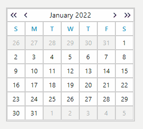

## Environment
|Product Version|Product|Author|
|----|----|----|
|2021.3.914|RadCalendar for WinForms|[Dinko Krastev](https://www.telerik.com/blogs/author/dinko-krastev)|



## Description

In order to achieve week selection, you can clear all dates that don't belong to the week from the __SelectedDates__ collection and select each date of the week. The following code snippet demonstrate how you can achieve this.


````C#
 public partial class RadForm1 : Telerik.WinControls.UI.RadForm
    {
        public RadForm1()
        {
            InitializeComponent();
            this.radCalendar1.AllowMultipleSelect = true;
            this.radCalendar1.SelectionChanged += RadCalendar1_SelectionChanged;
        }

        private void RadCalendar1_SelectionChanged(object sender, EventArgs e)
        {
            this.radCalendar1.SelectionChanged -= RadCalendar1_SelectionChanged;
            if (this.radCalendar1.SelectedDates.Count != 1)
            {
                this.radCalendar1.SelectedDates.Clear();
            }
            DateTime startDate = radCalendar1.FocusedDate.StartOfWeek(DayOfWeek.Monday).AddDays(-1);
            DateTime endDate = startDate.AddDays(6);
            while (startDate <= endDate)
            {
                this.radCalendar1.SelectedDates.Add(startDate);
                startDate = startDate.AddDays(1);
            }

            this.radCalendar1.SelectionChanged += RadCalendar1_SelectionChanged;
        }
    }
    public static class DateTimeExtensions
    {
        public static DateTime StartOfWeek(this DateTime dt, DayOfWeek startOfWeek)
        {
            int diff = dt.DayOfWeek - startOfWeek;
            if (diff < 0)
            {
                diff += 7;
            }
            return dt.AddDays(-1 * diff).Date;
        }
    }

        
````
````VB.NET
Imports System.Runtime.CompilerServices
Partial Public Class Form1
    Inherits Form

    Public Sub New()
        InitializeComponent()
        Me.RadCalendar1.AllowMultipleSelect = True
        AddHandler Me.RadCalendar1.SelectionChanged, AddressOf RadCalendar1_SelectionChanged
    End Sub

    Private Sub RadCalendar1_SelectionChanged(ByVal sender As Object, ByVal e As EventArgs)
        RemoveHandler Me.RadCalendar1.SelectionChanged, AddressOf RadCalendar1_SelectionChanged
        If Me.RadCalendar1.SelectedDates.Count <> 1 Then
            Me.RadCalendar1.SelectedDates.Clear()
        End If

        Dim startDate As DateTime = Me.RadCalendar1.FocusedDate.StartOfWeek(DayOfWeek.Monday).AddDays(-1)
        Dim endDate As DateTime = startDate.AddDays(6)

        While startDate <= endDate
            Me.RadCalendar1.SelectedDates.Add(startDate)
            startDate = startDate.AddDays(1)
        End While

        AddHandler Me.RadCalendar1.SelectionChanged, AddressOf RadCalendar1_SelectionChanged

    End Sub
End Class

Module DateTimeExtensions
    <Extension()>
    Function StartOfWeek(ByVal dt As DateTime, startOfWeekPam As DayOfWeek) As DateTime
        Dim diff As Integer = dt.DayOfWeek - startOfWeekPam

        If diff < 0 Then
            diff += 7
        End If

        Return dt.AddDays(-1 * diff).Date
    End Function
End Module

```` 

