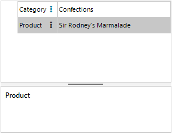

## Environment
 
|Product Version|Product|Author|
|----|----|----|
|2022.2.622|RadPropertyGrid for WinForms|[Desislava Yordanova](https://www.telerik.com/blogs/author/desislava-yordanova)|


## Description

RadPropertyGrid uses a **PropertyGridDropDownListEditor** for editing properties that have a type converter supporting standard values and do not have a UITypeEditor. When the editor is activated, a list of options is presented to the end user to choose from.

This article demonstrates a sample approach how to use the PropertyGridDropDownListEditor to achieve the well-known scenario for cascading comboboxes. Consider that you have **Category** and **Product** properties. When you select a certain category, then the listed products should be relevant for the selected category. 




## Solution

For this example we will use the Northwind database and its Categories and Products tables. When an editor is required in **RadPropertyGrid**, a **PropertyGridDropDownListEditor** will be created filled with the respective **DataSource** collection. For the **Product** property, the assigned Northwind.Products table will be filtered according to the selected category in the **Category** property.
 
 
````C#  

public RadForm1()
{
    InitializeComponent();

    PropertyStoreItem categoryItem = new PropertyStoreItem(typeof(string), "Category","Beverages");
    PropertyStoreItem productItem = new PropertyStoreItem(typeof(string), "Product","Chai");
    RadPropertyStore store = new RadPropertyStore();
    store.Add(categoryItem);
    store.Add(productItem); 
    this.radPropertyGrid1.SelectedObject = store;
    this.radPropertyGrid1.EditorRequired += radPropertyGrid1_EditorRequired;
    this.radPropertyGrid1.EditorInitialized += radPropertyGrid1_EditorInitialized;
    this.radPropertyGrid1.Edited += RadPropertyGrid1_Edited;
}

private void RadPropertyGrid1_Edited(object sender, PropertyGridItemEditedEventArgs e)
{
    if (e.Item.Label == "Category")
    {
        lastSelectedCategory = ((PropertyGridItem)e.Item).Value + "";
    }
}

string lastSelectedCategory = "Beverages";
private void radPropertyGrid1_EditorInitialized(object sender, PropertyGridItemEditorInitializedEventArgs e)
{
    PropertyGridDropDownListEditor editor = e.Editor as PropertyGridDropDownListEditor;
    if (editor != null)
    {
       BaseDropDownListEditorElement el = editor.EditorElement as BaseDropDownListEditorElement;
       el.SelectedValue = ((PropertyGridItem)e.Item).Value;
        if (e.Item.Label=="Category")
        {
            el.SelectedIndexChanged -= El_SelectedIndexChanged;
            el.SelectedIndexChanged += El_SelectedIndexChanged;
        }
    }
}

private void El_SelectedIndexChanged(object sender, Telerik.WinControls.UI.Data.PositionChangedEventArgs e)
{
    RadPropertyStore store = this.radPropertyGrid1.SelectedObject as RadPropertyStore;
    store["Product"].Value = null;
}

private void radPropertyGrid1_EditorRequired(object sender, PropertyGridEditorRequiredEventArgs e)
{
    if (e.Item.Label == "Category")
    {
        PropertyGridDropDownListEditor editor = new PropertyGridDropDownListEditor();
        BaseDropDownListEditorElement el = editor.EditorElement as BaseDropDownListEditorElement; 
        el.DisplayMember = "CategoryName";
        el.ValueMember = "CategoryName";
        el.DataSource = this.categoriesBindingSource;
        e.Editor = editor;
    }
    else if (e.Item.Label == "Product")
    {
        PropertyGridDropDownListEditor editor = new PropertyGridDropDownListEditor();
        BaseDropDownListEditorElement el = editor.EditorElement as BaseDropDownListEditorElement;
        el.DisplayMember = "ProductName";
        el.ValueMember = "ProductName";
        DataTable productsTable = ((DataSet)this.productsBindingSource.DataSource).Tables["Products"];
        DataView dv = new DataView(productsTable);
      
        dv.RowFilter = "CategoryID="+ GetCategoryIDByName(lastSelectedCategory);  
        el.DataSource = dv;
        e.Editor = editor;
    }
}

private int GetCategoryIDByName(string lastSelectedCategory)
{
    int id = -1;
    DataTable categoriesTable = ((DataSet)this.productsBindingSource.DataSource).Tables["Categories"];
    foreach (NwindDataSet.CategoriesRow row in categoriesTable.Rows)
    {
        if (row.CategoryName == lastSelectedCategory)
        {
            id = row.CategoryID;
            break;
        }
    }
    return id;
}

private void RadForm1_Load(object sender, EventArgs e)
{
    this.productsTableAdapter.Fill(this.nwindDataSet.Products);
    this.categoriesTableAdapter.Fill(this.nwindDataSet.Categories);
}

         
````
````VB.NET

Public Sub New()
    InitializeComponent()
    Dim categoryItem As PropertyStoreItem = New PropertyStoreItem(GetType(String), "Category", "Beverages")
    Dim productItem As PropertyStoreItem = New PropertyStoreItem(GetType(String), "Product", "Chai")
    Dim store As RadPropertyStore = New RadPropertyStore()
    store.Add(categoryItem)
    store.Add(productItem)
    Me.RadPropertyGrid1.SelectedObject = store
    AddHandler Me.RadPropertyGrid1.EditorRequired, AddressOf radPropertyGrid1_EditorRequired
    AddHandler Me.RadPropertyGrid1.EditorInitialized, AddressOf radPropertyGrid1_EditorInitialized
    AddHandler Me.RadPropertyGrid1.Edited, AddressOf RadPropertyGrid1_Edited
End Sub

Private Sub RadPropertyGrid1_Edited(ByVal sender As Object, ByVal e As PropertyGridItemEditedEventArgs)
    If e.Item.Label = "Category" Then
        lastSelectedCategory = (CType(e.Item, PropertyGridItem)).Value & ""
    End If
End Sub

Private lastSelectedCategory As String = "Beverages"

Private Sub radPropertyGrid1_EditorInitialized(ByVal sender As Object, ByVal e As PropertyGridItemEditorInitializedEventArgs)
    Dim editor As PropertyGridDropDownListEditor = TryCast(e.Editor, PropertyGridDropDownListEditor)

    If editor IsNot Nothing Then
        Dim el As BaseDropDownListEditorElement = TryCast(editor.EditorElement, BaseDropDownListEditorElement)
        el.SelectedValue = (CType(e.Item, PropertyGridItem)).Value

        If e.Item.Label = "Category" Then
            RemoveHandler el.SelectedIndexChanged, AddressOf El_SelectedIndexChanged
            AddHandler el.SelectedIndexChanged, AddressOf El_SelectedIndexChanged
        End If
    End If
End Sub

Private Sub El_SelectedIndexChanged(ByVal sender As Object, ByVal e As Telerik.WinControls.UI.Data.PositionChangedEventArgs)
    Dim store As RadPropertyStore = TryCast(Me.RadPropertyGrid1.SelectedObject, RadPropertyStore)
    store("Product").Value = Nothing
End Sub

Private Sub radPropertyGrid1_EditorRequired(ByVal sender As Object, ByVal e As PropertyGridEditorRequiredEventArgs)
    If e.Item.Label = "Category" Then
        Dim editor As PropertyGridDropDownListEditor = New PropertyGridDropDownListEditor()
        Dim el As BaseDropDownListEditorElement = TryCast(editor.EditorElement, BaseDropDownListEditorElement)
        el.DisplayMember = "CategoryName"
        el.ValueMember = "CategoryName"
        el.DataSource = Me.CategoriesBindingSource
        e.Editor = editor
    ElseIf e.Item.Label = "Product" Then
        Dim editor As PropertyGridDropDownListEditor = New PropertyGridDropDownListEditor()
        Dim el As BaseDropDownListEditorElement = TryCast(editor.EditorElement, BaseDropDownListEditorElement)
        el.DisplayMember = "ProductName"
        el.ValueMember = "ProductName"
        Dim productsTable As DataTable = (CType(Me.ProductsBindingSource.DataSource, DataSet)).Tables("Products")
        Dim dv As DataView = New DataView(productsTable)
        dv.RowFilter = "CategoryID=" & GetCategoryIDByName(lastSelectedCategory)
        el.DataSource = dv
        e.Editor = editor
    End If
End Sub

Private Function GetCategoryIDByName(ByVal lastSelectedCategory As String) As Integer
    Dim id As Integer = -1
    Dim categoriesTable As DataTable = (CType(Me.ProductsBindingSource.DataSource, DataSet)).Tables("Categories")

    For Each row As NwindDataSet.CategoriesRow In categoriesTable.Rows

        If row.CategoryName = lastSelectedCategory Then
            id = row.CategoryID
            Exit For
        End If
    Next

    Return id
End Function
Private Sub RadForm1_Load(sender As Object, e As EventArgs) Handles MyBase.Load
    Me.ProductsTableAdapter.Fill(Me.NwindDataSet.Products)
    Me.CategoriesTableAdapter.Fill(Me.NwindDataSet.Categories)

End Sub

````

# See Also

* [Editors]()
