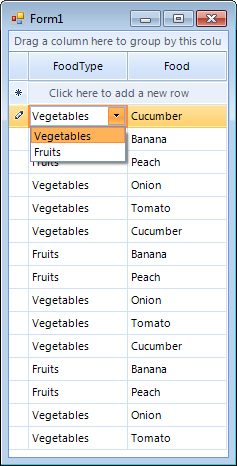
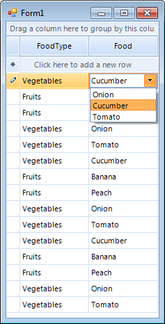
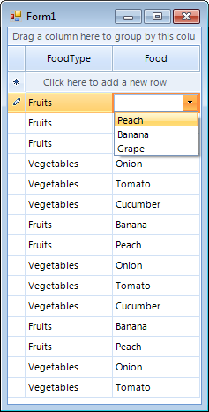

|Product Version|Product|Author|Last modified|
|----|----|----|----|
|2012.3.1017|RadGridView for WinForms|[Stefan Stefanov](https://www.telerik.com/blogs/author/stefan-stefanov)|Dec 15, 2012|
   
   
## HOW-TO  
This article demonstrates how you can implement the popular 'cascading combos' scenario where the range of options available in a drop-down list of a combo column depend on the choice made by the end-user in another combo column for the same row.  
   
## SOLUTION  
1.Lets create two classes that are going to be used in this example. The first is called FoodType and the other one is Food. As the classes names imply, we will have two combo boxes - the first will allow choosing the type of the food (i.e. Fruits and Vegetables) and the second will allow for choosing the food itself (i.e Cucumbers, Bananas etc):  
 
````C#
public class FoodType
{
    private int foodTypeID;
    private string foodType;
 
    public FoodType(int foodTypeID, string foodType)
    {
        this.foodTypeID = foodTypeID;
        this.foodType = foodType;
    }
 
    public int FoodTypeID
    {
        get { return foodTypeID; }
        set { foodTypeID = value; }
    }
 
    public string FoodTypeName
    {
        get { return foodType; }
        set { foodType = value; }
    }
}
 
public class Food
{
    private int foodID;
    private string foodName;
 
    public Food(int foodID, string foodName)
    {
        this.foodID = foodID;
        this.foodName = foodName;
    }
 
    public int FoodID
    {
        get { return foodID; }
        set { foodID = value; }
    }
 
    public string FoodName
    {
        get { return foodName; }
        set { foodName = value; }
    }
}

````
````VB.NET
Public Class FoodType
    Private foodTypeID As Integer
    Private foodType As String

    Public Sub New(ByVal foodTypeID As Integer, ByVal foodType As String)
        Me.foodTypeID = foodTypeID
        Me.foodType = foodType
    End Sub

    Public Property FoodTypeID As Integer
        Get
            Return foodTypeID
        End Get
        Set(ByVal value As Integer)
            foodTypeID = value
        End Set
    End Property

    Public Property FoodTypeName As String
        Get
            Return foodType
        End Get
        Set(ByVal value As String)
            foodType = value
        End Set
    End Property
End Class

Public Class Food
    Private foodID As Integer
    Private foodName As String

    Public Sub New(ByVal foodID As Integer, ByVal foodName As String)
        Me.foodID = foodID
        Me.foodName = foodName
    End Sub

    Public Property FoodID As Integer
        Get
            Return foodID
        End Get
        Set(ByVal value As Integer)
            foodID = value
        End Set
    End Property

    Public Property FoodName As String
        Get
            Return foodName
        End Get
        Set(ByVal value As String)
            foodName = value
        End Set
    End Property
End Class


```` 

2.Create three BindingLists (as fields) that will hold the necessary data and populate them  
 
````C#
BindingList<Food> fullList;
BindingList<Food> fruitsList;
BindingList<Food> vegetablesList;
 
public Form1()
{
    InitializeComponent();
 
    fullList = new BindingList<Food>();
    fullList.Add(new Food(0, "Onion"));
    fullList.Add(new Food(1, "Cucumber"));
    fullList.Add(new Food(2, "Tomato"));
    fullList.Add(new Food(3, "Peach"));
    fullList.Add(new Food(4, "Banana"));
    fullList.Add(new Food(5, "Grape"));
 
    fruitsList = new BindingList<Food>();
    fruitsList.Add(fullList[3]);
    fruitsList.Add(fullList[4]);
    fruitsList.Add(fullList[5]);
 
    vegetablesList = new BindingList<Food>();
    vegetablesList.Add(fullList[0]);
    vegetablesList.Add(fullList[1]);
    vegetablesList.Add(fullList[2]);
 
    BindingList<FoodType> typesList = new BindingList<FoodType>();
    typesList.Add(new FoodType(0, "Vegetables"));
    typesList.Add(new FoodType(1, "Fruits"));
 
    GridViewComboBoxColumn foodType = new GridViewComboBoxColumn();
    foodType.FieldName = "FoodType";
    this.radGridView1.Columns.Add(foodType);
    foodType.DataSource = typesList;
    foodType.Width = 100;
    foodType.DisplayMember = "FoodTypeName";
    foodType.ValueMember = "FoodTypeID";
 
    GridViewComboBoxColumn food = new GridViewComboBoxColumn();
    food.FieldName = "Food";
    this.radGridView1.Columns.Add(food);
    food.DataSource = fullList;
    food.Width = 100;
    food.DisplayMember = "FoodName";
    food.ValueMember = "FoodID";
}

````
````VB.NET
    Private fullList As BindingList(Of Food)
    Private fruitsList As BindingList(Of Food)
    Private vegetablesList As BindingList(Of Food)

    Public Sub New()
        InitializeComponent()
        fullList = New BindingList(Of Food)()
        fullList.Add(New Food(0, "Onion"))
        fullList.Add(New Food(1, "Cucumber"))
        fullList.Add(New Food(2, "Tomato"))
        fullList.Add(New Food(3, "Peach"))
        fullList.Add(New Food(4, "Banana"))
        fullList.Add(New Food(5, "Grape"))
        fruitsList = New BindingList(Of Food)()
        fruitsList.Add(fullList(3))
        fruitsList.Add(fullList(4))
        fruitsList.Add(fullList(5))
        vegetablesList = New BindingList(Of Food)()
        vegetablesList.Add(fullList(0))
        vegetablesList.Add(fullList(1))
        vegetablesList.Add(fullList(2))
        Dim typesList As BindingList(Of FoodType) = New BindingList(Of FoodType)()
        typesList.Add(New FoodType(0, "Vegetables"))
        typesList.Add(New FoodType(1, "Fruits"))
        Dim foodType As GridViewComboBoxColumn = New GridViewComboBoxColumn()
        foodType.FieldName = "FoodType"
        Me.radGridView1.Columns.Add(foodType)
        foodType.DataSource = typesList
        foodType.Width = 100
        foodType.DisplayMember = "FoodTypeName"
        foodType.ValueMember = "FoodTypeID"
        Dim food As GridViewComboBoxColumn = New GridViewComboBoxColumn()
        food.FieldName = "Food"
        Me.radGridView1.Columns.Add(food)
        food.DataSource = fullList
        food.Width = 100
        food.DisplayMember = "FoodName"
        food.ValueMember = "FoodID"
    End Sub

````

3.Create the **GridViewComboBoxColumn** columns and make their settings. The first column is responsible for the food types, while the second for the food according to the food type:  
 
````C#
GridViewComboBoxColumn foodType = new GridViewComboBoxColumn();
foodType.FieldName = "FoodType";
this.radGridView1.Columns.Add(foodType);
foodType.DataSource = typesList;
foodType.Width = 100;
foodType.DisplayMember = "FoodTypeName";
foodType.ValueMember = "FoodTypeID";
 
GridViewComboBoxColumn food = new GridViewComboBoxColumn();
food.FieldName = "Food";
this.radGridView1.Columns.Add(food);
food.DataSource = fullList;
food.Width = 100;
food.DisplayMember = "FoodName";
food.ValueMember = "FoodID";

````
````VB.NET
Dim foodType As GridViewComboBoxColumn = New GridViewComboBoxColumn()
foodType.FieldName = "FoodType"
Me.radGridView1.Columns.Add(foodType)
foodType.DataSource = typesList
foodType.Width = 100
foodType.DisplayMember = "FoodTypeName"
foodType.ValueMember = "FoodTypeID"
Dim food As GridViewComboBoxColumn = New GridViewComboBoxColumn()
food.FieldName = "Food"
Me.radGridView1.Columns.Add(food)
food.DataSource = fullList
food.Width = 100
food.DisplayMember = "FoodName"
food.ValueMember = "FoodID"

```` 

4.Last subscribe for the **CellEditorInitialized** event of **RadGridView**, where modifications for the dynamic editor will be placed:  
 
````C#
void radGridView1_CellEditorInitialized(object sender, Telerik.WinControls.UI.GridViewCellEventArgs e)
{
    if (e.Column.HeaderText == "Food")
    {
        if (this.radGridView1.CurrentRow.Cells["FoodType"].Value != DBNull.Value
            && this.radGridView1.CurrentRow.Cells["FoodType"].Value != null)
        {
            RadDropDownListEditor editor = (RadDropDownListEditor)this.radGridView1.ActiveEditor;
            RadDropDownListEditorElement editorElement = (RadDropDownListEditorElement)editor.EditorElement;
            if (int.Parse(this.radGridView1.CurrentRow.Cells["FoodType"].Value.ToString()) == 0)
            {
                editorElement.DataSource = vegetablesList;
            }
            else
            {
                editorElement.DataSource = fruitsList;
            }
            editorElement.SelectedValue = null;
            editorElement.SelectedValue = this.radGridView1.CurrentCell.Value;
        }
    }
}
````
````VB.NET
Private Sub radGridView1_CellEditorInitialized(ByVal sender As Object, ByVal e As Telerik.WinControls.UI.GridViewCellEventArgs)
    If e.Column.HeaderText = "Food" Then

        If Me.radGridView1.CurrentRow.Cells("FoodType").Value <> DBNull.Value AndAlso Me.radGridView1.CurrentRow.Cells("FoodType").Value IsNot Nothing Then
            Dim editor As RadDropDownListEditor = CType(Me.radGridView1.ActiveEditor, RadDropDownListEditor)
            Dim editorElement As RadDropDownListEditorElement = CType(editor.EditorElement, RadDropDownListEditorElement)

            If Integer.Parse(Me.radGridView1.CurrentRow.Cells("FoodType").Value.ToString()) = 0 Then
                editorElement.DataSource = vegetablesList
            Else
                editorElement.DataSource = fruitsList
            End If

            editorElement.SelectedValue = Nothing
            editorElement.SelectedValue = Me.radGridView1.CurrentCell.Value
        End If
    End If
End Sub

```` 

5.Last, but not least, we should subscribe to the **CellValueChanged** event which is fired after the editing process of a cell is finished and there is a new value committed to the cell. In the **CellValueChanged** event handler we should check if the cell for which the value has been changed is in the column FoodType. If 'yes', this means that the value of the Food cell in the same row is not valid anymore (for example, you cannot have "Vegetable" entered for the FoodType leaving the value of the Food cell to "Apple") and we should delete it:

````C#
void radGridView1_CellValueChanged(object sender, GridViewCellEventArgs e)
{
    if (e.Column.HeaderText == "FoodType")
    {
        e.Row.Cells["Food"].Value = null;
    }
}

````
````VB.NET
Private Sub radGridView1_CellValueChanged(ByVal sender As Object, ByVal e As GridViewCellEventArgs)
    If e.Column.HeaderText = "FoodType" Then
        e.Row.Cells("Food").Value = Nothing
    End If
End Sub

````

The result is:

  



>note You can download a complete VB and C# project from the following [link](https://github.com/telerik/winforms-sdk/tree/master/GridView/CascadingComboboxes).
