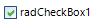
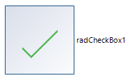

## Environment
<table>
	<tr>
		<td>Product Version</td>
		<td>2021.3.1123</td>
	</tr>
	<tr>
		<td>Product</td>
		<td>RadCheckBox for WinForms</td>
	</tr>
</table>


## Description

This example demonstrates how to change the size of [RadCheckBox]() and its CheckMarkPrimitive.  

## Solution

By default, RadCheckBox looks like the below screenshot:



It is possible to specify minimum size for the CheckElement and thus enlarge it: 

#### Changing the Size when the ControlDefault theme is applied


````C#

this.radCheckBox1.ButtonElement.CheckMarkPrimitive.CheckElement.UseFixedCheckSize = false;
this.radCheckBox1.ButtonElement.CheckMarkPrimitive.CheckElement.MinSize = new Size(100, 100);
this.radCheckBox1.ToggleState = Telerik.WinControls.Enumerations.ToggleState.On; 

````
````VB.NET

Me.radCheckBox1.ButtonElement.CheckMarkPrimitive.CheckElement.UseFixedCheckSize = False
Me.radCheckBox1.ButtonElement.CheckMarkPrimitive.CheckElement.MinSize = New Size(100, 100)
Me.radCheckBox1.ToggleState = Telerik.WinControls.Enumerations.ToggleState.[On]

````



#### Changing the Size when the Fluent theme is applied

The previously provided code snippet doesn't produce the illustrated result when the Fluent theme is applied. This is because the Fluent theme uses an image with fixed 14x14 size for the checkmark. You can apply a bigger **Image** to the RadCheckBox.ButtonElement.CheckMarkPrimitive.**ImageElement**.

# See Also
* [RadCheckBox]()
