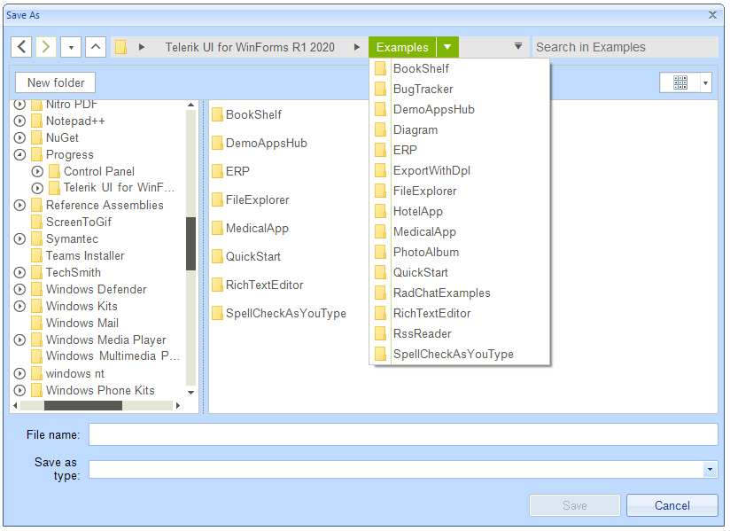

## Environment
 
|Product Version|Product|Author|
|----|----|----|
|2020.2.512|RadSaveFileDialog for WinForms|[Nadya Karaivanova](https://www.telerik.com/blogs/author/nadya-karaivanova)|
 
## Description

A common requirement is to change the font style and size in **RadFileDialogs**. Note that [RadSaveFileDialog](), [RadOpenFileDialog](), and [RadOpenFolderDialog]() are represented by a [RadForm]() that contains a set of elements. 

 


## Solution 

The possible solution in order to change the font of a particular dialog is to iterate recursively all the controls which are contained in the respective dialog and change the font of each of them.  Please note that for some controls it is enough to just set the **Font** property, while on others (like **RadTreeView**, **RadListView**), you will need to introduce this setting in a formatting event.

Below is illustrated an example with **RadSaveFileDialog**:

````C#
public partial class RadForm1 : Telerik.WinControls.UI.RadForm
    {
        Font font = new Font("Arial", 10f);
        public RadForm1()
        {
            InitializeComponent();
            
            List<Control> controls = this.GetAllControls(radSaveFileDialog1.SaveFileDialogForm);
            controls.Add(this);
            foreach (var control in controls)
            {
                control.Font = this.font;
            }
            //RadListView
            RadListView listView = controls.FirstOrDefault(c => c is RadListView) as RadListView;
            listView.VisualItemFormatting += this.ListView_VisualItemFormatting;
            listView.CellFormatting += this.ListView_CellFormatting;

            //RadTreeView
            RadTreeView treeView = controls.FirstOrDefault(c => c is RadTreeView) as RadTreeView;
            treeView.NodeFormatting += this.TreeView_NodeFormatting;

            //RadBreadCrumb
            RadBreadCrumb breadcrumb = controls.FirstOrDefault(c => c is RadBreadCrumb) as RadBreadCrumb;
            breadcrumb.HistoryItemCreated += this.Breadcrumb_HistoryItemCreated;
            breadcrumb.AutoCompleteSuggestHelper.DropDownList.ItemDataBound += this.AutoCompleteSuggestHelperDropDownList_ItemDataBound;
            breadcrumb.SplitButtonCreated += this.Breadcrumb_SplitButtonCreated;
            breadcrumb.BreadCrumbElement.HeaderDropDownButtonElement.DropDownOpening += this.HeaderDropDownButtonElement_DropDownOpening;

            //RadDropDownButtons
            var dropDownButtons = controls.Where(c => c is RadDropDownButton);
            foreach (RadDropDownButton dropDownButton in dropDownButtons)
            {
                dropDownButton.DropDownOpening += this.DropDownButton_DropDownOpening;
            }

            radSaveFileDialog1.ShowDialog();

        }
        private void HeaderDropDownButtonElement_DropDownOpening(object sender, CancelEventArgs e)
        {
            BreadCrumbDropDownButtonElement headerButton = sender as BreadCrumbDropDownButtonElement;
            foreach (RadItem item in headerButton.Items)
            {
                item.Font = this.font;
            }
        }

        private void Breadcrumb_SplitButtonCreated(object sender, SplitButtonCreatedEventArgs e)
        {
            foreach (RadItem item in e.SplitButtonElement.Items)
            {
                item.Font = this.font;
            }
        }

        private void AutoCompleteSuggestHelperDropDownList_ItemDataBound(object sender, ListItemDataBoundEventArgs args)
        {
            args.NewItem.Font = this.font;
        }

        private void Breadcrumb_HistoryItemCreated(object sender, AssociatedMenuItemEventArgs e)
        {
            e.MenuItem.Font = this.font;
        }

        private void DropDownButton_DropDownOpening(object sender, EventArgs e)
        {
            RadDropDownButton dropDownButton = sender as RadDropDownButton;
            foreach (RadItem item in dropDownButton.Items)
            {
                item.Font = this.font;
            }
        }

        private void TreeView_NodeFormatting(object sender, TreeNodeFormattingEventArgs e)
        {
            e.NodeElement.ContentElement.Font = this.font;
        }

        private void ListView_CellFormatting(object sender, ListViewCellFormattingEventArgs e)
        {
            e.CellElement.Font = this.font;
        }

        private void ListView_VisualItemFormatting(object sender, ListViewVisualItemEventArgs e)
        {
            e.VisualItem.Font = this.font;
        }

        public List<Control> GetAllControls(Control control)
        {
            var controls = control.Controls.Cast<Control>();
            return controls.SelectMany(ctrl => GetAllControls(ctrl)).Concat(controls).ToList();
        }
    }
   
````
````VB.NET
Public Class RadForm1
    Private font As Font = New Font("Arial", 10.0F)
    Public Sub New()
        InitializeComponent()
        Dim controls As List(Of Control) = Me.GetAllControls(RadSaveFileDialog1.SaveFileDialogForm)
        controls.Add(Me)
        For Each control In controls
            control.Font = Me.font
        Next

        'RadListView
        Dim listView As RadListView = TryCast(controls.FirstOrDefault(Function(c) TypeOf c Is RadListView), RadListView)
        AddHandler listView.VisualItemFormatting, AddressOf Me.ListView_VisualItemFormatting
        AddHandler listView.CellFormatting, AddressOf Me.ListView_CellFormatting

        'RadTreeView
        Dim treeView As RadTreeView = TryCast(controls.FirstOrDefault(Function(c) TypeOf c Is RadTreeView), RadTreeView)
        AddHandler treeView.NodeFormatting, AddressOf Me.TreeView_NodeFormatting

        'RadBreadCrumb
        Dim breadcrumb As RadBreadCrumb = TryCast(controls.FirstOrDefault(Function(c) TypeOf c Is RadBreadCrumb), RadBreadCrumb)
        AddHandler breadcrumb.HistoryItemCreated, AddressOf Breadcrumb_HistoryItemCreated
        AddHandler breadcrumb.AutoCompleteSuggestHelper.DropDownList.ItemDataBound, AddressOf Me.AutoCompleteSuggestHelperDropDownList_ItemDataBound
        AddHandler breadcrumb.SplitButtonCreated, AddressOf Me.Breadcrumb_SplitButtonCreated
        AddHandler breadcrumb.BreadCrumbElement.HeaderDropDownButtonElement.DropDownOpening, AddressOf Me.HeaderDropDownButtonElement_DropDownOpening

        'RadDropDownButtons
        Dim dropDownButtons = controls.Where(Function(c) TypeOf c Is RadDropDownButton)
        For Each dropDownButton As RadDropDownButton In dropDownButtons
            AddHandler dropDownButton.DropDownOpening, AddressOf Me.DropDownButton_DropDownOpening
        Next

        RadSaveFileDialog1.ShowDialog()
    End Sub

    Private Sub HeaderDropDownButtonElement_DropDownOpening(ByVal sender As Object, ByVal e As CancelEventArgs)
        Dim headerButton As BreadCrumbDropDownButtonElement = TryCast(sender, BreadCrumbDropDownButtonElement)
        For Each item As RadItem In headerButton.Items
            item.Font = Me.font
        Next
    End Sub

    Private Sub Breadcrumb_SplitButtonCreated(ByVal sender As Object, ByVal e As SplitButtonCreatedEventArgs)
        For Each item As RadItem In e.SplitButtonElement.Items
            item.Font = Me.font
        Next
    End Sub

    Private Sub AutoCompleteSuggestHelperDropDownList_ItemDataBound(ByVal sender As Object, ByVal args As ListItemDataBoundEventArgs)
        args.NewItem.Font = Me.font
    End Sub

    Private Sub Breadcrumb_HistoryItemCreated(ByVal sender As Object, ByVal e As AssociatedMenuItemEventArgs)
        e.MenuItem.Font = Me.font
    End Sub

    Private Sub DropDownButton_DropDownOpening(ByVal sender As Object, ByVal e As EventArgs)
        Dim dropDownButton As RadDropDownButton = TryCast(sender, RadDropDownButton)
        For Each item As RadItem In dropDownButton.Items
            item.Font = Me.font
        Next
    End Sub

    Private Sub TreeView_NodeFormatting(ByVal sender As Object, ByVal e As TreeNodeFormattingEventArgs)
        e.NodeElement.ContentElement.Font = Me.font
    End Sub

    Private Sub ListView_CellFormatting(ByVal sender As Object, ByVal e As ListViewCellFormattingEventArgs)
        e.CellElement.Font = Me.font
    End Sub

    Private Sub ListView_VisualItemFormatting(ByVal sender As Object, ByVal e As ListViewVisualItemEventArgs)
        e.VisualItem.Font = Me.font
    End Sub

    Public Function GetAllControls(ByVal control As Control) As List(Of Control)
        Dim controls = control.Controls.Cast(Of Control)()
        Return controls.SelectMany(Function(ctrl) GetAllControls(ctrl)).Concat(controls).ToList()
    End Function
End Class

````

