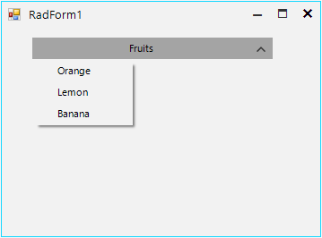

## Environment
 
|Product Version|Product|Author|
|----|----|----|
|2021.2.511|RadDropDownButton for WinForms|[Nadya Karaivanova](https://www.telerik.com/blogs/author/nadya-karaivanova)|


## Description

By default the popup appears at the left side below the control if you are using **RadDropDownButton**, **RadDropDownList**, etc. 



The **DropDownDirection** property indicates the direction in which the popup would appear: *left*, *right*, *up* or *down*. However, the user may want to show the popup on a different location, for example displaying it at the right side below the control instead of left. 

This article demonstrates how you can change the location of the popup before it gets opened. 


## Solution

To achieve this you should handle the **PopupOpening** event. Then, cast the **CancelEventArgs** to the **RadPopupOpeningEventArgs**. Thus, you can use the **CustomLocation** property to specify the new point by calculating the exact location where you want the popup to appear:


````C#
this.radDropDownButton1.DropDownButtonElement.DropDownMenu.PopupOpening += this.DropDownMenu_PopupOpening;

private void DropDownMenu_PopupOpening(object sender, CancelEventArgs args)
{
    RadPopupOpeningEventArgs eventArgs = (RadPopupOpeningEventArgs)args;
    eventArgs.CustomLocation = new Point(eventArgs.CustomLocation.X + this.radDropDownButton1.Width - this.radDropDownButton1.DropDownButtonElement.DropDownMenu.Width, eventArgs.CustomLocation.Y);
}

````
````VB.NET   
AddHandler Me.radDropDownButton1.DropDownButtonElement.DropDownMenu.PopupOpening, AddressOf Me.DropDownMenu_PopupOpening 

Private Sub DropDownMenu_PopupOpening(ByVal sender As Object, ByVal args As CancelEventArgs)
    Dim eventArgs As RadPopupOpeningEventArgs = CType(args, RadPopupOpeningEventArgs)
    eventArgs.CustomLocation = New Point(eventArgs.CustomLocation.X + Me.radDropDownButton1.Width - Me.radDropDownButton1.DropDownButtonElement.DropDownMenu.Width, eventArgs.CustomLocation.Y)
End Sub
    
````

