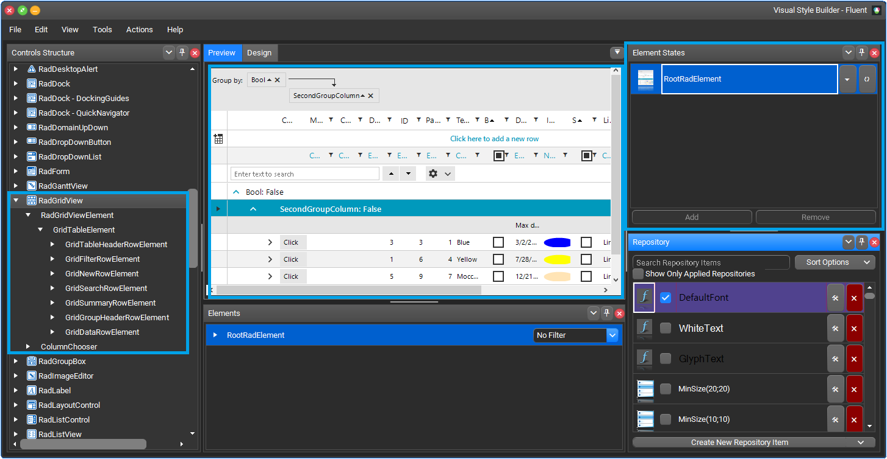
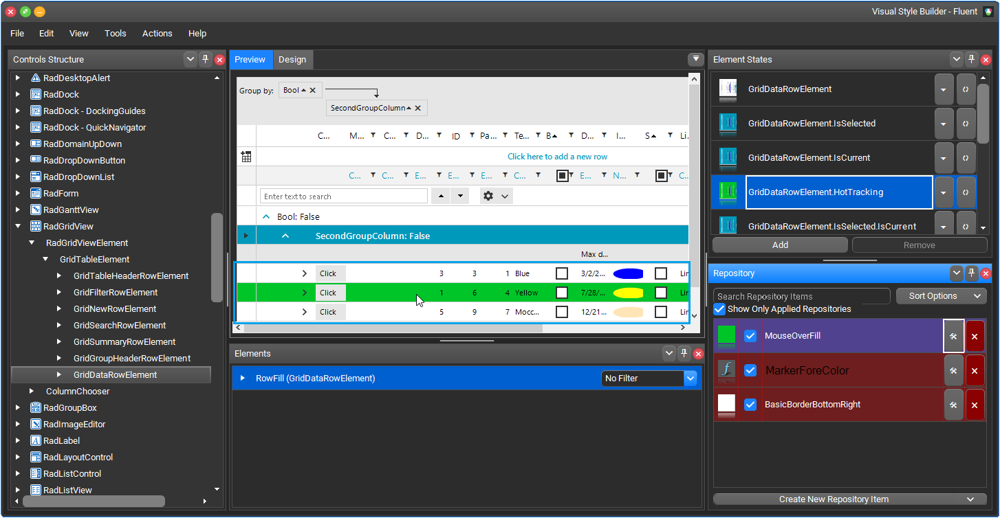

## Environment
 
|Product Version|Product|Author|
|----|----|----|
|2021.1.223|RadGridView for WinForms|[Nadya Karaivanova](https://www.telerik.com/blogs/author/nadya-karaivanova)|
 
## Description

A common requirement is to be able to change the hot trocking color when the mouse hovers the rows in **RadGridView**. Usually the element's colors, borders, etc. are defined through the theme. This is why it is suitable to modify the existing theme if you want to customize its visual appearance. This can be achieved with [Visual Style Builder](). VSB allows creating custom or editing the predefined themes. 

This tutorial demonstrates how you can change the hot tracking color of rows in RadGridView. The theme that I use is **Fluent** theme from **Telerik UI for Winforms** suite.

>note It is important to know which is the exact theme that you want to customize since the design of the separate themes in the suite may differ.

## Solution 

First, you should load the desired predefined theme by following the steps described in [Loading Predefined Themes]() article. In this case, I am loading the Fluent theme.

Once the theme is loaded, you can find the **RadGridView** control in the *Control Structure* section. In the *Preview* window you can see how the control currently looks. The *Element States* window shows the possible states that the selected element may have. The *Repository* section lists all the repository items available for the currently edited theme. For more information please check [Architecture]() article. The following picture illustrates this:

In order to change the hot tracking color you should refer to **GridDataRowElement** and find the **GridDataRowElement.HotTracking** element state. In the *Repository* window you can see the applied styles. For the MouseOverFill repo there is a gray color. You can see the grey color when hoving over the rows in the grid. 

Click on the edit button on MouseOverFill repo. Then, the *Edit Repository Item* dialog will show and you can start editing the color according to your needs.

When you save the applied changes you can see the new style applied in the **RadGridView**:

Finally, you need to save the customized theme. Please check [Saving and Loading Theme Files]() article. Now, the theme is ready and you can use it in your application with the customized color. 

