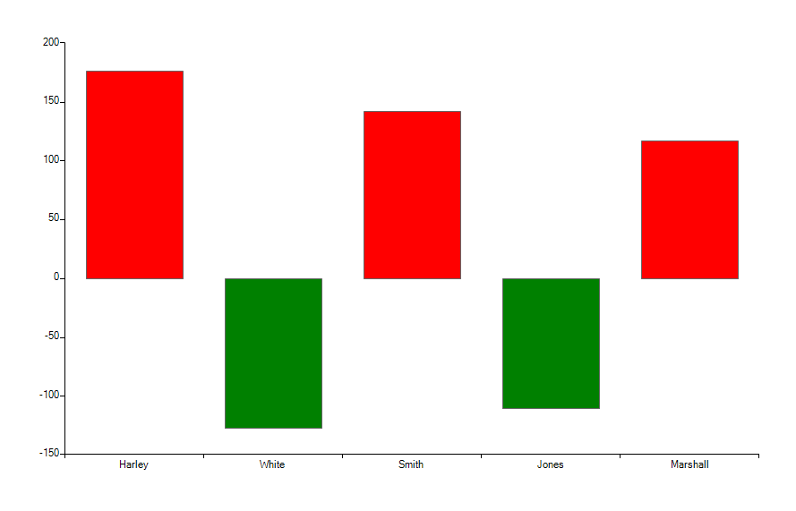

 
|Product Version|Product|Author|
|----|----|----|
|2019.2.618|RadGridView for WinForms|[Dimitar Karamfilov]|

# Problem

You need to set the BackColor of each bar chart depending on the DataPoint value.

# Solution

Iterate the series children and set the color. This should be done after the chart is initialized. The following example sets the color of the values depending on their value. 



````C#
BarSeries barSeries = new BarSeries("Performance", "RepresentativeName");
barSeries.Name = "Q1";
barSeries.DataPoints.Add(new CategoricalDataPoint(177, "Harley"));
barSeries.DataPoints.Add(new CategoricalDataPoint(-128, "White"));
barSeries.DataPoints.Add(new CategoricalDataPoint(143, "Smith"));
barSeries.DataPoints.Add(new CategoricalDataPoint(-111, "Jones"));
barSeries.DataPoints.Add(new CategoricalDataPoint(118, "Marshall"));
this.radChartView1.Series.Add(barSeries);

foreach (BarPointElement item in radChartView1.Series[0].Children)
{
    var value = ((CategoricalDataPoint)item.DataPoint).Value;
    if (value.Value < 0)
    {
        item.BackColor = Color.Green;
    }
    else
    {
        item.BackColor = Color.Red;
    }

}

````
````VB.NET

Public Sub New()
	InitializeComponent()
	Dim barSeries As New BarSeries("Performance", "RepresentativeName")
	barSeries.Name = "Q1"
	barSeries.DataPoints.Add(New CategoricalDataPoint(177, "Harley"))
	barSeries.DataPoints.Add(New CategoricalDataPoint(-128, "White"))
	barSeries.DataPoints.Add(New CategoricalDataPoint(143, "Smith"))
	barSeries.DataPoints.Add(New CategoricalDataPoint(-111, "Jones"))
	barSeries.DataPoints.Add(New CategoricalDataPoint(118, "Marshall"))
	Me.radChartView1.Series.Add(barSeries)

	For Each item As BarPointElement In radChartView1.Series(0).Children
		Dim value = CType(item.DataPoint, CategoricalDataPoint).Value
		If value.Value < 0 Then
			item.BackColor = Color.Green
		Else
			item.BackColor = Color.Red
		End If

	Next item
End Sub

````

