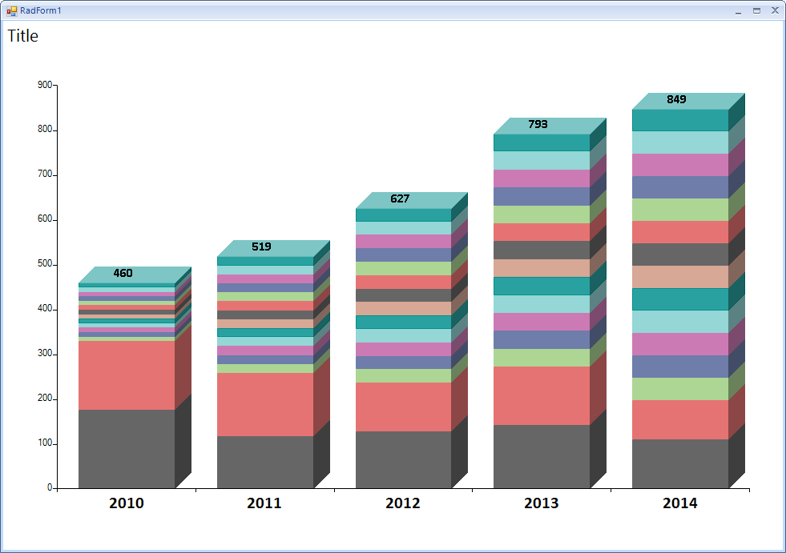

## Environment
<table>
	<tr>
		<td>Product Version</td>
		<td>2018.3.1016</td>
	</tr>
	<tr>
		<td>Product</td>
		<td>RadChartView for WinForms</td>
	</tr>
</table>

|Product Version|Product|Author|
|----|----|----|
|2018.3.1016|RadChartView for WinForms|[Hristo Merdjanov](https://www.telerik.com/blogs/author/hristo-merdjanov)|

## Description

An example demonstrating how a stacked 3D bar chart can be implemented.  

>note A complete solution in C# and VB.NET is available in our SDK repository: https://github.com/telerik/winforms-sdk/tree/master/ChartView/3DBarChart.

## Solution

A custom *Cartesian* renderer will be responsible for creating special bar elements which will be painted with a 3D effect. 

>caption Figure 1: 3D Bar Chart

# See Also
* [Custom Rendering]()