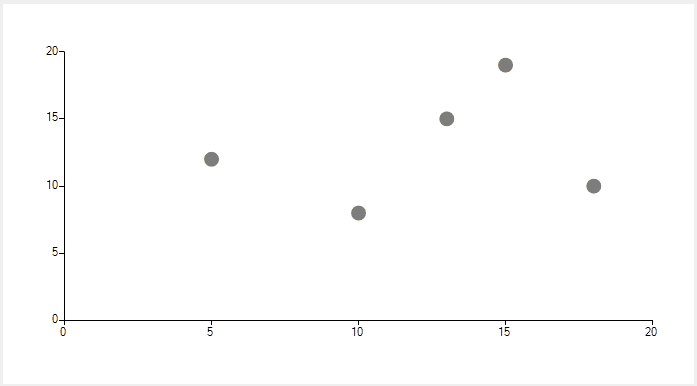

## Environment
 
|Product Version|Product|Author|
|----|----|----|
|2023.1.314|RadChartView for WinForms|[Dinko Krastev](https://www.telerik.com/blogs/author/dinko-krastev)|
 

## Description

In this tutorial, we will demonstrate how to add DataPoint on mouse click location. In addition, we will add a border to the newly added data point to distinguish the points added using the mouse.



## Solution 

To make this work, you will need to get the X and Y axis value depending on the mouse location. Using these values, we can create new DataPoint and add it to the DataPoints collection of the series. For the purpose of this tutorial we are going to use __ScatterSeries__.

````C#
public partial class Form1 : Form
{
    public Form1()
    {
        InitializeComponent();
        ScatterSeries scatterSeries = new ScatterSeries();
        scatterSeries.BorderColor = Color.Red;
        scatterSeries.Shape = new CircleShape();
        scatterSeries.PointSize = new SizeF(15,15);
        scatterSeries.Name = "";
        scatterSeries.DataPoints.Add(new ScatterDataPoint(15, 19));
        scatterSeries.DataPoints.Add(new ScatterDataPoint(18, 10));
        scatterSeries.DataPoints.Add(new ScatterDataPoint(13, 15));
        scatterSeries.DataPoints.Add(new ScatterDataPoint(10, 8));
        scatterSeries.DataPoints.Add(new ScatterDataPoint(5, 12));
        this.radChartView1.Series.Add(scatterSeries);
        this.radChartView1.MouseDown += RadChartView1_MouseDown;
    }

    private object GetHorizontalAxisValueFromMouse(MouseEventArgs e)
    {
        LinearAxis axis = radChartView1.Axes[1] as LinearAxis;
        double delta = axis.ActualRange.Maximum - axis.ActualRange.Minimum;
        double totalHeight = axis.Model.LayoutSlot.Height;
        double ratio = 1 - (e.Location.Y - this.radChartView1.Area.View.Viewport.Y - axis.Model.LayoutSlot.Y) / totalHeight;
        double value = axis.ActualRange.Minimum + delta * ratio;

        return value;
    }

    private object GetVerticalAxisValueFromMouse(MouseEventArgs e)
    {
        LinearAxis axis = radChartView1.Axes[0] as LinearAxis;
        double delta = axis.ActualRange.Maximum - axis.ActualRange.Minimum;
        double totalWidth = axis.Model.LayoutSlot.Width;
        double ratio = (e.Location.X - this.radChartView1.Area.View.Viewport.X - axis.Model.LayoutSlot.X) / totalWidth;
        double value = axis.ActualRange.Minimum + delta * ratio;

        return value;
    }

    private void RadChartView1_MouseDown(object sender, MouseEventArgs e)
    {
        ScatterSeries scatterSeries = this.radChartView1.Series[0] as ScatterSeries;                   
        object hValue = this.GetVerticalAxisValueFromMouse(e);
        object vValue = this.GetHorizontalAxisValueFromMouse(e);
        double horizontalValue = Math.Round(double.Parse(hValue.ToString()), 2);
        double verticvalValue = Math.Round(double.Parse(vValue.ToString()), 2);
        scatterSeries.DataPoints.Add(new ScatterDataPoint(horizontalValue, verticvalValue));
        scatterSeries.Children.Last().BorderWidth = 2;
                          
    }
}
      
       
````
````VB.NET
    Public Partial Class Form1
    Inherits Form

    Public Sub New()
        InitializeComponent()
        Dim scatterSeries As ScatterSeries = New ScatterSeries()
        scatterSeries.BorderColor = Color.Red
        scatterSeries.Shape = New CircleShape()
        scatterSeries.PointSize = New SizeF(15, 15)
        scatterSeries.Name = ""
        scatterSeries.DataPoints.Add(New ScatterDataPoint(15, 19))
        scatterSeries.DataPoints.Add(New ScatterDataPoint(18, 10))
        scatterSeries.DataPoints.Add(New ScatterDataPoint(13, 15))
        scatterSeries.DataPoints.Add(New ScatterDataPoint(10, 8))
        scatterSeries.DataPoints.Add(New ScatterDataPoint(5, 12))
        Me.radChartView1.Series.Add(scatterSeries)
        AddHandler Me.radChartView1.MouseDown, AddressOf RadChartView1_MouseDown
    End Sub

    Private Function GetHorizontalAxisValueFromMouse(ByVal e As MouseEventArgs) As Object
        Dim axis As LinearAxis = TryCast(radChartView1.Axes(1), LinearAxis)
        Dim delta As Double = axis.ActualRange.Maximum - axis.ActualRange.Minimum
        Dim totalHeight As Double = axis.Model.LayoutSlot.Height
        Dim ratio As Double = 1 - (e.Location.Y - Me.radChartView1.Area.View.Viewport.Y - axis.Model.LayoutSlot.Y) / totalHeight
        Dim value As Double = axis.ActualRange.Minimum + delta * ratio
        Return value
    End Function

    Private Function GetVerticalAxisValueFromMouse(ByVal e As MouseEventArgs) As Object
        Dim axis As LinearAxis = TryCast(radChartView1.Axes(0), LinearAxis)
        Dim delta As Double = axis.ActualRange.Maximum - axis.ActualRange.Minimum
        Dim totalWidth As Double = axis.Model.LayoutSlot.Width
        Dim ratio As Double = (e.Location.X - Me.radChartView1.Area.View.Viewport.X - axis.Model.LayoutSlot.X) / totalWidth
        Dim value As Double = axis.ActualRange.Minimum + delta * ratio
        Return value
    End Function

    Private Sub RadChartView1_MouseDown(ByVal sender As Object, ByVal e As MouseEventArgs)
        Dim scatterSeries As ScatterSeries = TryCast(Me.radChartView1.Series(0), ScatterSeries)
        Dim hValue As Object = Me.GetVerticalAxisValueFromMouse(e)
        Dim vValue As Object = Me.GetHorizontalAxisValueFromMouse(e)
        Dim horizontalValue As Double = Math.Round(Double.Parse(hValue.ToString()), 2)
        Dim verticvalValue As Double = Math.Round(Double.Parse(vValue.ToString()), 2)
        scatterSeries.DataPoints.Add(New ScatterDataPoint(horizontalValue, verticvalValue))
        scatterSeries.Children.Last().BorderWidth = 2
    End Sub
End Class

   
    
````


