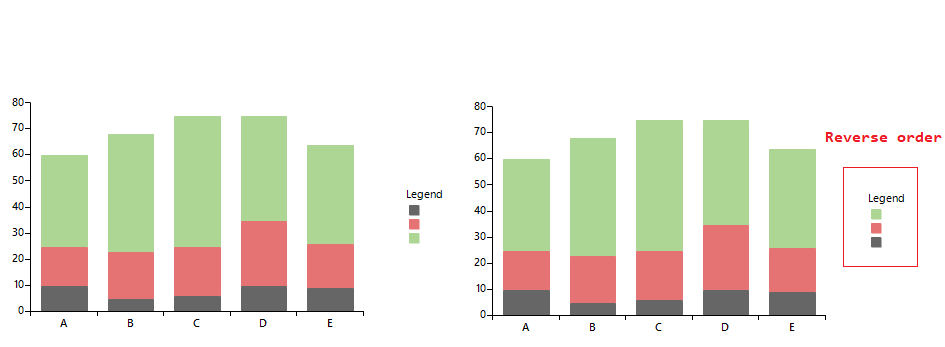

## Environment

|Product Version|Product|Author|
|----|----|----|
|2022.1.222|RadChartView for WinForms|[Dinko Krastev](https://www.telerik.com/blogs/author/dinko-krastev)|


## Description

When the Legend of the RadChartView is shown, the items inside will be ordered in the same way as the series inside the chart Series collection. In scenario where we have stack bar series, the series will be ordered from bottom to top, while the legend items will be ordered from top to bottom. 

## Solution

We can reverse the order of the legend items so that is more readable for the end user.



````C#
public RadForm1()
{
    InitializeComponent();
    this.Load += RadForm1_Load;
}

private void RadForm1_Load(object sender, EventArgs e)
{
    var legendItems = new List<LegendItem>(this.radChartView1.ChartElement.LegendElement.Items.Reverse());
    this.radChartView1.ChartElement.LegendElement.Items.Clear();
    foreach (var legendItem in legendItems)
    {
        this.radChartView1.ChartElement.LegendElement.Items.Add(legendItem);
    }
}


````
````VB.NET
Public Sub New()
	InitializeComponent()
	AddHandler Me.Load, AddressOf RadForm1_Load
End Sub

Private Sub RadForm1_Load(ByVal sender As Object, ByVal e As EventArgs)
	Dim legendItems = New List(Of LegendItem)(Me.radChartView1.ChartElement.LegendElement.Items.Reverse())
	Me.radChartView1.ChartElement.LegendElement.Items.Clear()

	For Each legendItem In legendItems
		Me.radChartView1.ChartElement.LegendElement.Items.Add(legendItem)
	Next
End Sub


````
