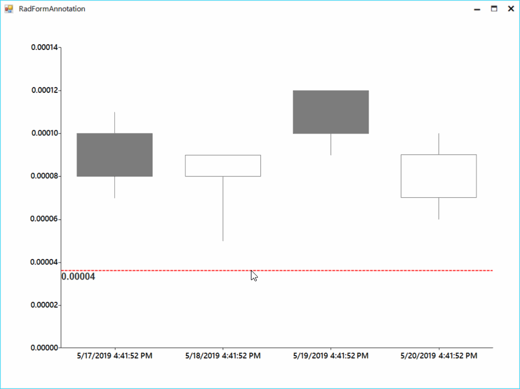

## Environment
 
|Product Version|Product|Author|
|----|----|----|
|2019.2.508|RadChartView for WinForms|[Hristo Merdjanov](https://www.telerik.com/blogs/author/hristo-merdjanov)|
 

## Description

An example demonstrating how a line can be painted in **RadChartView** following the mouse position.

## Solution 

**RadChartView** already supports annotations. The solution in the article will update annotations collection upon moving the mouse. 

>caption Figure 1: Annotation Following the Mouse


#### Implementation

````C#
public partial class RadFormAnnotation : Telerik.WinControls.UI.RadForm
{
    public RadFormAnnotation()
    {
        InitializeComponent();

        FluentTheme ft = new FluentTheme();
        ThemeResolutionService.ApplicationThemeName = ft.ThemeName;

        this.radChartView1.MouseMove += RadChartView1_MouseMove;

        CandlestickSeries candlestickSeries = new CandlestickSeries();
        candlestickSeries.DataPoints.Add(new OhlcDataPoint(.00010, .00011, .00007, .00008, DateTime.Now));
        candlestickSeries.DataPoints.Add(new OhlcDataPoint(.00008, .00009, .00005, .00009, DateTime.Now.AddDays(1)));
        candlestickSeries.DataPoints.Add(new OhlcDataPoint(.00012, .00012, .00009, .00010, DateTime.Now.AddDays(2)));
        candlestickSeries.DataPoints.Add(new OhlcDataPoint(.00007, .00010, .00006, .00009, DateTime.Now.AddDays(3)));

        this.radChartView1.Series.Add(candlestickSeries);
        this.radChartView1.Axes[1].LabelFormat = "{0:N5}";
    }

    private void RadChartView1_MouseMove(object sender, MouseEventArgs e)
    {
        object hValue = this.GetVerticalAxisValueFromMouse(e);

        this.radChartView1.Annotations.Clear();
        CartesianGridLineAnnotation annotation1 = new CartesianGridLineAnnotation();
        annotation1.Value = hValue;
        annotation1.Font = new Font("Arial", 12, FontStyle.Bold);
        annotation1.Axis = this.radChartView1.Axes[1] as CartesianAxis;
        annotation1.BorderColor = Color.Red;
        annotation1.BorderDashStyle = DashStyle.Dash;
        annotation1.BorderWidth = 2;
        annotation1.Label = ((double)hValue).ToString("N5");
        this.radChartView1.Annotations.Add(annotation1);
    }

    private object GetVerticalAxisValueFromMouse(MouseEventArgs e)
    {
        LinearAxis axis = radChartView1.Axes[1] as LinearAxis;
        double delta = axis.ActualRange.Maximum - axis.ActualRange.Minimum;
        double totalHeight = axis.Model.LayoutSlot.Height;
        double ratio = 1 - (e.Location.Y - this.radChartView1.Area.View.Viewport.Y - axis.Model.LayoutSlot.Y) / totalHeight;
        double value = axis.ActualRange.Minimum + delta * ratio;

        return value;
    }
}

````
````VB.NET
Partial Public Class RadForm1

    Public Sub New()
        InitializeComponent()

        AddHandler Me.RadChartView1.MouseMove, AddressOf RadChartView1_MouseMove
        Dim candlestickSeries As CandlestickSeries = New CandlestickSeries()
        candlestickSeries.DataPoints.Add(New OhlcDataPoint(0.0001, 0.00011, 0.00007, 0.00008, DateTime.Now))
        candlestickSeries.DataPoints.Add(New OhlcDataPoint(0.00008, 0.00009, 0.00005, 0.00009, DateTime.Now.AddDays(1)))
        candlestickSeries.DataPoints.Add(New OhlcDataPoint(0.00012, 0.00012, 0.00009, 0.0001, DateTime.Now.AddDays(2)))
        candlestickSeries.DataPoints.Add(New OhlcDataPoint(0.00007, 0.0001, 0.00006, 0.00009, DateTime.Now.AddDays(3)))
        Me.RadChartView1.Series.Add(candlestickSeries)
        Me.RadChartView1.Axes(1).LabelFormat = "{0:N5}"
    End Sub

    Private Sub RadChartView1_MouseMove(ByVal sender As Object, ByVal e As MouseEventArgs)
        Dim hValue As Object = Me.GetVerticalAxisValueFromMouse(e)
        Me.RadChartView1.Annotations.Clear()
        Dim annotation1 As CartesianGridLineAnnotation = New CartesianGridLineAnnotation()
        annotation1.Value = hValue
        annotation1.Font = New Font("Arial", 12, FontStyle.Bold)
        annotation1.Axis = TryCast(Me.RadChartView1.Axes(1), CartesianAxis)
        annotation1.BorderColor = Color.Red
        annotation1.BorderDashStyle = DashStyle.Dash
        annotation1.BorderWidth = 2
        annotation1.Label = (CDbl(hValue)).ToString("N5")
        Me.RadChartView1.Annotations.Add(annotation1)
    End Sub

    Private Function GetVerticalAxisValueFromMouse(ByVal e As MouseEventArgs) As Object
        Dim axis As LinearAxis = TryCast(RadChartView1.Axes(1), LinearAxis)
        Dim delta As Double = axis.ActualRange.Maximum - axis.ActualRange.Minimum
        Dim totalHeight As Double = axis.Model.LayoutSlot.Height
        Dim ratio As Double = 1 - (e.Location.Y - Me.RadChartView1.Area.View.Viewport.Y - axis.Model.LayoutSlot.Y) / totalHeight
        Dim value As Double = axis.ActualRange.Minimum + delta * ratio
        Return value
    End Function
End Class

````

# See Also

* [RadChartView Annotations]() 


