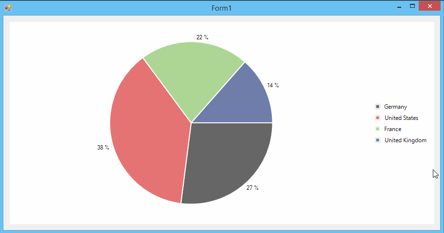

## Environment
|Product Version|Product|Author|
|----|----|----|
|2022.2.511|RadChartView for WinForms|[Dinko Krastev](https://www.telerik.com/blogs/author/dinko-krastev)|


## Description

In the following topic, we will demonstrate how we can offset PieSeries slices by clicking on its corresponding legend item.

## Solution

This behavior can be achieved by handling the __MouseDown__ event of the chart. In the event handler, we will need to find the associated data point with the clicked LegendItemElement.



````C#

public Form1()
{
	InitializeComponent();

	this.radChartView1.AreaType = ChartAreaType.Pie;
	PieSeries series = new PieSeries();
	series.DataPoints.Add(new PieDataPoint(50, "Germany"));
	series.DataPoints.Add(new PieDataPoint(70, "United States"));
	series.DataPoints.Add(new PieDataPoint(40, "France"));
	series.DataPoints.Add(new PieDataPoint(25, "United Kingdom"));
	series.ShowLabels = true;

	this.radChartView1.Series.Add(series);
	this.radChartView1.ShowLegend = true;
	this.radChartView1.MouseDown += radChartView1_MouseDown;
}

private void radChartView1_MouseDown(object sender, MouseEventArgs e)
{
	RadChartView chart = (RadChartView)sender;
	RadElement element = chart.ElementTree.GetElementAtPoint(e.Location);
	LegendItemElement itemElement = chart.ElementTree.GetElementAtPoint(e.Location) as LegendItemElement;
	if (itemElement == null)
	{
		RadElement parent = element.Parent;
		while (parent != null)
		{
			if (parent is LegendItemElement)
			{
				itemElement = (LegendItemElement)parent;
				break;
			}

			parent = parent.Parent;
		}
	}

	if (itemElement != null)
	{
		PieDataPoint dataPoint = ((PiePointElement)itemElement.LegendItem.Element).DataPoint as PieDataPoint;
		if (dataPoint.OffsetFromCenter > 0)
		{
			dataPoint.OffsetFromCenter = 0;
		}
		else
		{ 
			dataPoint.OffsetFromCenter = 0.1;
		}
	}
}

````
````VB.NET

Public Sub New()
	InitializeComponent()
	Me.radChartView1.AreaType = ChartAreaType.Pie
	Dim series As PieSeries = New PieSeries()
	series.DataPoints.Add(New PieDataPoint(50, "Germany"))
	series.DataPoints.Add(New PieDataPoint(70, "United States"))
	series.DataPoints.Add(New PieDataPoint(40, "France"))
	series.DataPoints.Add(New PieDataPoint(25, "United Kingdom"))
	series.ShowLabels = True
	Me.radChartView1.Series.Add(series)
	Me.radChartView1.ShowLegend = True
	AddHandler Me.radChartView1.MouseDown, AddressOf radChartView1_MouseDown
End Sub

Private Sub radChartView1_MouseDown(ByVal sender As Object, ByVal e As MouseEventArgs)
	Dim chart As RadChartView = CType(sender, RadChartView)
	Dim element As RadElement = chart.ElementTree.GetElementAtPoint(e.Location)
	Dim itemElement As LegendItemElement = TryCast(chart.ElementTree.GetElementAtPoint(e.Location), LegendItemElement)

	If itemElement Is Nothing Then
		Dim parent As RadElement = element.Parent

		While parent IsNot Nothing

			If TypeOf parent Is LegendItemElement Then
				itemElement = CType(parent, LegendItemElement)
				Exit While
			End If

			parent = parent.Parent
		End While
	End If

	If itemElement IsNot Nothing Then
		Dim dataPoint As PieDataPoint = TryCast((CType(itemElement.LegendItem.Element, PiePointElement)).DataPoint, PieDataPoint)

		If dataPoint.OffsetFromCenter > 0 Then
			dataPoint.OffsetFromCenter = 0
		Else
			dataPoint.OffsetFromCenter = 0.1
		End If
	End If
End Sub

````

