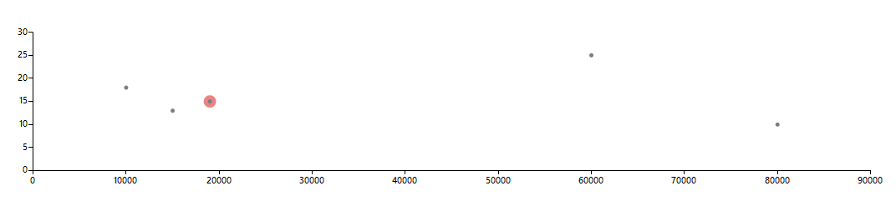

## Environment

|Product Version|Product|Author|
|----|----|----|
|2025.1.211|RadTreeView for WinForms|[Dinko Krastev](https://www.telerik.com/blogs/author/dinko-krastev)|

## Description

This article will demonstrate how to determine the nearest ScatterDataPoint to a mouse click location using the mouse click position. 



## Solution

To achieve this, calculate the axis values corresponding to the mouse click position on the chart. Then iterate over the data points in the series and determine the closest one. 

 Once the closest point is identified, you can create an additional ScatterSeries and add a duplicate ScatterDataPoint with the same values. This secondary series can be used to visually highlight the nearest data point.

The following code snippet demonstrates a full implementation.

````C#
public partial class Form1 : Form
{
    ScatterSeries scatterSeries = new ScatterSeries();
    public Form1()
    {
        InitializeComponent();
        scatterSeries.Name = "";
        scatterSeries.DataPoints.Add(new ScatterDataPoint(19000, 15));
        scatterSeries.DataPoints.Add(new ScatterDataPoint(10000, 18));
        scatterSeries.DataPoints.Add(new ScatterDataPoint(15000, 13));
        scatterSeries.DataPoints.Add(new ScatterDataPoint(80000, 10));
        scatterSeries.DataPoints.Add(new ScatterDataPoint(60000, 25));
        scatterSeries.PointSize = new SizeF(5, 5);
        this.radChartView1.Series.Add(scatterSeries);

        this.radChartView1.MouseDown += RadChartView1_MouseDown;
    }
    private void RadChartView1_MouseDown(object sender, MouseEventArgs e)
    {
        Point pt = this.radChartView1.ChartElement.Wrapper.PointFromControl(e.Location);
        double verticalValue = Convert.ToDouble(GetVerticalAxisValueFromMouse(e));
        double horizontalValue = Convert.ToDouble(GetHorizontalAxisValueFromMouse(e));

        Debug.WriteLine("X: " + horizontalValue + "  Y: " + verticalValue);

        ScatterDataPoint closestPoint = null;
        double minDistance = double.MaxValue;

        var seriesToRemove = this.radChartView1.Series.FirstOrDefault(s => s.Name =="Closest Point");
        if (seriesToRemove != null)
        {
            this.radChartView1.Series.Remove(seriesToRemove);
        }
        foreach (ScatterDataPoint dataPoint in scatterSeries.DataPoints)
        {
            // Calculate the Euclidean distance
            double distance = Math.Sqrt(Math.Pow(dataPoint.XValue - horizontalValue, 2) + Math.Pow((double)dataPoint.YValue - verticalValue, 2));
            // Update the closest point if the current distance is smaller
            if (distance < minDistance)
            {
                minDistance = distance;
                closestPoint = dataPoint;
            }
        }

        if (closestPoint != null)
        {
            var newScatterSeries = new ScatterSeries();
            newScatterSeries.Name = "Closest Point";
            newScatterSeries.DataPoints.Add(new ScatterDataPoint(closestPoint.XValue, (double)closestPoint.YValue));
            newScatterSeries.PointSize = new SizeF(15, 15);
            newScatterSeries.BorderColor = Color.Red;
            this.radChartView1.Series.Add(newScatterSeries);
            this.radChartView1.Invalidate();
            this.radChartView1.Update();
        }
    }

    private object GetHorizontalAxisValueFromMouse(MouseEventArgs e)
    {
        LinearAxis axis = radChartView1.Axes[0] as LinearAxis;
        IChartView view = (IChartView)axis.View;
        double delta = axis.ActualRange.Maximum - axis.ActualRange.Minimum;
        double totalWidth = axis.Model.LayoutSlot.Width;
        double ratio = 1 - (e.Location.X - this.radChartView1.Area.View.Viewport.X - view.PlotOriginX - axis.Model.LayoutSlot.X) / (totalWidth * view.ZoomWidth);
        double value = axis.ActualRange.Minimum + delta * ratio;
        return axis.ActualRange.Maximum - value;
    }
    private object GetVerticalAxisValueFromMouse(MouseEventArgs e)
    {
        LinearAxis axis = radChartView1.Axes[1] as LinearAxis;
        IChartView view = (IChartView)axis.View;
        double delta = axis.ActualRange.Maximum - axis.ActualRange.Minimum;
        double totalHeight = axis.Model.LayoutSlot.Height;
        double ratio = 1 - (e.Location.Y - this.radChartView1.Area.View.Viewport.Y - view.PlotOriginY - axis.Model.LayoutSlot.Y) / (totalHeight * view.ZoomHeight);
        double value = axis.ActualRange.Minimum + delta * ratio;
        return value;
    }
}

````

## See Also

- [RadChartView Overview Documentation](https://docs.telerik.com/devtools/winforms/controls/chartview/overview)