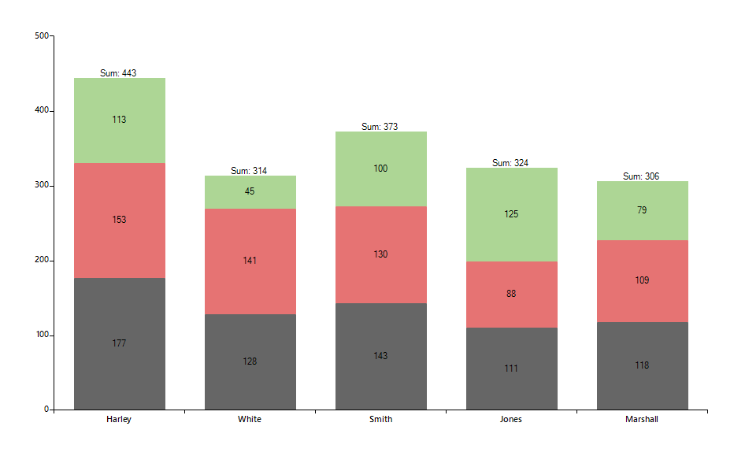

## Environment
<table>
	<tr>
		<td>Product Version</td>
		<td>2019.3.911</td>
	</tr>
	<tr>
		<td>Product</td>
		<td>RadChartView for WinForms</td>
	</tr>
</table>


## Description

An example demonstrating how multiple **BarSeries** can be customized when they are stacked by adding a summary label at the top.  

## Solution

A custom *Cartesian* renderer will be responsible for creating special label elements for the series which is positioned at the top of the stack. The custom elements will paint an additional summary text on top of the data point. The example also features a sample implementation for calculating the summary values.

>caption Figure 1: Summary Labels


#### Custom Renderer and Labels 

````C#
public class CustomCartesianRenderer : CartesianRenderer
{
    public CustomCartesianRenderer(CartesianArea area)
        : base(area)
    { }

    protected override void InitializeSeriesLabels()
    {
        base.InitializeSeriesLabels();
        
        IDictionary<object, List<double?>> summaryValues = new Dictionary<object, List<double?>>();
        for (int i = 0; i < this.Area.Series.Count; i++)
        {
            BarSeries barSeries = this.Area.Series[i] as BarSeries;
            if (barSeries == null)
            {
                continue;
            }

            for (int j = 0; j < barSeries.DataPoints.Count; j++)
            {
                CategoricalDataPoint dp = (CategoricalDataPoint)barSeries.DataPoints[j];
                if (!summaryValues.ContainsKey(dp.Category))
                {
                    summaryValues.Add(dp.Category, new List<double?>() { dp.Value });
                }
                else
                {
                    summaryValues[dp.Category].Add(dp.Value);
                }
            }
        }

        string lastSeriesName = this.Area.Series[this.Area.Series.Count - 1].Name;
        for (int i = 0; i < this.DrawParts.Count; i++)
        {
            BarLabelElementDrawPart labelPart = this.DrawParts[i] as BarLabelElementDrawPart;
            if (labelPart != null && labelPart.Element.Name == lastSeriesName)
            {
                CustomBarLabelElementDrawPart customLabelPart = new CustomBarLabelElementDrawPart((BarSeries)labelPart.Element, this);
                customLabelPart.SummaryValues = summaryValues;
                this.DrawParts[i] = customLabelPart;
            }
        }
    }
}
public class CustomBarLabelElementDrawPart : BarLabelElementDrawPart
{
    private IDictionary<object, List<double?>> summaryValues;

    public CustomBarLabelElementDrawPart(BarSeries series, IChartRenderer renderer)
        : base(series, renderer)
    { }

    public IDictionary<object, List<double?>> SummaryValues
    {
        get
        {
            return this.summaryValues;
        }
        set
        {
            this.summaryValues = value;
        }
    }

    public override void Draw()
    {
        Graphics graphics = this.Renderer.Surface as Graphics;
        RadGdiGraphics radGraphics = new RadGdiGraphics(graphics);

        foreach (DataPointElement dataPointElement in this.Element.Children)
        {
            CategoricalDataPoint categoricalDataPoint = dataPointElement.DataPoint as CategoricalDataPoint;
            if (!this.summaryValues.ContainsKey(categoricalDataPoint.Category))
            {
                continue;
            }

            double? sum = this.summaryValues[categoricalDataPoint.Category].Sum();
            string summaryText = string.Format("Sum: {0}", sum);

            RadRect slot = categoricalDataPoint.LayoutSlot;
            RectangleF barBounds = new RectangleF((float)(this.OffsetX + slot.X), (float)(this.OffsetY + slot.Y), (float)slot.Width, (float)slot.Height);
            float realHeight = barBounds.Height * dataPointElement.HeightAspectRatio;
            barBounds.Y += barBounds.Height - realHeight;
            barBounds.Height = realHeight;
            barBounds = this.AdjustBarDataPointBounds(dataPointElement, barBounds);
            barBounds.Width = Math.Max(barBounds.Width, 1f);

            object state = radGraphics.SaveState();

            int horizontalTranslate = (int)(barBounds.X + barBounds.Width / 2);
            int verticalTranslate = (int)(barBounds.Y + barBounds.Height / 2);

            float angle = (float)this.Element.LabelRotationAngle % 360f;

            if (angle != 0)
            {
                radGraphics.TranslateTransform(horizontalTranslate, verticalTranslate);
                radGraphics.RotateTransform(angle);
                radGraphics.TranslateTransform(-horizontalTranslate, -verticalTranslate);
            }

            Size desiredSize = TextRenderer.MeasureText(summaryText, dataPointElement.Font);

            FillPrimitiveImpl fill = new FillPrimitiveImpl(dataPointElement, null);
            fill.PaintFill(radGraphics, 0, Size.Empty, barBounds);

            BorderPrimitiveImpl border = new BorderPrimitiveImpl(dataPointElement, null);
            border.PaintBorder(radGraphics, 0, Size.Empty, barBounds);

            using (Brush brush = new SolidBrush(dataPointElement.ForeColor))
            {
                RectangleF drawRectangle = new RectangleF();
                drawRectangle.X = barBounds.X + dataPointElement.Padding.Left + (barBounds.Width - desiredSize.Width) /2;
                drawRectangle.Y = barBounds.Y + dataPointElement.Padding.Top - desiredSize.Height;
                drawRectangle.Width = barBounds.Width - dataPointElement.Padding.Right;
                drawRectangle.Height = barBounds.Height - dataPointElement.Padding.Bottom;

                StringFormat format = new StringFormat();
                graphics.DrawString(summaryText, dataPointElement.Font, brush, drawRectangle, format);
            }

            if (angle != 0)
            {
                radGraphics.ResetTransform();
            }

            radGraphics.RestoreState(state);

        }

        base.Draw();
    }

    private RectangleF AdjustBarDataPointBounds(DataPointElement point, RectangleF bounds)
    {
        RectangleF barBounds = bounds;

        if (point.BorderBoxStyle == BorderBoxStyle.SingleBorder || point.BorderBoxStyle == BorderBoxStyle.OuterInnerBorders)
        {
            barBounds.X += point.BorderWidth - (int)((point.BorderWidth - 1f) / 2f);
            barBounds.Width -= point.BorderWidth;
            barBounds.Y += point.BorderWidth - (int)((point.BorderWidth - 1f) / 2f);
            barBounds.Height -= point.BorderWidth;
        }
        else if (point.BorderBoxStyle == BorderBoxStyle.FourBorders)
        {
            barBounds.Y += 1;
            barBounds.Height -= 1;
            barBounds.X += 1;
            barBounds.Width -= 1;
        }

        if (((CartesianRenderer)this.Renderer).Area.Orientation == System.Windows.Forms.Orientation.Horizontal)
        {
            barBounds.X--;
        }

        return barBounds;
    }
}

````
````VB.NET
Public Class CustomCartesianRenderer
    Inherits CartesianRenderer

    Public Sub New(ByVal area As CartesianArea)
        MyBase.New(area)
    End Sub

    Protected Overrides Sub InitializeSeriesLabels()
        MyBase.InitializeSeriesLabels()
        Dim summaryValues As IDictionary(Of Object, List(Of Double?)) = New Dictionary(Of Object, List(Of Double?))()

        For i As Integer = 0 To Me.Area.Series.Count - 1
            Dim barSeries As BarSeries = TryCast(Me.Area.Series(i), BarSeries)

            If barSeries Is Nothing Then
                Continue For
            End If

            For j As Integer = 0 To barSeries.DataPoints.Count - 1
                Dim dp As CategoricalDataPoint = CType(barSeries.DataPoints(j), CategoricalDataPoint)

                If Not summaryValues.ContainsKey(dp.Category) Then
                    summaryValues.Add(dp.Category, New List(Of Double?)() From {
                        dp.Value
                    })
                Else
                    summaryValues(dp.Category).Add(dp.Value)
                End If
            Next
        Next

        Dim lastSeriesName As String = Me.Area.Series(Me.Area.Series.Count - 1).Name

        For i As Integer = 0 To Me.DrawParts.Count - 1
            Dim labelPart As BarLabelElementDrawPart = TryCast(Me.DrawParts(i), BarLabelElementDrawPart)

            If labelPart IsNot Nothing AndAlso labelPart.Element.Name = lastSeriesName Then
                Dim customLabelPart As CustomBarLabelElementDrawPart = New CustomBarLabelElementDrawPart(CType(labelPart.Element, BarSeries), Me)
                customLabelPart.SummaryValues = summaryValues
                Me.DrawParts(i) = customLabelPart
            End If
        Next
    End Sub
End Class

Public Class CustomBarLabelElementDrawPart
    Inherits BarLabelElementDrawPart

    Private _summaryValues As IDictionary(Of Object, List(Of Double?))

    Public Sub New(ByVal series As BarSeries, ByVal renderer As IChartRenderer)
        MyBase.New(series, renderer)
    End Sub

    Public Property SummaryValues As IDictionary(Of Object, List(Of Double?))
        Get
            Return Me._summaryValues
        End Get
        Set(ByVal value As IDictionary(Of Object, List(Of Double?)))
            Me._summaryValues = value
        End Set
    End Property

    Public Overrides Sub Draw()
        Dim graphics As Graphics = TryCast(Me.Renderer.Surface, Graphics)
        Dim radGraphics As RadGdiGraphics = New RadGdiGraphics(graphics)

        For Each dataPointElement As DataPointElement In Me.Element.Children
            Dim categoricalDataPoint As CategoricalDataPoint = TryCast(dataPointElement.DataPoint, CategoricalDataPoint)

            If Not Me.SummaryValues.ContainsKey(categoricalDataPoint.Category) Then
                Continue For
            End If

            Dim sum As Double? = Me.SummaryValues(categoricalDataPoint.Category).Sum()
            Dim summaryText As String = String.Format("Sum: {0}", sum)
            Dim slot As RadRect = categoricalDataPoint.LayoutSlot
            Dim barBounds As RectangleF = New RectangleF(CSng((Me.OffsetX + slot.X)), CSng((Me.OffsetY + slot.Y)), CSng(slot.Width), CSng(slot.Height))
            Dim realHeight As Single = barBounds.Height * dataPointElement.HeightAspectRatio
            barBounds.Y += barBounds.Height - realHeight
            barBounds.Height = realHeight
            barBounds = Me.AdjustBarDataPointBounds(dataPointElement, barBounds)
            barBounds.Width = Math.Max(barBounds.Width, 1.0F)
            Dim state As Object = radGraphics.SaveState()
            Dim horizontalTranslate As Integer = CInt((barBounds.X + barBounds.Width / 2))
            Dim verticalTranslate As Integer = CInt((barBounds.Y + barBounds.Height / 2))
            Dim angle As Single = CSng(Me.Element.LabelRotationAngle) Mod 360.0F

            If angle <> 0 Then
                radGraphics.TranslateTransform(horizontalTranslate, verticalTranslate)
                radGraphics.RotateTransform(angle)
                radGraphics.TranslateTransform(-horizontalTranslate, -verticalTranslate)
            End If

            Dim desiredSize As Size = TextRenderer.MeasureText(summaryText, dataPointElement.Font)
            Dim fill As FillPrimitiveImpl = New FillPrimitiveImpl(dataPointElement, Nothing)
            fill.PaintFill(radGraphics, 0, Size.Empty, barBounds)
            Dim border As BorderPrimitiveImpl = New BorderPrimitiveImpl(dataPointElement, Nothing)
            border.PaintBorder(radGraphics, 0, Size.Empty, barBounds)

            Using brush As Brush = New SolidBrush(dataPointElement.ForeColor)
                Dim drawRectangle As RectangleF = New RectangleF()
                drawRectangle.X = barBounds.X + dataPointElement.Padding.Left + (barBounds.Width - desiredSize.Width) / 2
                drawRectangle.Y = barBounds.Y + dataPointElement.Padding.Top - desiredSize.Height
                drawRectangle.Width = barBounds.Width - dataPointElement.Padding.Right
                drawRectangle.Height = barBounds.Height - dataPointElement.Padding.Bottom
                Dim format As StringFormat = New StringFormat()
                graphics.DrawString(summaryText, dataPointElement.Font, brush, drawRectangle, format)
            End Using

            If angle <> 0 Then
                radGraphics.ResetTransform()
            End If

            radGraphics.RestoreState(state)
        Next

        MyBase.Draw()
    End Sub

    Private Function AdjustBarDataPointBounds(ByVal point As DataPointElement, ByVal bounds As RectangleF) As RectangleF
        Dim barBounds As RectangleF = bounds

        If point.BorderBoxStyle = BorderBoxStyle.SingleBorder OrElse point.BorderBoxStyle = BorderBoxStyle.OuterInnerBorders Then
            barBounds.X += point.BorderWidth - CInt(((point.BorderWidth - 1.0F) / 2.0F))
            barBounds.Width -= point.BorderWidth
            barBounds.Y += point.BorderWidth - CInt(((point.BorderWidth - 1.0F) / 2.0F))
            barBounds.Height -= point.BorderWidth
        ElseIf point.BorderBoxStyle = BorderBoxStyle.FourBorders Then
            barBounds.Y += 1
            barBounds.Height -= 1
            barBounds.X += 1
            barBounds.Width -= 1
        End If

        If (CType(Me.Renderer, CartesianRenderer)).Area.Orientation = System.Windows.Forms.Orientation.Horizontal Then
            barBounds.X -= 1
        End If

        Return barBounds
    End Function
End Class

````

Below is a sample setup with three stacked bar series. The renderer will be changed in the **CreateRenderer** event of the chart.

#### Form`s Class

````C#
public partial class RadForm1 : Telerik.WinControls.UI.RadForm
{
    public RadForm1()
        {
            InitializeComponent();

            this.radChartView1.CreateRenderer += RadChartView1_CreateRenderer;

            BarSeries barSeries = new BarSeries("Performance", "RepresentativeName");
            barSeries.Name = "Q1";
            barSeries.CombineMode = ChartSeriesCombineMode.Stack;
            barSeries.ShowLabels = true;

            barSeries.DataPoints.Add(new CategoricalDataPoint(177, "Harley"));
            barSeries.DataPoints.Add(new CategoricalDataPoint(128, "White"));
            barSeries.DataPoints.Add(new CategoricalDataPoint(143, "Smith"));
            barSeries.DataPoints.Add(new CategoricalDataPoint(111, "Jones"));
            barSeries.DataPoints.Add(new CategoricalDataPoint(118, "Marshall"));

            this.radChartView1.Series.Add(barSeries);

            BarSeries barSeries2 = new BarSeries("Performance", "RepresentativeName");
            barSeries2.Name = "Q2";
            barSeries2.CombineMode = ChartSeriesCombineMode.Stack;
            barSeries2.ShowLabels = true;

            barSeries2.DataPoints.Add(new CategoricalDataPoint(153, "Harley"));
            barSeries2.DataPoints.Add(new CategoricalDataPoint(141, "White"));
            barSeries2.DataPoints.Add(new CategoricalDataPoint(130, "Smith"));
            barSeries2.DataPoints.Add(new CategoricalDataPoint(88, "Jones"));
            barSeries2.DataPoints.Add(new CategoricalDataPoint(109, "Marshall"));
            this.radChartView1.Series.Add(barSeries2);

            BarSeries barSeries3 = new BarSeries("Performance", "RepresentativeName");
            barSeries3.Name = "Q3";
            barSeries3.CombineMode = ChartSeriesCombineMode.Stack;
            barSeries3.ShowLabels = true;

            barSeries3.DataPoints.Add(new CategoricalDataPoint(113, "Harley"));
            barSeries3.DataPoints.Add(new CategoricalDataPoint(45, "White"));
            barSeries3.DataPoints.Add(new CategoricalDataPoint(100, "Smith"));
            barSeries3.DataPoints.Add(new CategoricalDataPoint(125, "Jones"));
            barSeries3.DataPoints.Add(new CategoricalDataPoint(79, "Marshall"));
            this.radChartView1.Series.Add(barSeries3);
        }

    private void RadChartView1_CreateRenderer(object sender, ChartViewCreateRendererEventArgs e)
        {
            e.Renderer = new CustomCartesianRenderer(e.Area as CartesianArea);
        }
}

````
````VB.NET
Public Class RadForm1

    Public Sub New()
        InitializeComponent()

        AddHandler Me.RadChartView1.CreateRenderer, AddressOf RadChartView1_CreateRenderer
        Dim barSeries As BarSeries = New BarSeries("Performance", "RepresentativeName")
        barSeries.Name = "Q1"
        barSeries.CombineMode = ChartSeriesCombineMode.Stack
        barSeries.ShowLabels = True
        barSeries.DataPoints.Add(New CategoricalDataPoint(177, "Harley"))
        barSeries.DataPoints.Add(New CategoricalDataPoint(128, "White"))
        barSeries.DataPoints.Add(New CategoricalDataPoint(143, "Smith"))
        barSeries.DataPoints.Add(New CategoricalDataPoint(111, "Jones"))
        barSeries.DataPoints.Add(New CategoricalDataPoint(118, "Marshall"))
        Me.RadChartView1.Series.Add(barSeries)
        Dim barSeries2 As BarSeries = New BarSeries("Performance", "RepresentativeName")
        barSeries2.Name = "Q2"
        barSeries2.CombineMode = ChartSeriesCombineMode.Stack
        barSeries2.ShowLabels = True
        barSeries2.DataPoints.Add(New CategoricalDataPoint(153, "Harley"))
        barSeries2.DataPoints.Add(New CategoricalDataPoint(141, "White"))
        barSeries2.DataPoints.Add(New CategoricalDataPoint(130, "Smith"))
        barSeries2.DataPoints.Add(New CategoricalDataPoint(88, "Jones"))
        barSeries2.DataPoints.Add(New CategoricalDataPoint(109, "Marshall"))
        Me.RadChartView1.Series.Add(barSeries2)
        Dim barSeries3 As BarSeries = New BarSeries("Performance", "RepresentativeName")
        barSeries3.Name = "Q3"
        barSeries3.CombineMode = ChartSeriesCombineMode.Stack
        barSeries3.ShowLabels = True
        barSeries3.DataPoints.Add(New CategoricalDataPoint(113, "Harley"))
        barSeries3.DataPoints.Add(New CategoricalDataPoint(45, "White"))
        barSeries3.DataPoints.Add(New CategoricalDataPoint(100, "Smith"))
        barSeries3.DataPoints.Add(New CategoricalDataPoint(125, "Jones"))
        barSeries3.DataPoints.Add(New CategoricalDataPoint(79, "Marshall"))
        Me.RadChartView1.Series.Add(barSeries3)
    End Sub

    Private Sub RadChartView1_CreateRenderer(ByVal sender As Object, ByVal e As ChartViewCreateRendererEventArgs)
        e.Renderer = New CustomCartesianRenderer(TryCast(e.Area, CartesianArea))
    End Sub
End Class
````

# See Also
* [Custom Rendering]()