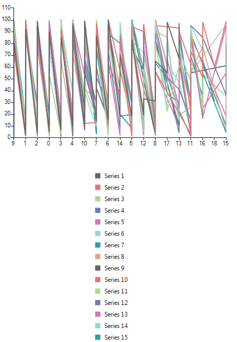
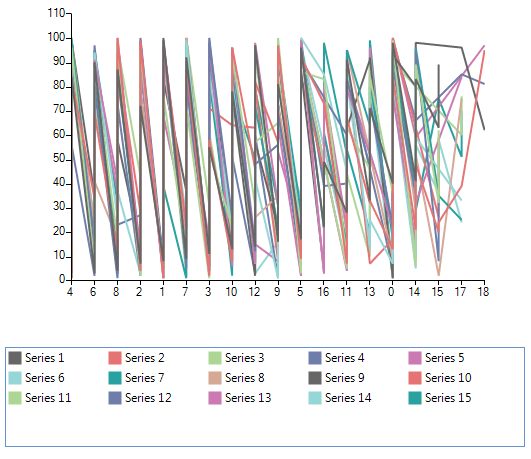

## Environment
 
|Product Version|Product|Author|
|----|----|----|
|2019.2.508|RadChartView for WinForms|[Desislava Yordanova](https://www.telerik.com/blogs/author/desislava-yordanova)|
 

## Description

The **ChartLegendElement** displays the legend items in a **StackLayoutElement** which can be either vertical or horizontal.



The purpose of this article is to demonstrate a sample approach how to wrap the legend item and use the space more efficiently.



## Solution 

It is possible to insert a **RadListViewElement** in the **ChartLegendElement** to achieve wrapping the legend items:

#### Wrap Legend Items

````C#

        public RadForm1()
        {
            InitializeComponent();

            Random rand = new Random();
            List<LineSeries> list = new List<LineSeries>();
            for (var index = 1; index <= 15; index++)
            {
                LineSeries ls = new LineSeries();
                ls.LegendTitle = "Series " + index;
                list.Add(ls);
            }

            for (int index = 1; index <= 100; index++)
            {
                foreach (LineSeries s in list)
                    s.DataPoints.Add(new CategoricalDataPoint(index, rand.Next(0, rand.Next(5, 20))));
            }
            this.radChartView1.Series.AddRange(list.ToArray());
            this.radChartView1.ShowLegend = true;
            this.radChartView1.ChartElement.LegendPosition = LegendPosition.Bottom;
        }

        internal class MyChart : RadChartView
        {
            protected override RadChartElement CreateChartElement()
            {
                return new MyChartElement();
            }
        }

        internal class MyChartElement : RadChartElement
        {
            protected override ChartLegendElement CreateChartLegendElement()
            {
                return new MyLegendElement(this);
            }

            protected override Type ThemeEffectiveType
            {
                get
                {
                    return typeof(RadChartElement);
                }
            }
        }

        internal class MyLegendElement : ChartLegendElement
        {
            private RadListViewElement panel;

            public MyLegendElement(RadChartElement chartElement) : base(chartElement)
            {
            }

            protected override void OnLegendInfosCollectionChanged(Telerik.WinControls.Data.NotifyCollectionChangedEventArgs e, bool providerChange)
            {
                base.OnLegendInfosCollectionChanged(e, providerChange);
                if (e.Action == Telerik.WinControls.Data.NotifyCollectionChangedAction.Add)
                {
                    LegendItem li = e.NewItems[0] as LegendItem;
                    panel.Items.Add(li.Title);
                    panel.Items.Last().Tag = li.Element;
                }
                panel.SelectedIndex = -1;
            }

            protected override void CreateChildElements()
            {
                base.CreateChildElements();
                panel = new RadListViewElement();
                panel.VisualItemFormatting += ListView_VisualItemFormatting;
                panel.ShowCheckBoxes = true;
                panel.StretchHorizontally = true;
                panel.StretchVertically = false;
                panel.ViewType = ListViewType.IconsView;
                panel.ItemSize = new System.Drawing.Size(100, 20);
                panel.ShouldHandleMouseInput = true;
                panel.NotifyParentOnMouseInput = false;
                panel.MaxSize = new System.Drawing.Size(int.MaxValue, 100);
                this.StackElement.Visibility = Telerik.WinControls.ElementVisibility.Collapsed;
                this.Children.Add(panel);
            }

            protected override Type ThemeEffectiveType
            {
                get
                {
                    return typeof(ChartLegendElement);
                }
            }

            private void ListView_VisualItemFormatting(object sender, ListViewVisualItemEventArgs e)
            {
                ListViewItemCheckbox checkBox = e.VisualItem.ToggleElement as ListViewItemCheckbox;
                if (checkBox != null)
                {
                    e.VisualItem.ToggleElement.ShouldHandleMouseInput = false;
                    e.VisualItem.ToggleElement.NotifyParentOnMouseInput = false;
                    checkBox.CheckMarkPrimitive.Fill.BackColor = ((LineSeries)(e.VisualItem.Data.Tag)).BorderColor;
                    checkBox.CheckMarkPrimitive.Fill.GradientStyle = Telerik.WinControls.GradientStyles.Solid;
                    checkBox.CheckMarkPrimitive.Border.Visibility = Telerik.WinControls.ElementVisibility.Collapsed;
                }
            }
        }
       
````
````VB.NET
    Sub New()

        InitializeComponent()

        Dim rand As New Random
        Dim list As New List(Of LineSeries)
        For index = 1 To 15
            Dim ls As New LineSeries
            ls.LegendTitle = "Series " & index
            list.Add(ls)
        Next

        For index = 1 To 100
            For Each s As LineSeries In list
                s.DataPoints.Add(New CategoricalDataPoint(index, rand.Next(0, rand.Next(5, 20))))
            Next
        Next
        Me.RadChartView1.Series.AddRange(list.ToArray())
        Me.RadChartView1.ShowLegend = True
        Me.RadChartView1.ChartElement.LegendPosition = LegendPosition.Bottom
    End Sub

    Friend Class MyChart
    Inherits RadChartView

        Protected Overrides Function CreateChartElement() As RadChartElement
            Return New MyChartElement()
        End Function
    End Class

    Friend Class MyChartElement
    Inherits RadChartElement
        
        Protected Overrides Function CreateChartLegendElement() As ChartLegendElement
            Return New MyLegendElement(Me)
        End Function
        Protected Overrides ReadOnly Property ThemeEffectiveType() As Type
            Get
                Return GetType(RadChartElement)
            End Get
        End Property
    End Class

    Friend Class MyLegendElement
    Inherits ChartLegendElement

        Private panel As RadListViewElement
        Public Sub New(chartElement As RadChartElement)
            MyBase.New(chartElement)

        End Sub

        Protected Overrides Sub OnLegendInfosCollectionChanged(e As Telerik.WinControls.Data.NotifyCollectionChangedEventArgs, providerChange As Boolean)
            MyBase.OnLegendInfosCollectionChanged(e, providerChange)
            If e.Action = Telerik.WinControls.Data.NotifyCollectionChangedAction.Add Then
                Dim li As LegendItem = TryCast(e.NewItems(0), LegendItem)
                panel.Items.Add(li.Title)
                panel.Items.Last().Tag = li.Element
            End If
            panel.SelectedIndex = -1
        End Sub

        Protected Overrides Sub CreateChildElements()
            MyBase.CreateChildElements()
            panel = New RadListViewElement()
            AddHandler panel.VisualItemFormatting, AddressOf ListView_VisualItemFormatting
            panel.ShowCheckBoxes = True
            panel.StretchHorizontally = True
            panel.StretchVertically = False
            panel.ViewType = ListViewType.IconsView
            panel.ItemSize = New Drawing.Size(100, 20)
            panel.ShouldHandleMouseInput = True
            panel.NotifyParentOnMouseInput = False
            panel.MaxSize = New Drawing.Size(Integer.MaxValue, 100)
            Me.StackElement.Visibility = Telerik.WinControls.ElementVisibility.Collapsed
            Me.Children.Add(panel)
        End Sub
        Protected Overrides ReadOnly Property ThemeEffectiveType() As Type
            Get
                Return GetType(ChartLegendElement)
            End Get
        End Property

        Private Sub ListView_VisualItemFormatting(sender As Object, e As ListViewVisualItemEventArgs)
            Dim checkBox As ListViewItemCheckbox = TryCast(e.VisualItem.ToggleElement, ListViewItemCheckbox)
            If checkBox IsNot Nothing Then 
                e.VisualItem.ToggleElement.ShouldHandleMouseInput = False
                e.VisualItem.ToggleElement.NotifyParentOnMouseInput = False
                checkBox.CheckMarkPrimitive.Fill.BackColor = DirectCast(e.VisualItem.Data.Tag, LineSeries).BorderColor
                checkBox.CheckMarkPrimitive.Fill.GradientStyle = Telerik.WinControls.GradientStyles.Solid
                checkBox.CheckMarkPrimitive.Border.Visibility = Telerik.WinControls.ElementVisibility.Collapsed
            End If
        End Sub
    End Class
   
    
````


