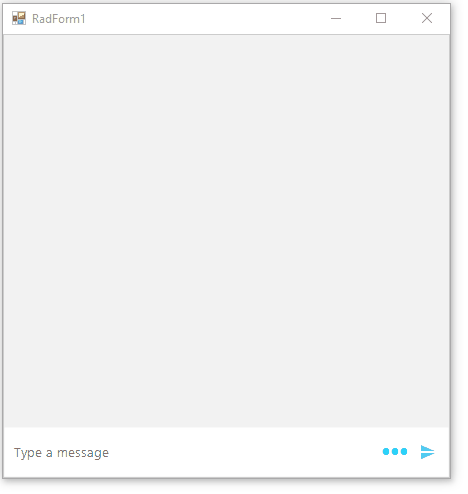

 
|Product Version|Product|Author|
|----|----|----|
|2022.1.222|RadChatView for WinForms|[Dinko Krastev](https://www.telerik.com/blogs/author/dinko-krastev)|

# Problem

At this time of writing this KB article, the __RadChat__ control does not provide an API to edit/delete its messages through a RadContextMenu.

# Solution

The control is very customizable and you could achieve this scenario using custom code. 

1. First we need to create __RadContextMenu__ with two __RadMenuItems (Edit/Delete)__ and subscribe to their __Click__ events. In their event handler, we can execute our custom logic.
2. In the __ItemFormatting__ event of the __RadChat__ we can get an instance of each message and subscribe to its MouseDown event. In its event handler, we can show the menu.
3. Editing a message will require adding additional RadTextBox placed in RadHostItem which we will use for the editing process. When the user clicks on the Edit RadMenuItem, we can show the __RadTextBox__. The user will enter the new message and pressing enter, for example, will change the actual message.
4. Deleting a message is much easier. When the user clicks on the __Delete RadMenuItem__, we can get the current clicked message and delete it from the __RadChat.ChatElement.MessagesViewElement.Items__ collection.
5. This approach can be further customized to mark the edited text and perform some other custom logic depending on the edited text.
6. Full sample code can be found below.



````C#

public partial class RadForm1 : System.Windows.Forms.Form
{
    RadContextMenu contextMenu = new RadContextMenu();
    RadTextBox textBox;
    RadHostItem hostItem;
    TextMessageItemElement currentClickedTextMessageItemElement;
    private Author author2;
    public RadForm1()
    {
        InitializeComponent();

        new RadControlSpyForm().Show();
        this.radChat1.AutoAddUserMessages = true;
        this.radChat1.SendMessage += radChat1_SendMessage;

        this.radChat1.Author = new Author(Properties.Resources.Janet, "User");
        author2 = new Author(Properties.Resources.AndrewFuller, "devNXT Bot");

        RadMenuItem editItem = new RadMenuItem("Edit");
        editItem.Click += EditItem_Click;
        RadMenuItem deleteItem = new RadMenuItem("Delete");
        deleteItem.Click += DeleteItem_Click;
        contextMenu.Items.Add(editItem);
        contextMenu.Items.Add(deleteItem);
        this.radChat1.ItemFormatting += RadChat1_ItemFormatting1;
            
    }

    private void RadChat1_ItemFormatting1(object sender, ChatItemElementEventArgs e)
    {
        LightVisualElement bubble = e.ItemElement.MainMessageElement;
        if (e.ItemElement is TextMessageItemElement )
        {
            bubble.MouseDown -= RadForm1_MouseDown;
            bubble.MouseDown += RadForm1_MouseDown;

            bool isUpdated = (e.ItemElement as TextMessageItemElement).Tag != null ? true : false;
            if(isUpdated)
            {
                bubble.DrawFill = true;
                bubble.BackColor = Color.LightGreen;
            }               
        }
        else
        {
            bubble.ResetValue(LightVisualElement.DrawBorderProperty, Telerik.WinControls.ValueResetFlags.Local);
            bubble.ResetValue(LightVisualElement.BackColorProperty, Telerik.WinControls.ValueResetFlags.Local);
        }
    }

    private void DeleteItem_Click(object sender, EventArgs e)
    {
        var menuItem = sender as MenuItem;
        this.radChat1.ChatElement.MessagesViewElement.Items.Remove(currentClickedTextMessageItemElement.Data);
    }
      
    private void EditItem_Click(object sender, EventArgs e)
    {
        if (currentClickedTextMessageItemElement.Data.Message is ChatTextMessage)
        {
            if (textBox == null)
            {
                textBox = new RadTextBox();
                textBox.KeyDown += T_KeyDown;
                hostItem = new RadHostItem(textBox);
                hostItem.MinSize = new Size(200, 24);
            }

            currentClickedTextMessageItemElement.MainMessageElement.DrawText = false;
            currentClickedTextMessageItemElement.MainMessageElement.Children.Add(hostItem);
            textBox.Text = (currentClickedTextMessageItemElement.Data.Message as ChatTextMessage).Message;               
        }
    }

    private void T_KeyDown(object sender, KeyEventArgs e)
    {
        if (e.KeyData == Keys.Return)
        {
            var ctm = currentClickedTextMessageItemElement.Data.Message as ChatTextMessage;
            ctm.Message = textBox.Text;
            // Submit
            currentClickedTextMessageItemElement.MainMessageElement.Children.Remove(hostItem);
            currentClickedTextMessageItemElement.Tag = "Updated";
            VirtualAssistanChat(ctm.Message);
        }
        else if (e.KeyData == Keys.Escape)
        {
            // Cancel
            // Remove editor
            currentClickedTextMessageItemElement.MainMessageElement.Children.Remove(hostItem);
        }
        currentClickedTextMessageItemElement.MainMessageElement.DrawText = true;
    }

    private void RadForm1_MouseDown(object sender, MouseEventArgs e)
    {
        if (e.Button == MouseButtons.Right)
        {
            currentClickedTextMessageItemElement = (sender as ChatMessageBubbleElement).Parent as TextMessageItemElement;
            contextMenu.Show(this, new Point(e.X, e.Y));
        }
    }       

    private void radChat1_SendMessage(object sender, SendMessageEventArgs e)
    {
        Telerik.WinControls.UI.ChatTextMessage chatMessage = (Telerik.WinControls.UI.ChatTextMessage)e.Message;
        this.radChat1.AutoAddUserMessages = true;
        VirtualAssistanChat(chatMessage.Message);
    }

    private void radChat1_SuggestedActionClicked(object sender, SuggestedActionEventArgs e)
    {
        this.radChat1.AddMessage(new ChatTextMessage("You have chosen " + e.Action.Text, this.radChat1.Author, DateTime.Now));
    }

    void VirtualAssistanChat(string message)
    {
        if (message == "Hello")
        {
            ChatTextMessage message12 = new ChatTextMessage("I am your Virtual Assistant", author2, DateTime.Now.AddSeconds(15));
            this.radChat1.AddMessage(message12);
        }
            
        if (message.Contains("Options"))
        {
            ChatTextMessage message12 = new ChatTextMessage("Below are your Automation options:", author2, DateTime.Now.AddSeconds(15));
            this.radChat1.AddMessage(message12);
            List<SuggestedActionDataItem> suggestedActions = new List<SuggestedActionDataItem>();
            suggestedActions.Add(new SuggestedActionDataItem(".Net Core Conversion"));
            suggestedActions.Add(new SuggestedActionDataItem("Code Forensics"));
            this.radChat1.AddMessage(new ChatSuggestedActionsMessage(suggestedActions, author2, DateTime.Now));
            ChatSuggestedActionsMessage suggestionActionsMessage = new ChatSuggestedActionsMessage(suggestedActions, author2, DateTime.Now);
            this.radChat1.AddMessage(suggestionActionsMessage);
            this.radChat1.SuggestedActionClicked -= radChat1_SuggestedActionClicked;
            this.radChat1.SuggestedActionClicked += radChat1_SuggestedActionClicked;
        }

        if (message.Contains(".Net Core Conversion"))
        {
            ChatTextMessage message12 = new ChatTextMessage("Below are your Conversion options:", author2, DateTime.Now.AddSeconds(5));
            this.radChat1.AddMessage(message12);
            List<SuggestedActionDataItem> actions = new List<SuggestedActionDataItem>();
            actions.Add(new SuggestedActionDataItem("Console Application"));
            actions.Add(new SuggestedActionDataItem("MVC"));
            actions.Add(new SuggestedActionDataItem("Windows App"));
            actions.Add(new SuggestedActionDataItem("Restful"));
            actions.Add(new SuggestedActionDataItem("SOAP"));
            actions.Add(new SuggestedActionDataItem("Container"));
            actions.Add(new SuggestedActionDataItem("Others"));
            this.radChat1.AddMessage(new ChatSuggestedActionsMessage(actions, author2, DateTime.Now));
            ChatSuggestedActionsMessage suggestionActionsMessage = new ChatSuggestedActionsMessage(actions, author2, DateTime.Now);
            this.radChat1.AddMessage(suggestionActionsMessage);
            this.radChat1.SuggestedActionClicked -= radChat1_SuggestedActionClicked;
            this.radChat1.SuggestedActionClicked += radChat1_SuggestedActionClicked;
        }
    }
}

````
````VB.NET

Partial Public Class RadForm2
    Inherits System.Windows.Forms.Form

    Private contextMenu As RadContextMenu = New RadContextMenu()
    Private textBox As RadTextBox
    Private hostItem As RadHostItem
    Private currentClickedTextMessageItemElement As TextMessageItemElement
    Private author2 As Author

    Public Sub New()
        InitializeComponent()
        Me.RadChat1.AutoAddUserMessages = True
        AddHandler Me.RadChat1.SendMessage, AddressOf radChat1_SendMessage
        Me.RadChat1.Author = New Author(My.Resources.Janet, "User")
        author2 = New Author(My.Resources.AndrewFuller, "devNXT Bot")
        Dim editItem As RadMenuItem = New RadMenuItem("Edit")
        AddHandler editItem.Click, AddressOf EditItem_Click
        Dim deleteItem As RadMenuItem = New RadMenuItem("Delete")
        AddHandler deleteItem.Click, AddressOf DeleteItem_Click
        contextMenu.Items.Add(editItem)
        contextMenu.Items.Add(deleteItem)
        AddHandler Me.radChat1.ItemFormatting, AddressOf RadChat1_ItemFormatting1
    End Sub

    Private Sub RadChat1_ItemFormatting1(ByVal sender As Object, ByVal e As ChatItemElementEventArgs)
        Dim bubble As LightVisualElement = e.ItemElement.MainMessageElement

        If TypeOf e.ItemElement Is TextMessageItemElement Then
            RemoveHandler bubble.MouseDown, AddressOf RadForm1_MouseDown
            AddHandler bubble.MouseDown, AddressOf RadForm1_MouseDown
            Dim isUpdated As Boolean = If((TryCast(e.ItemElement, TextMessageItemElement)).Tag IsNot Nothing, True, False)

            If isUpdated Then
                bubble.DrawFill = True
                bubble.BackColor = Color.LightGreen
            End If
        Else
            bubble.ResetValue(LightVisualElement.DrawBorderProperty, Telerik.WinControls.ValueResetFlags.Local)
            bubble.ResetValue(LightVisualElement.BackColorProperty, Telerik.WinControls.ValueResetFlags.Local)
        End If
    End Sub

    Private Sub DeleteItem_Click(ByVal sender As Object, ByVal e As EventArgs)
        Dim menuItem = TryCast(sender, MenuItem)
        Me.radChat1.ChatElement.MessagesViewElement.Items.Remove(currentClickedTextMessageItemElement.Data)
    End Sub

    Private Sub EditItem_Click(ByVal sender As Object, ByVal e As EventArgs)
        If TypeOf currentClickedTextMessageItemElement.Data.Message Is ChatTextMessage Then

            If textBox Is Nothing Then
                textBox = New RadTextBox()
                AddHandler textBox.KeyDown, AddressOf T_KeyDown
                hostItem = New RadHostItem(textBox)
                hostItem.MinSize = New Size(200, 24)
            End If

            currentClickedTextMessageItemElement.MainMessageElement.DrawText = False
            currentClickedTextMessageItemElement.MainMessageElement.Children.Add(hostItem)
            textBox.Text = (TryCast(currentClickedTextMessageItemElement.Data.Message, ChatTextMessage)).Message
        End If
    End Sub

    Private Sub T_KeyDown(ByVal sender As Object, ByVal e As KeyEventArgs)
        If e.KeyData = Keys.[Return] Then
            Dim ctm = TryCast(currentClickedTextMessageItemElement.Data.Message, ChatTextMessage)
            ctm.Message = textBox.Text
            currentClickedTextMessageItemElement.MainMessageElement.Children.Remove(hostItem)
            currentClickedTextMessageItemElement.Tag = "Updated"
            VirtualAssistanChat(ctm.Message)
        ElseIf e.KeyData = Keys.Escape Then
            currentClickedTextMessageItemElement.MainMessageElement.Children.Remove(hostItem)
        End If

        currentClickedTextMessageItemElement.MainMessageElement.DrawText = True
    End Sub

    Private Sub RadForm1_MouseDown(ByVal sender As Object, ByVal e As MouseEventArgs)
        If e.Button = MouseButtons.Right Then
            currentClickedTextMessageItemElement = TryCast((TryCast(sender, ChatMessageBubbleElement)).Parent, TextMessageItemElement)
            contextMenu.Show(Me, New Point(e.X, e.Y))
        End If
    End Sub

    Private Sub radChat1_SendMessage(ByVal sender As Object, ByVal e As SendMessageEventArgs)
        Dim chatMessage As Telerik.WinControls.UI.ChatTextMessage = CType(e.Message, Telerik.WinControls.UI.ChatTextMessage)
        Me.radChat1.AutoAddUserMessages = True
        VirtualAssistanChat(chatMessage.Message)
    End Sub

    Private Sub radChat1_SuggestedActionClicked(ByVal sender As Object, ByVal e As SuggestedActionEventArgs)
        Me.radChat1.AddMessage(New ChatTextMessage("You have chosen " & e.Action.Text, Me.radChat1.Author, DateTime.Now))
    End Sub

    Private Sub VirtualAssistanChat(ByVal message As String)
        If message = "Hello" Then
            Dim message12 As ChatTextMessage = New ChatTextMessage("I am your Virtual Assistant", author2, DateTime.Now.AddSeconds(15))
            Me.radChat1.AddMessage(message12)
        End If

        If message.Contains("Options") Then
            Dim message12 As ChatTextMessage = New ChatTextMessage("Below are your Automation options:", author2, DateTime.Now.AddSeconds(15))
            Me.radChat1.AddMessage(message12)
            Dim suggestedActions As List(Of SuggestedActionDataItem) = New List(Of SuggestedActionDataItem)()
            suggestedActions.Add(New SuggestedActionDataItem(".Net Core Conversion"))
            suggestedActions.Add(New SuggestedActionDataItem("Code Forensics"))
            Me.radChat1.AddMessage(New ChatSuggestedActionsMessage(suggestedActions, author2, DateTime.Now))
            Dim suggestionActionsMessage As ChatSuggestedActionsMessage = New ChatSuggestedActionsMessage(suggestedActions, author2, DateTime.Now)
            Me.RadChat1.AddMessage(suggestionActionsMessage)
            RemoveHandler Me.RadChat1.SuggestedActionClicked, AddressOf radChat1_SuggestedActionClicked
            AddHandler Me.RadChat1.SuggestedActionClicked, AddressOf radChat1_SuggestedActionClicked
        End If

        If message.Contains(".Net Core Conversion") Then
            Dim message12 As ChatTextMessage = New ChatTextMessage("Below are your Conversion options:", author2, DateTime.Now.AddSeconds(5))
            Me.radChat1.AddMessage(message12)
            Dim actions As List(Of SuggestedActionDataItem) = New List(Of SuggestedActionDataItem)()
            actions.Add(New SuggestedActionDataItem("Console Application"))
            actions.Add(New SuggestedActionDataItem("MVC"))
            actions.Add(New SuggestedActionDataItem("Windows App"))
            actions.Add(New SuggestedActionDataItem("Restful"))
            actions.Add(New SuggestedActionDataItem("SOAP"))
            actions.Add(New SuggestedActionDataItem("Container"))
            actions.Add(New SuggestedActionDataItem("Others"))
            Me.radChat1.AddMessage(New ChatSuggestedActionsMessage(actions, author2, DateTime.Now))
            Dim suggestionActionsMessage As ChatSuggestedActionsMessage = New ChatSuggestedActionsMessage(actions, author2, DateTime.Now)
            Me.radChat1.AddMessage(suggestionActionsMessage)
            RemoveHandler Me.RadChat1.SuggestedActionClicked, AddressOf radChat1_SuggestedActionClicked
            AddHandler Me.RadChat1.SuggestedActionClicked, AddressOf radChat1_SuggestedActionClicked
        End If
    End Sub
End Class

````

