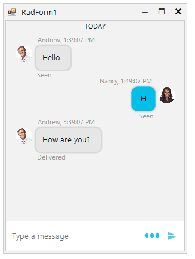

## Environment
 
|Product Version|Product|Author|
|----|----|----|
|2021.3.914|RadChat for WinForms|[Desislava Yordanova](https://www.telerik.com/blogs/author/desislava-yordanova)|
 
## Description

The messages in RadChat are arranged from top to bottom ordered according to their order of adding to the collection. Hence, the last added messages are added on last (bottom) position. This is the expected layout for all world-known chat applications.


A common requirement is to reverse the order of chat messages.
 
## Solution 

If you want to add the messages in a reversed order, it is necessary to plug into the logic for adding messages in the chat view. By default, when you type in the text box and confirm the message, it is automatically added to RadChat. This behavior can be controlled by the **AutoAddUserMessages** property. In addition, the **SendMessage** event is fired each time a new message is about to be added to the chat UI. It is allowed to modify the message itself or adjust whether the message will be added or inserted at position 0.
 

````C#

public RadForm1()
{
    InitializeComponent(); 

    this.radChat1.Author = new Author(Properties.Resources.AnneDodsworth, "Nancy");
    Author author2 = new Author(Properties.Resources.AndrewFuller,"Andrew");

    ChatTextMessage message1 = new ChatTextMessage("Hello", author2,DateTime.Now.AddHours(1));        
    this.radChat1.AddMessage(message1);
    this.radChat1.ChatElement.MessagesViewElement.Items.Last().Status = "Seen";

    ChatTextMessage message2 = new ChatTextMessage("Hi", this.radChat1.Author,DateTime.Now.AddHours(1).AddMinutes(10));
    this.radChat1.AddMessage(message2);
    this.radChat1.ChatElement.MessagesViewElement.Items.Last().Status = "Seen";

    ChatTextMessage message3 = new ChatTextMessage("How are you?", author2,DateTime.Now.AddHours(3));
    this.radChat1.AddMessage(message3);
    this.radChat1.ChatElement.MessagesViewElement.Items.Last().Status = "Delivered";

    this.radChat1.AutoAddUserMessages = false;
    this.radChat1.SendMessage += radChat1_SendMessage;
}

private void radChat1_SendMessage(object sender, SendMessageEventArgs e)
{
    AddMessage(e.Message);
}

public virtual void AddMessage(ChatMessage message)
{
    if (message.Author == null)
    {
        throw new ArgumentNullException("Author", "An author must be specified for each message added.");
    }

    BaseChatDataItem item = this.radChat1.ChatElement.ChatFactory.CreateDataItem(message);
    if (item != null)
    {
        this.radChat1.ChatElement.MessagesViewElement.Items.Insert(0, item);
    }

    ChatSuggestedActionsMessage choicesMessage = message as ChatSuggestedActionsMessage;

    if (choicesMessage != null)
    {
        this.radChat1.ChatElement.SuggestedActionsElement.ClearActions();
        this.radChat1.ChatElement.SuggestedActionsElement.AddActions(choicesMessage.SuggestedActions);
        this.radChat1.ChatElement.SuggestedActionsElement.ShowScrollBar = choicesMessage.ShowScrollBar;
        this.radChat1.ChatElement.SuggestedActionsElement.Visibility = ElementVisibility.Visible;
    }

    ChatOverlayMessage overlayMessage = message as ChatOverlayMessage;

    if (overlayMessage != null)
    {
        this.radChat1.ChatElement.ShowOverlay(overlayMessage);
    }
}


````
````VB.NET

 Public Sub New()
    InitializeComponent()
    Me.RadChat1.Author = New Author(My.Resources.AnneDodsworth, "Nancy")
    Dim author2 As Author = New Author(My.Resources.AndrewFuller, "Andrew")
    Dim message1 As ChatTextMessage = New ChatTextMessage("Hello", author2, DateTime.Now.AddHours(1))
    Me.RadChat1.AddMessage(message1)
    Me.RadChat1.ChatElement.MessagesViewElement.Items.Last().Status = "Seen"
    Dim message2 As ChatTextMessage = New ChatTextMessage("Hi", Me.RadChat1.Author, DateTime.Now.AddHours(1).AddMinutes(10))
    Me.RadChat1.AddMessage(message2)
    Me.RadChat1.ChatElement.MessagesViewElement.Items.Last().Status = "Seen"
    Dim message3 As ChatTextMessage = New ChatTextMessage("How are you?", author2, DateTime.Now.AddHours(3))
    Me.RadChat1.AddMessage(message3)
    Me.RadChat1.ChatElement.MessagesViewElement.Items.Last().Status = "Delivered"
    Me.RadChat1.AutoAddUserMessages = False
    AddHandler Me.RadChat1.SendMessage, AddressOf radChat1_SendMessage
End Sub

Private Sub radChat1_SendMessage(ByVal sender As Object, ByVal e As SendMessageEventArgs)
    AddMessage(e.Message)
End Sub

Public Overridable Sub AddMessage(ByVal message As ChatMessage)
    If message.Author Is Nothing Then
        Throw New ArgumentNullException("Author", "An author must be specified for each message added.")
    End If

    Dim item As BaseChatDataItem = Me.RadChat1.ChatElement.ChatFactory.CreateDataItem(message)

    If item IsNot Nothing Then
        Me.RadChat1.ChatElement.MessagesViewElement.Items.Insert(0, item)
    End If

    Dim choicesMessage As ChatSuggestedActionsMessage = TryCast(message, ChatSuggestedActionsMessage)

    If choicesMessage IsNot Nothing Then
        Me.RadChat1.ChatElement.SuggestedActionsElement.ClearActions()
        Me.RadChat1.ChatElement.SuggestedActionsElement.AddActions(choicesMessage.SuggestedActions)
        Me.RadChat1.ChatElement.SuggestedActionsElement.ShowScrollBar = choicesMessage.ShowScrollBar
        Me.RadChat1.ChatElement.SuggestedActionsElement.Visibility = ElementVisibility.Visible
    End If

    Dim overlayMessage As ChatOverlayMessage = TryCast(message, ChatOverlayMessage)

    If overlayMessage IsNot Nothing Then
        Me.RadChat1.ChatElement.ShowOverlay(overlayMessage)
    End If
End Sub


````




    
   
  
    
 
