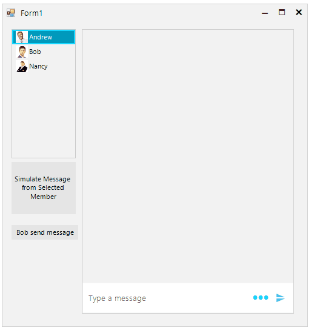

## Environment
 
|Product Version|Product|Author|
|----|----|----|
|2023.3.1010|RadChat for WinForms|[Dinko Krastev](https://www.telerik.com/blogs/author/dinko-krastev)|
 

## Description

This tutorial demonstrates a sample approach how to preserve text message history per user.

 

## Solution 

A complete solution providing a C# and VB.NET project is available [here](https://github.com/telerik/winforms-sdk/tree/master/Chat/PreserveUserTextMessageHistory).

