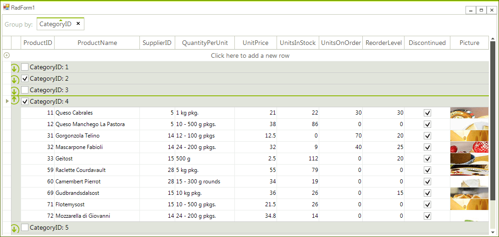

|Product Version|Product|Author|Last modified|
|----|----|----|----|
|2017.3.912|RadGridView for WinForms|[Desislava Yordanova](https://www.telerik.com/blogs/author/desislava-yordanova)|October 02, 2017|

#### Problem

By default, the group rows in **RadGridView** display the group value and the added aggregates to the **GroupDescriptor**. A common scenario is to check/uncheck all rows from a certain group by a check box placed in the group header.  


#### Solution

We will create a derivative of **GridGroupContentCellElement** and insert a **RadCheckBoxElement** in the cell’s children. For the correct layout of the group row element, the text will be visualized in a **LightVisualElement** next to the check box. Both of the elements will be hosted in **StackLayoutElement**. When the check box is toggled, all rows that belong to the group should be updated.

````C#
public class CustomGridGroupContentCellElement : GridGroupContentCellElement
{
    RadCheckBoxElement checkBoxElement = new RadCheckBoxElement();
    LightVisualElement textElement = new LightVisualElement();
    StackLayoutElement stack = new StackLayoutElement();
 
    public CustomGridGroupContentCellElement(GridViewColumn column, GridRowElement row)
        : base(column, row)
    {
    }
 
    protected override Type ThemeEffectiveType
    {
        get
        {
            return typeof(GridGroupContentCellElement);
        }
    }
 
    protected override void CreateChildElements()
    {
        base.CreateChildElements();
        stack = new StackLayoutElement();
        stack.Orientation = Orientation.Horizontal;
        stack.StretchHorizontally = true;
 
        checkBoxElement.StretchHorizontally = false;
        checkBoxElement.CheckStateChanged += checkBoxElement_CheckStateChanged;
        textElement.TextAlignment = ContentAlignment.MiddleLeft;
        this.Children.Add(stack);
        stack.Children.Add(checkBoxElement);
        stack.Children.Add(textElement);
    }
 
    private void checkBoxElement_CheckStateChanged(object sender, EventArgs e)
    {
        //update child rows
        GridViewGroupRowInfo group = this.RowInfo as GridViewGroupRowInfo;
        group.Tag = checkBoxElement.Checked;
        this.GridViewElement.GridControl.BeginUpdate();
        int scrollValue = this.GridControl.TableElement.VScrollBar.Value;
        foreach (GridViewRowInfo row in this.RowInfo.ChildRows)
        {
            GridViewGroupRowInfo groupRow = row as GridViewGroupRowInfo;
            if (groupRow != null)
            {
                Toggle(groupRow, checkBoxElement.Checked);
            }
 
            row.Cells["Discontinued"].Value = checkBoxElement.Checked;
        }
        this.GridViewElement.GridControl.EndUpdate();
        this.GridViewElement.GridControl.TableElement.VScrollBar.Value = scrollValue;
    }
 
    private void Toggle(GridViewGroupRowInfo groupRow, bool state)
    {
        groupRow.Tag = state;
        foreach (GridViewRowInfo row in groupRow.ChildRows)
        {
            GridViewGroupRowInfo g = row as GridViewGroupRowInfo;
            if (g != null)
            {
                Toggle(g, state);
            }
 
            row.Cells["Discontinued"].Value = state;
        }
    }
 
    public override void SetContent()
    {
        base.SetContent();
        this.DrawText = false;
        textElement.Text = ((GridViewGroupRowInfo)this.RowInfo).HeaderText;
        checkBoxElement.CheckStateChanged -= checkBoxElement_CheckStateChanged;
        if (this.RowInfo.Tag != null)
        {
            checkBoxElement.Checked = (bool)this.RowInfo.Tag;
        }
        else
        {
            checkBoxElement.Checked = false;
        }
        checkBoxElement.CheckStateChanged += checkBoxElement_CheckStateChanged;
    }
}

````
````VB.NET
Public Class CustomGridGroupContentCellElement
    Inherits GridGroupContentCellElement
    Private checkBoxElement As RadCheckBoxElement
    Private textElement As LightVisualElement
    Private stack As StackLayoutElement
 
    Public Sub New(column As GridViewColumn, row As GridRowElement)
        MyBase.New(column, row)
    End Sub
 
    Protected Overrides ReadOnly Property ThemeEffectiveType() As Type
        Get
            Return GetType(GridGroupContentCellElement)
        End Get
    End Property
 
    Protected Overrides Sub CreateChildElements()
        MyBase.CreateChildElements()
        checkBoxElement = New RadCheckBoxElement()
        textElement = New LightVisualElement()
        stack = New StackLayoutElement()
        stack.Orientation = Orientation.Horizontal
        stack.StretchHorizontally = True
 
        checkBoxElement.StretchHorizontally = False
        AddHandler checkBoxElement.CheckStateChanged, AddressOf checkBoxElement_CheckStateChanged
        textElement.TextAlignment = ContentAlignment.MiddleLeft
        Me.Children.Add(stack)
        stack.Children.Add(checkBoxElement)
        stack.Children.Add(textElement)
    End Sub
 
    Private Sub checkBoxElement_CheckStateChanged(sender As Object, e As EventArgs)
        'update child rows
        Dim group As GridViewGroupRowInfo = TryCast(Me.RowInfo, GridViewGroupRowInfo)
        group.Tag = checkBoxElement.Checked
        Me.GridViewElement.GridControl.BeginUpdate()
        Dim scrollValue As Integer = Me.GridControl.TableElement.VScrollBar.Value
        For Each row As GridViewRowInfo In Me.RowInfo.ChildRows
            Dim groupRow As GridViewGroupRowInfo = TryCast(row, GridViewGroupRowInfo)
            If groupRow IsNot Nothing Then
                Toggle(groupRow, checkBoxElement.Checked)
            End If
 
            row.Cells("Discontinued").Value = checkBoxElement.Checked
        Next
        Me.GridViewElement.GridControl.EndUpdate()
        Me.GridViewElement.GridControl.TableElement.VScrollBar.Value = scrollValue
    End Sub
 
    Private Sub Toggle(groupRow As GridViewGroupRowInfo, state As Boolean)
        groupRow.Tag = state
        For Each row As GridViewRowInfo In groupRow.ChildRows
            Dim g As GridViewGroupRowInfo = TryCast(row, GridViewGroupRowInfo)
            If g IsNot Nothing Then
                Toggle(g, state)
            End If
 
            row.Cells("Discontinued").Value = state
        Next
    End Sub
 
    Public Overrides Sub SetContent()
        MyBase.SetContent()
        Me.DrawText = False
        textElement.Text = DirectCast(Me.RowInfo, GridViewGroupRowInfo).HeaderText
        RemoveHandler checkBoxElement.CheckStateChanged, AddressOf checkBoxElement_CheckStateChanged
        If Me.RowInfo.Tag IsNot Nothing Then
            checkBoxElement.Checked = CBool(Me.RowInfo.Tag)
        Else
            checkBoxElement.Checked = False
        End If
        AddHandler checkBoxElement.CheckStateChanged, AddressOf checkBoxElement_CheckStateChanged
    End Sub
End Class

````

In order to replace the default group cell with the custom one, it is necessary to subscribe to the CreateCell event:


````C#
private void radGridView1_CreateCell(object sender, Telerik.WinControls.UI.GridViewCreateCellEventArgs e)
{
    if (e.CellType == typeof(GridGroupContentCellElement))
    {
        e.CellElement = new CustomGridGroupContentCellElement(e.Column, e.Row);
    }
}

````
````VB.NET
Private Sub radGridView1_CreateCell(sender As Object, e As Telerik.WinControls.UI.GridViewCreateCellEventArgs)
    If e.CellType Is GetType(GridGroupContentCellElement) Then
        e.CellElement = New CustomGridGroupContentCellElement(e.Column, e.Row)
    End If
End Sub

````

When a cell’s value is changed in the **GridViewCheckBoxColumn** the group row’s check box should be updated as well:

````C#
private void radGridView1_CellValueChanged(object sender, GridViewCellEventArgs e)
{
    if (e.Column.Name == "Discontinued")
    {
        GridViewGroupRowInfo parentGroup = e.Row.Parent as GridViewGroupRowInfo;
        if (parentGroup != null)
        {
            bool atLeastOneOff = false;
            foreach (GridViewRowInfo row in parentGroup.ChildRows)
            {
                if ((bool)row.Cells["Discontinued"].Value == false)
                {
                    atLeastOneOff = true;
                    break;
                }
            }
            parentGroup.Tag = !atLeastOneOff;
        }
    }
}

````
````VB.NET
Private Sub radGridView1_CellValueChanged(sender As Object, e As GridViewCellEventArgs)
    If e.Column.Name = "Discontinued" Then
        Dim parentGroup As GridViewGroupRowInfo = TryCast(e.Row.Parent, GridViewGroupRowInfo)
        If parentGroup IsNot Nothing Then
            Dim atLeastOneOff As Boolean = False
            For Each row As GridViewRowInfo In parentGroup.ChildRows
                If CBool(row.Cells("Discontinued").Value) = False Then
                    atLeastOneOff = True
                    Exit For
                End If
            Next
            parentGroup.Tag = Not atLeastOneOff
        End If
    End If
End Sub

````

>note You can download a VB and C# project from the following [link](https://github.com/telerik/winforms-sdk/tree/master/GridView/GridCheckAllGroupRows).
