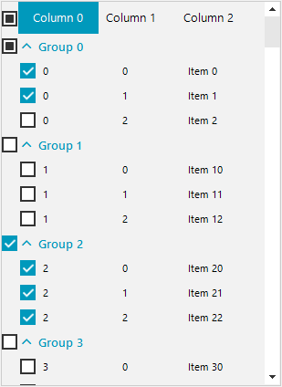

## Environment
|Product Version|Product|Author|
|----|----|----|
|2020.1.113|RadListView for WinForms|[Desislava Yordanova](https://www.telerik.com/blogs/author/desislava-yordanova)|

## Description
 
This article demonstrates how to implement check all functionality in the group items in **RadListview**.

## Solution

It is necessary to add a **RadCheckBoxElement** to the **ListViewElement** that will manage all the check-boxes in the groups. We will create a custom **ListViewDataItemGroup** that stores the **CheckState** of data group item considering the toggle state of the inner items. It is also required to create a custom **DetailListViewGroupVisualItem** which represents the visual element that contains a **RadCheckBoxElement**. Once the visual element is toggled, it is necessary to update the **CheckState** of the respective data item. 

A complete C# and VB code is available in our sdk-repository: [Here](https://github.com/telerik/winforms-sdk/tree/master/ListView/ListViewCheckAllGroups)

# See Also

* [ListView Custom Item]()
* [Grouping]() 

