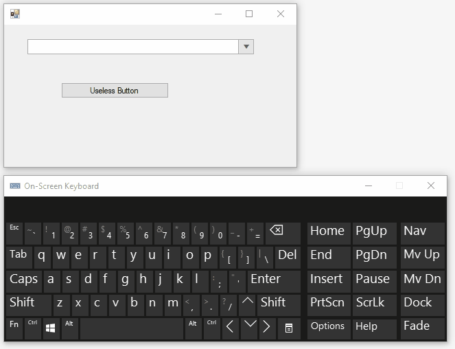

## Environment
<table>
	<tr>
		<td>Product Version</td>
		<td>2021.3.1123</td>
	</tr>
	<tr>
		<td>Product</td>
		<td>RadCheckedDropDownList for WinForms</td>
	</tr>
</table>


## Description

This tutorial demonstrates how to insert a new token inside RadCheckedDropDownList if the text is not present in the Items collection.

## Solution

**RadCheckedDropDownListElement** is purposed to synchronize its checked items with the tokens entered in the editable area (EditableElementText). That is why if the tokens are not available in the **Items** collection as items, they are not expected to be preserved. This behavior is desired and it is controlled by the internal **SyncEditorElementWithSelectedItem** method. However, this internal default logic can't be controlled or overridden. 
The **TokenValidating** event is appropriate for detecting when a new token is about to be entered. It is possible to control whether it is valid or not. However, inserting new items to the RadCheckedDropDownList.**Items** collection while validating a token is a tricky moment. The possible solution is to stop the default synchronization while the **Items** collection is being managed: 
 



````C#

private void RadCheckedDropDownList1_TokenValidating(object sender, TokenValidatingEventArgs e)
{
    this.radCheckedDropDownList1.TokenValidating -= RadCheckedDropDownList1_TokenValidating;
    if (!e.IsValidToken)
    {
        AutoCompleteBoxViewElement textBox = sender as AutoCompleteBoxViewElement;
        if (this.radCheckedDropDownList1.DropDownListElement.FindStringExact(e.Text) == -1)
        {
            this.radCheckedDropDownList1.CheckedDropDownListElement.BeginUpdate();
            this.radCheckedDropDownList1.Items.Add(new RadCheckedListDataItem(e.Text, true));
            this.radCheckedDropDownList1.CheckedDropDownListElement.EndUpdate();
            e.IsValidToken = true;
        }
    }
    this.radCheckedDropDownList1.TokenValidating += RadCheckedDropDownList1_TokenValidating;
}

````
````VB.NET

Private Sub dd_TokenValidating(sender As Object, e As TokenValidatingEventArgs) Handles RadCheckedDropDownList1.TokenValidating
    RemoveHandler RadCheckedDropDownList1.TokenValidating, AddressOf dd_TokenValidating
    If Not e.IsValidToken Then
        Dim textBox As AutoCompleteBoxViewElement = TryCast(sender, AutoCompleteBoxViewElement)
        If RadCheckedDropDownList1.DropDownListElement.FindStringExact(e.Text) = -1 Then
            Me.RadCheckedDropDownList1.CheckedDropDownListElement.BeginUpdate()
            RadCheckedDropDownList1.Items.Add(New RadCheckedListDataItem(e.Text, True))
            Me.RadCheckedDropDownList1.CheckedDropDownListElement.EndUpdate()
            e.IsValidToken = True
        End If
    End If
    AddHandler RadCheckedDropDownList1.TokenValidating, AddressOf dd_TokenValidating
End Sub

````

# See Also

* [Adding Items Programmatically]()