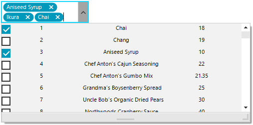
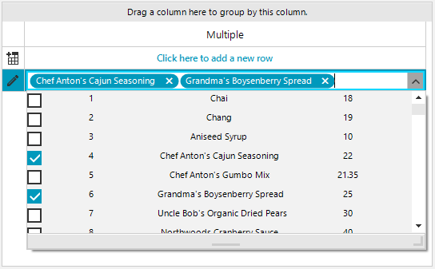

## Environment
 
|Product Version|Product|Author|
|----|----|----|
|2020.3.1020|RadMultiColumnCombobox for WinForms|[Desislava Yordanova](https://www.telerik.com/blogs/author/desislava-yordanova)|
 
## Description

[RadMultiColumnComboBox]() displays a popup grid which allows showing different information for each record arranged in columns. However, this control allows selecting a single record from the drop down. A common requirement is to allow the user pick up more than one option.

Telerik UI for WinForms suite offers a control that provides functionality to check multiple items in the drop down area and tokenize them in the text area. It is called [RadCheckedDropDownList](). However, similar to [RadDropDownList](), it displays just a single field for each item controlled by the **DisplayMember**.

This tutorial demonstrates a sample approach how to achieve checked RadMultiColumnComboBox - show several columns of data whilst being able to select multiple items with check boxes without closing the popup.   

 

## Solution 
 
It is necessary to use a [RadCheckedDropDownList]() and create custom visual items in the drop down. For this purpose, it is necessary to handle the **CreatingVisualItem** and replace the default **RadCheckedListVisualItem** with a custom one.

The custom **RadCheckedListVisualItem** will be composed of a **StackLayoutElement** which hosts as many **LightVisualElements** as you need depending on the columns count that you need to simulate:

#### Custom RadCheckedListVisualItem

````C#
private void RadForm1_Load(object sender, EventArgs e)
{ 
    this.productsTableAdapter.Fill(this.nwindDataSet.Products);
    this.radCheckedDropDownList1.CreatingVisualListItem += RadCheckedDropDownList1_CreatingVisualListItem;
    this.radCheckedDropDownList1.DataSource = this.productsBindingSource;
    this.radCheckedDropDownList1.DisplayMember = "ProductName";
    this.radCheckedDropDownList1.DropDownSizingMode = SizingMode.UpDownAndRightBottom;
    this.radCheckedDropDownList1.DropDownMinSize = new Size(500, 200);
    this.radCheckedDropDownList1.Multiline = true;
}

private void RadCheckedDropDownList1_CreatingVisualListItem(object sender, CreatingVisualListItemEventArgs args)
{
    args.VisualItem = new CustomRadCheckedListVisualItem();
}

public class CustomRadCheckedListVisualItem : RadCheckedListVisualItem
{
    private StackLayoutElement stackLayout;
    private LightVisualElement name;
    private LightVisualElement id;
    private LightVisualElement price;

    protected override RadLabelElement CreateLabelElement()
    {
        stackLayout = new StackLayoutElement();
        name = new LightVisualElement();
        id = new LightVisualElement();
        price = new LightVisualElement();

        stackLayout.Orientation = Orientation.Horizontal;
        stackLayout.StretchHorizontally = true;
        stackLayout.Children.Add(id);
        stackLayout.Children.Add(name);
        stackLayout.Children.Add(price);
        this.Children.Add(stackLayout);
        return base.CreateLabelElement();
    }

    protected override void SynchronizeProperties()
    {
        base.SynchronizeProperties();
        DataRowView rowView = this.Data.DataBoundItem as DataRowView;
        if (rowView != null)
        {
            id.Text = rowView.Row["ProductID"] + string.Empty;
            name.Text = rowView.Row["ProductName"] + string.Empty;
            price.Text = rowView.Row["UnitPrice"] + string.Empty;
        }
        this.Label.Text = "";
    }
} 

````
````VB.NET
Public Class CustomRadCheckedListVisualItem
Inherits RadCheckedListVisualItem
    Dim stackLayout As StackLayoutElement
    Dim name As LightVisualElement
    Dim id As LightVisualElement
    Dim price As LightVisualElement
    Protected Overrides Function CreateLabelElement() As RadLabelElement
        stackLayout = New StackLayoutElement
        name = New LightVisualElement
        id = New LightVisualElement
        price = New LightVisualElement

        stackLayout.Orientation = Orientation.Horizontal
        stackLayout.StretchHorizontally = True 
        stackLayout.Children.Add(id)
        stackLayout.Children.Add(name)
        stackLayout.Children.Add(price)
        Me.Children.Add(stackLayout)
        Return MyBase.CreateLabelElement()
    End Function
    Protected Overrides Sub SynchronizeProperties()
        MyBase.SynchronizeProperties()
        Dim rowView As DataRowView = TryCast(Me.Data.DataBoundItem, DataRowView)
        If rowView IsNot Nothing Then
            id.Text = rowView.Row("ProductID")
            name.Text = rowView.Row("ProductName")
            price.Text = rowView.Row("UnitPrice")
        End If
        Me.Label.Text=""
    End Sub

End Class

Private Sub RadForm1_Load(sender As Object, e As EventArgs) Handles MyBase.Load
    Me.ProductsTableAdapter.Fill(Me.NwindDataSet.Products)
    AddHandler Me.RadCheckedDropDownList1.CreatingVisualListItem, AddressOf RadCheckedDropDownList1_CreatingVisualListItem
    Me.RadCheckedDropDownList1.DataSource = Me.ProductsBindingSource
    Me.RadCheckedDropDownList1.DisplayMember = "ProductName"
    Me.RadCheckedDropDownList1.DropDownSizingMode = SizingMode.UpDownAndRightBottom
    Me.RadCheckedDropDownList1.DropDownMinSize = New Size(500, 200)
    Me.RadCheckedDropDownList1.Multiline = True
End Sub

Private Sub RadCheckedDropDownList1_CreatingVisualListItem(sender As Object, args As CreatingVisualListItemEventArgs)
    args.VisualItem = New CustomRadCheckedListVisualItem()
End Sub
 

```` 

## Use it as an editor in RadGridView

The above solution can be adopted for **RadGridView** as an editor. It is necessary to construct a [custom editor]() and replace it in the **EditorRequired** event:
 
 

````C#
public RadForm1()
{
    InitializeComponent();

    GridViewTextBoxColumn checkedDropDownListColumn = new GridViewTextBoxColumn();
    checkedDropDownListColumn.FieldName = "Multiple";
    checkedDropDownListColumn.Width = 200;
    this.radGridView1.Columns.Add(checkedDropDownListColumn);
    this.radGridView1.EditorRequired += radGridView1_EditorRequired;
}

private void radGridView1_EditorRequired(object sender, EditorRequiredEventArgs e)
{
    if (this.radGridView1.CurrentColumn.Name == "Multiple")
    {
        RadCheckedDropDownListElement editor = new GridViewCheckedDropDownListEditor();
        editor.CreatingVisualItem += editor_CreatingVisualItem;
        editor.DataSource = this.productsBindingSource;
        editor.DisplayMember = "ProductName";
        editor.DropDownSizingMode = SizingMode.UpDownAndRightBottom;
        editor.DropDownMinSize = new Size(500, 200);
        e.Editor = editor;
    }
}

public class GridViewCheckedDropDownListEditor : RadCheckedDropDownListElement
{
    public override object Value
    {
        get
        {
            return this.Text;
        }
        set
        {
            this.Text = value + "";
        }
    }
}

private void editor_CreatingVisualItem(object sender, CreatingVisualListItemEventArgs args)
{
    args.VisualItem = new CustomRadCheckedListVisualItem();
}
 

````
````VB.NET
Sub New() 
    InitializeComponent()
    Dim checkedDropDownListColumn As New GridViewTextBoxColumn()
    checkedDropDownListColumn.FieldName = "Multiple"
    checkedDropDownListColumn.Width = 200
    Me.RadGridView1.Columns.Add(checkedDropDownListColumn)
    AddHandler Me.RadGridView1.EditorRequired, AddressOf radGridView1_EditorRequired
End Sub
Private Sub radGridView1_EditorRequired(ByVal sender As Object, ByVal e As EditorRequiredEventArgs)
    If Me.RadGridView1.CurrentColumn.Name = "Multiple" Then
        Dim editor As RadCheckedDropDownListElement = New GridViewCheckedDropDownListEditor()
        AddHandler editor.CreatingVisualItem, AddressOf editor_CreatingVisualItem
        editor.DataSource = Me.ProductsBindingSource
        editor.DisplayMember = "ProductName"
        editor.DropDownSizingMode = SizingMode.UpDownAndRightBottom
        editor.DropDownMinSize = New Size(500, 200)
        e.Editor = editor
    End If
End Sub

Public Class GridViewCheckedDropDownListEditor
Inherits RadCheckedDropDownListElement
    Public Overrides Property Value() As Object
        Get
            Return Me.Text
        End Get
        Set(ByVal value As Object)
            Me.Text = value & ""
        End Set
    End Property
End Class

Private Sub editor_CreatingVisualItem(sender As Object, args As CreatingVisualListItemEventArgs)
    args.VisualItem = New CustomRadCheckedListVisualItem()
End Sub
 

````

# See Also

* [RadCheckedDropDownList]()
* [RadMultiColumnComboBox]()

