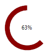

## Environment
 
|Product Version|Product|Author|
|----|----|----|
|2019.3.917|RadProgressBar for WinForms|[Desislava Yordanova](https://www.telerik.com/blogs/author/desislava-yordanova)|
 
## Description

The main purpose of [RadProgressBar]() is to indicate progress. However, it doesn't offer circular style. This tutorial aims to demonstrate a sample approach how to achieve a circular progress bar using the existing circular waiting styles for [RadWaitingBar]()




## Solution 

Create a derivative of **RadWaitingBar** and manipulate the **InitialStartElementAngle**, **SweepAngle** and **MinSweepAngle** to represent the equivalent value within the range [0-100]. A sample implementation is demonstrated in the following code snippet:


````C#

        public class CircularProgressBar : RadWaitingBar
        {
            private decimal _value;
            private Color _color;

            public override string ThemeClassName
            {
                get
                {
                    return typeof(RadWaitingBar).FullName;
                }
            }

            protected override RadWaitingBarElement CreateWaitingBarElement()
            {
                RadWaitingBarElement waitingElement = base.CreateWaitingBarElement();
                waitingElement.WaitingStyle = Telerik.WinControls.Enumerations.WaitingBarStyles.FadingRing;
                FadingRingWaitingBarIndicatorElement indicator = waitingElement.ContentElement.WaitingIndicators[0] as FadingRingWaitingBarIndicatorElement;
                this._color = Color.Blue;
                waitingElement.Text = "0 %";
            
                indicator.InitialStartElementAngle = 90;
                indicator.SweepAngle = 360;
                indicator.MinSweepAngle = 0;

                return waitingElement;
            }

            public decimal ProgressValue
            {
                get
                {
                    return this._value;
                }

                set
                {
                    _value = value;
                    FadingRingWaitingBarIndicatorElement indicator = 
                        this.WaitingBarElement.ContentElement.WaitingIndicators[0] as FadingRingWaitingBarIndicatorElement;
                    this.WaitingBarElement.Text = value + "%";
                    indicator.MinSweepAngle = (int)ConvertProgressValueToAngle(value);
                    UpdateVisualStyles();
                }
            }

            public Color ProgressColor
            {
                get
                {
                    return _color;
                }
                set
                {
                    this._color = value;
                    FadingRingWaitingBarIndicatorElement indicator = 
                        this.WaitingBarElement.ContentElement.WaitingIndicators[0] as FadingRingWaitingBarIndicatorElement;
                    indicator.ElementColor = this.ProgressColor;
                    indicator.ElementColor2 = this.ProgressColor;
                }
            }

            private void UpdateVisualStyles()
            {
                FadingRingWaitingBarIndicatorElement indicator = 
                    this.WaitingBarElement.ContentElement.WaitingIndicators[0] as FadingRingWaitingBarIndicatorElement;
                indicator.ElementColor = this.ProgressColor;
                indicator.ElementColor2 = this.ProgressColor;
                indicator.GradientStyle = Telerik.WinControls.GradientStyles.Solid;
                indicator.InnerRadius = this.Width / 4 + 10;
                indicator.Radius = this.Width / 4 + 20;
            }

            private decimal ConvertProgressValueToAngle(decimal value)
            {
                decimal angleValue = 0;
                angleValue = value * 360 / 100;
                return angleValue;
            }
        } 

        CircularProgressBar circularProgressBar = new CircularProgressBar();

        public RadForm1()
        {
            InitializeComponent();
           
            circularProgressBar.Size = new Size(100, 100);
            circularProgressBar.Location = new Point(10, 10);
            this.Controls.Add(circularProgressBar);
            circularProgressBar.ProgressValue = 50;
            circularProgressBar.ProgressColor = Color.DarkRed;
			circularProgressBar.BackColor = Color.Transparent;
			circularProgressBar.WaitingBarElement.DrawBorder = false;

        }

        
````
````VB.NET

 
    Public Class CircularProgressBar
        Inherits RadWaitingBar

        Private _value As Decimal
        Private _color As Color

        Public Overrides Property ThemeClassName As String
            Get
                Return GetType(RadWaitingBar).FullName
            End Get
            Set(value As String)
                MyBase.ThemeClassName = value
            End Set
        End Property

        Protected Overrides Function CreateWaitingBarElement() As RadWaitingBarElement
            Dim waitingElement As RadWaitingBarElement = MyBase.CreateWaitingBarElement()
            waitingElement.WaitingStyle = Telerik.WinControls.Enumerations.WaitingBarStyles.FadingRing
            Dim indicator As FadingRingWaitingBarIndicatorElement = TryCast(waitingElement.ContentElement.WaitingIndicators(0), FadingRingWaitingBarIndicatorElement)
            Me._color = Color.Blue
            waitingElement.Text = "0 %"
            indicator.InitialStartElementAngle = 90
            indicator.SweepAngle = 360
            indicator.MinSweepAngle = 0
            Return waitingElement
        End Function

        Public Property ProgressValue As Decimal
            Get
                Return Me._value
            End Get
            Set(ByVal value As Decimal)
                _value = value
                Dim indicator As FadingRingWaitingBarIndicatorElement = _
                    TryCast(Me.WaitingBarElement.ContentElement.WaitingIndicators(0), FadingRingWaitingBarIndicatorElement)
                Me.WaitingBarElement.Text = value & "%"
                indicator.MinSweepAngle = CInt(ConvertProgressValueToAngle(value))
                UpdateVisualStyles()
            End Set
        End Property

        Public Property ProgressColor As Color
            Get
                Return _color
            End Get
            Set(ByVal value As Color)
                Me._color = value
                Dim indicator As FadingRingWaitingBarIndicatorElement = _
                    TryCast(Me.WaitingBarElement.ContentElement.WaitingIndicators(0), FadingRingWaitingBarIndicatorElement)
                indicator.ElementColor = Me.ProgressColor
                indicator.ElementColor2 = Me.ProgressColor
            End Set
        End Property

        Private Sub UpdateVisualStyles()
            Dim indicator As FadingRingWaitingBarIndicatorElement = _
                TryCast(Me.WaitingBarElement.ContentElement.WaitingIndicators(0), FadingRingWaitingBarIndicatorElement)
            indicator.ElementColor = Me.ProgressColor
            indicator.ElementColor2 = Me.ProgressColor
            indicator.GradientStyle = Telerik.WinControls.GradientStyles.Solid
            indicator.InnerRadius = Me.Width / 4 + 10
            indicator.Radius = Me.Width / 4 + 20
        End Sub

        Private Function ConvertProgressValueToAngle(ByVal value As Decimal) As Decimal
            Dim angleValue As Decimal = 0
            angleValue = value * 360 / 100
            Return angleValue
        End Function
    End Class
     
    Private _circularProgressBar As CircularProgressBar = New CircularProgressBar()

    Public Sub New()
        InitializeComponent()

        _circularProgressBar.Size = New Size(100, 100)
        _circularProgressBar.Location = New Point(10, 10) 
        Me.Controls.Add(_circularProgressBar)
        _circularProgressBar.ProgressValue = 50
        _circularProgressBar.ProgressColor = Color.DarkRed
		_circularProgressBar.BackColor = Color.Transparent
		_circularProgressBar.WaitingBarElement.DrawBorder = False

    End Sub

```` 
 

# See Also

* [ProgressBar]() 
* [WaitingBar]()


    
   
  
    
 
