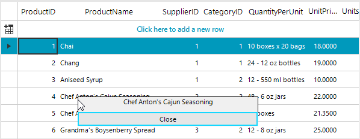

## Environment
 
|Product Version|Product|Author|
|----|----|----|
|2019.2.917|RadGridView for WinForms|[Desislava Yordanova](https://www.telerik.com/blogs/author/desislava-yordanova)|
 

## Description

The [ScreenTip]() is a UI feature which consists of a small window that appears when the mouse cursor is hovered over a particular element. By default, each control has a **ScreenTipNeeded** event which is fired when the mouse hovers over the various elements inside the control. The screen tip extends the tool-tips functionality because it can show many different elements including images.

The screen-tip is supposed to be shown when you hover a cell. The screen-tip itself is not expected to hover it and click an element in it. This tutorial demonstrates how to achieve clickable screen-tips. 


## Solution 

For such cases, you can simply use a [ShapedForm]() (without a title-bar) and add all the controls that you want to see in the screen-tip.

>note You can create a **ShapedForm** at design time and produce whatever layout you need. When hovering with the mouse over grid cells, you can simply show this clickable form that simulates the screen-tip.



````C#

public RadForm1()
{
    InitializeComponent();

    //prepare the screentip form
    screenTipForm = new ShapedForm();
    screenTipForm.FormBorderStyle = System.Windows.Forms.FormBorderStyle.None ;
    screenTipForm.Size = new Size(300, 50);
    RadButton closeButton = new RadButton();
    closeButton.Text = "Close";
    closeButton.Dock = DockStyle.Bottom;
    screenTipForm.Controls.Add(closeButton);
    RadLabel label = new RadLabel();
    label.Name = "radLabel1"; 
    label.AutoSize = false;
    label.Size = new System.Drawing.Size(screenTipForm.Size.Width, 20);
    label.TextAlignment = ContentAlignment.TopCenter;
    label.Dock = DockStyle.Fill;
    screenTipForm.Controls.Add(label);
    
    closeButton.Click += closeButton_Click;
    this.radGridView1.MouseHover += radGridView1_MouseHover;
}

private void closeButton_Click(object sender, EventArgs e)
{
    screenTipForm.Hide();
}

ShapedForm screenTipForm;

private void radGridView1_MouseHover(object sender, EventArgs e)
{
    Point pt = this.radGridView1.PointToClient(new Point(Cursor.Position.X, Cursor.Position.Y));
    GridDataCellElement dataCell = this.radGridView1.ElementTree.GetElementAtPoint(pt) as GridDataCellElement;
    if (dataCell != null)
    {
        screenTipForm.Hide();
        screenTipForm.Controls["radLabel1"].Text = dataCell.Text;
        screenTipForm.SetDesktopLocation(Cursor.Position.X, Cursor.Position.Y);
        screenTipForm.Show();
    }
}
        

````
````VB.NET

Public Sub New()
    InitializeComponent()
    screenTipForm = New ShapedForm()
    screenTipForm.FormBorderStyle = System.Windows.Forms.FormBorderStyle.None
    screenTipForm.Size = New Size(300, 50)
    Dim closeButton As RadButton = New RadButton()
    closeButton.Text = "Close"
    closeButton.Dock = DockStyle.Bottom
    screenTipForm.Controls.Add(closeButton)
    Dim label As RadLabel = New RadLabel()
    label.Name = "radLabel1"
    label.AutoSize = False
    label.Size = New System.Drawing.Size(screenTipForm.Size.Width, 20)
    label.TextAlignment = ContentAlignment.TopCenter
    label.Dock = DockStyle.Fill
    screenTipForm.Controls.Add(label)
    AddHandler closeButton.Click, AddressOf closeButton_Click
    AddHandler Me.RadGridView1.MouseHover, AddressOf radGridView1_MouseHover
End Sub

Private Sub closeButton_Click(ByVal sender As Object, ByVal e As EventArgs)
    screenTipForm.Hide()
End Sub

Private screenTipForm As ShapedForm

Private Sub radGridView1_MouseHover(ByVal sender As Object, ByVal e As EventArgs)
    Dim pt As Point = Me.RadGridView1.PointToClient(New Point(Cursor.Position.X, Cursor.Position.Y))
    Dim dataCell As GridDataCellElement = TryCast(Me.RadGridView1.ElementTree.GetElementAtPoint(pt), GridDataCellElement)

    If dataCell IsNot Nothing Then
        screenTipForm.Hide()
        screenTipForm.Controls("radLabel1").Text = dataCell.Text
        screenTipForm.SetDesktopLocation(Cursor.Position.X, Cursor.Position.Y)
        screenTipForm.Show()
    End If
End Sub
     

```` 
 

# See Also

* [Screentips]() 


    
   
  
    
 
