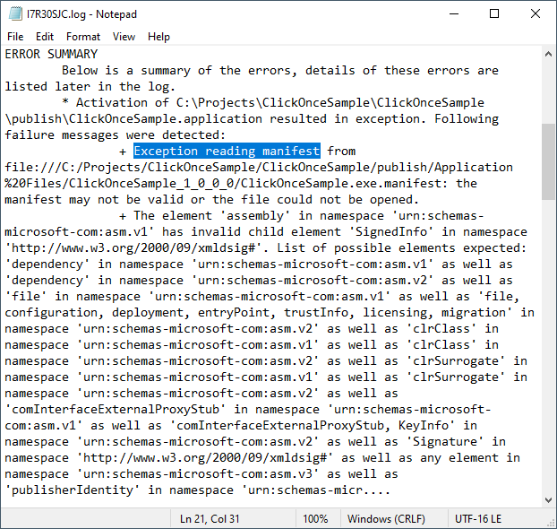

## Environment
 
|Product Version|Product|Author|
|----|----|----|
|2020.2.616|Telerik UI for WinForms|[Desislava Yordanova](https://www.telerik.com/blogs/author/desislava-yordanova)|
 
## Description

There are different approaches for application deployment. One of the most commonly used is [ClickOnce](). Note that declaring DPI awareness in the app.manifest file breaks ClickOnce applications. There is a know issue regarding the ClickOnce installer when reading the manifest. Please refer to the following [MSDN thread](https://social.msdn.microsoft.com/Forums/azure/en-US/3bc5b258-b85f-4714-b8a5-f984d86e635a/my-c-clickonce-application-will-not-install-after-publishing?forum=winformssetup). 

>caption ClickOnce error message

 

## Solution 

The suggested way to avoid this is only available if your project's target framework is .NET 4.7 and your application run on a Windows 10 Creators update (1703) or newer. It requires you to have an **app.manifest** and an **app.config** files added to your project. 

Inside the config file you should have the following settings:

````XML
<?xml version="1.0" encoding="utf-8"?>
<configuration>
  <startup>
    <supportedRuntime version="v4.0" sku=".NETFramework,Version=v4.7"/>
  </startup>
  <System.Windows.Forms.ApplicationConfigurationSection>
    <add key="DPIAwareness" value="PerMonitorV2"/>
    <add key="DisableDpiChangedMessageHandling" value="True" />
  </System.Windows.Forms.ApplicationConfigurationSection>
</configuration>

````

and inside the manifest file you should declare your app is compatible with Windows 10:

````XML
<?xml version="1.0" encoding="utf-8"?>
<assembly manifestVersion="1.0" xmlns="urn:schemas-microsoft-com:asm.v1">
<assemblyIdentity version="1.0.0.0" name="MyApplication.app"/>
<compatibility xmlns="urn:schemas-microsoft-com:compatibility.v1">
  <application>
   <supportedOS Id="{8e0f7a12-bfb3-4fe8-b9a5-48fd50a15a9a}" />
  </application>
</compatibility>
</assembly>

````

An alternative approach which I believe is the easiest way to redistribute Telerik assemblies in case of commercial WinForms applications deployed to your end users is to deploy the Telerik assemblies together with your application with the sole exception of the Telerik.WinControls.UI.Design.dll assembly. 

>important The **Telerik.WinControls.UI.Design.dll** assembly may not be deployed to end-users under any circumstance.

# See Also

* [Redistributing Telerik UI for WinForms]()


 
