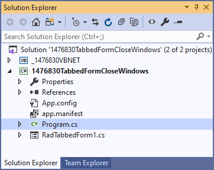
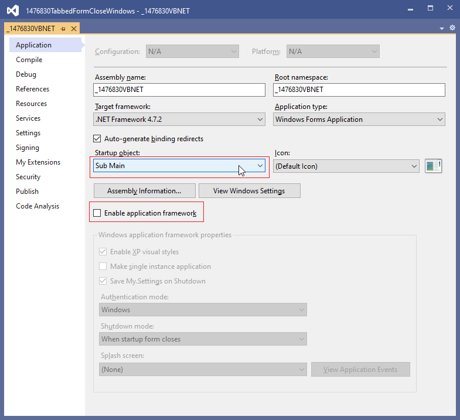

## Environment
 
|Product Version|Product|Author|
|----|----|----|
|2020.2.616|RadTabbedForm for WinForms|[Desislava Yordanova](https://www.telerik.com/blogs/author/desislava-yordanova)|
 

## Description

[RadTabbedForm]() allows you to display tabs in the title bar, just like in most modern Web browsers. You can pin the tabs or reorder them via drag drop. You can open any tab in a standalone window as well. Thus, by dragging a tab outside the title bar, you will generate another opened form.

However, in case you have multiple windows (forms) opened, each of which can be closed separately via the close button, closing the main window (form) will close the rest of the available forms as well.

A common requirement is to keep the application running until the last form is closed. Although, this scenario is more like a general-programming question, this article is intended to show how to handle it and keep the application running even in case of closing the main form.

## Solution 
 
After some research, the following thread seems to be quite useful on this topic and provide different approaches: [Close a windows form without exiting the entire application](https://stackoverflow.com/questions/5599097/close-a-windows-form-without-exiting-the-entire-application?rq=1)

Usually, the **Program** file has the following default code:



````C#

Application.Run(new RadTabbedForm1());
 
````
````VB.NET

Application.Run(New RadTabbedForm1()) 

````

>note For VB.NET projects, you can refer to the following thread explaining how to simulate a Program.vb file: [What is the equivalent of Program.cs in VB.NET](https://stackoverflow.com/questions/10534683/what-is-the-equivalent-of-program-cs-in-vb-net)



When your application starts, the first thing it does is to create a new form of whichever form is your main form and then run it. The application will quit when that form is closed. The following code snippet demonstrates how to avoid closing the application when the main form is closed:

````C#

static class Program
{
    /// <summary>
    /// The main entry point for the application.
    /// </summary>
    [STAThread]
    static void Main()
    {
        Application.EnableVisualStyles();
        Application.SetCompatibleTextRenderingDefault(false);
        var main_form = new RadTabbedForm1();
        main_form.Show();
        Application.Run();

        //comment this code line
        //Application.Run(new RadTabbedForm1());
    }

 
````
````VB.NET

Public Class RadTabbedForm1
    Shared Sub Main()
        Application.EnableVisualStyles()
        Application.SetCompatibleTextRenderingDefault(False)
        Dim main_form = New RadTabbedForm1()
        main_form.Show()
        Application.Run()
    End Sub
End Class

````

Then, you can call Application.**Exit** when the last opened form is being closed:

````C#

    public RadTabbedForm1()
    {
        InitializeComponent();

        this.AllowAero = false;

        this.FormClosed += RadTabbedForm1_FormClosed;
        this.TabbedFormControl.TabbedFormControlElement.ItemDragService.TabbedFormCreating += ItemDragService_TabbedFormCreating;
    }

    private void RadTabbedForm1_FormClosed(object sender, FormClosedEventArgs e)
    {
        CloseApplicationIfLast();
    }

    private void ItemDragService_TabbedFormCreating(object sender, TabbedFormCreatingEventArgs e)
    {
        e.TabbedForm.FormClosed += TabbedForm_FormClosed;
        e.TabbedForm.TabbedFormControlCreating += TabbedForm_TabbedFormControlCreating;
    }

    private void TabbedForm_TabbedFormControlCreating(object sender, TabbedFormControlCreatingEventArgs e)
    {
        e.TabbedFormControl.TabbedFormControlElement.ItemDragService.TabbedFormCreating += ItemDragService_TabbedFormCreating;
    }

    private void TabbedForm_FormClosed(object sender, FormClosedEventArgs e)
    {
        CloseApplicationIfLast(); 
    }

    private void CloseApplicationIfLast()
    {
        if (Application.OpenForms.Count == 0)
        {
            Application.Exit();
        }
    }

````
````VB.NET

Public Sub New()
    InitializeComponent()
    Me.AllowAero = False
    AddHandler Me.FormClosed, AddressOf RadTabbedForm1_FormClosed
    AddHandler Me.TabbedFormControl.TabbedFormControlElement.ItemDragService.TabbedFormCreating, AddressOf ItemDragService_TabbedFormCreating
End Sub

Private Sub RadTabbedForm1_FormClosed(ByVal sender As Object, ByVal e As FormClosedEventArgs)
    CloseApplicationIfLast()
End Sub

Private Sub ItemDragService_TabbedFormCreating(ByVal sender As Object, ByVal e As TabbedFormCreatingEventArgs)
    AddHandler e.TabbedForm.FormClosed, AddressOf TabbedForm_FormClosed
    AddHandler e.TabbedForm.TabbedFormControlCreating, AddressOf TabbedForm_TabbedFormControlCreating
End Sub

Private Sub TabbedForm_TabbedFormControlCreating(ByVal sender As Object, ByVal e As TabbedFormControlCreatingEventArgs)
    AddHandler e.TabbedFormControl.TabbedFormControlElement.ItemDragService.TabbedFormCreating, AddressOf ItemDragService_TabbedFormCreating
End Sub

Private Sub TabbedForm_FormClosed(ByVal sender As Object, ByVal e As FormClosedEventArgs)
    CloseApplicationIfLast()
End Sub

Private Sub CloseApplicationIfLast()
    If Application.OpenForms.Count = 0 Then
        Application.[Exit]()
    End If
End Sub


````
 

# See Also

* [RadTabbedForm]() 
* [RadTabbedFormDragDropService ]()

