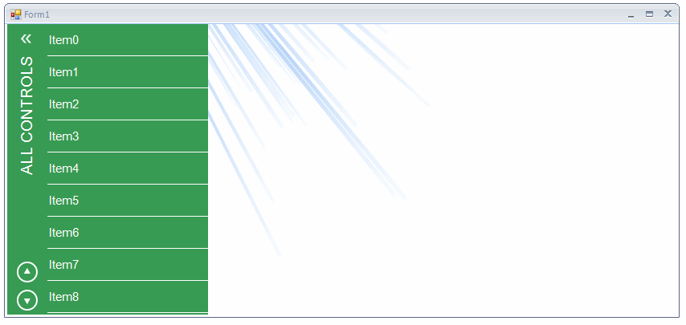

## Environment
|Date Posted|Product|Author|
|----|----|----|
|March 27, 2015|RadCollapsiblePanel for WinForms|[Desislava Yordanova](https://www.telerik.com/blogs/author/desislava-yordanova)|

# Problem
 
This article demonstrates how to achieve the collapsible menu from the Demo application.  


 
# Solution 
 
Firstly, you should create a new project with a **RadForm**. Afterwards, drag a [RadCollapsiblePanel](https://docs.telerik.com/devtools/winforms/panels-and-labels/collapsiblepanel/overview) and a [RadPanorama](https://docs.telerik.com/devtools/winforms/panorama/overview) from the Toolbox and drop them onto the form. You need to insert a [RadListControl](https://docs.telerik.com/devtools/winforms/dropdown-listcontrol-and-checkeddropdownlist/listcontrol/listcontrol) in the **RadCollapsiblePanel**.
 
Then, you should change the RadCollapsiblePanel.**ExpandDirection** to *Right* and customize its style by changing the header font, fore color, rotate the text etc*.*We should apply a specific image to the **HeaderButtonElement** for the expanded and collapsed state. We will use **LightVisualElement** **s** for the up and down arrows added to the CollapsiblePanelElement.HeaderElement.**Children** collection. In order to customize the **RadListControl**, we can use the [VisualItemFormatting](https://docs.telerik.com/devtools/winforms/dropdown-listcontrol-and-checkeddropdownlist/listcontrol/customizing-items-%28visual-appearance%29) event.

````C#
Font font = new Font("Arial", 14f);
Font itemsFont = new Font("Arial", 11f);
 
public Form1()
{
    InitializeComponent();
 
    this.BackColor = Color.White;
 
    this.radCollapsiblePanel1.Width = 250;
    this.radCollapsiblePanel1.Dock = DockStyle.Left;
    this.radCollapsiblePanel1.ExpandDirection = Telerik.WinControls.UI.RadDirection.Right;
   
    this.radPanorama1.Dock = DockStyle.Fill;
    this.radPanorama1.PanoramaElement.BackColor = Color.Transparent;
  
    this.radCollapsiblePanel1.HeaderText = "ALL CONTROLS";
    this.radCollapsiblePanel1.CollapsiblePanelElement.HeaderElement.Margin = new Padding(0, 0, -5, 0);
    this.radCollapsiblePanel1.CollapsiblePanelElement.HeaderElement.HeaderTextElement.AngleTransform = 180;
    this.radCollapsiblePanel1.CollapsiblePanelElement.HeaderElement.HeaderTextElement.Font = font;
    this.radCollapsiblePanel1.CollapsiblePanelElement.HeaderElement.HeaderTextElement.ForeColor = Color.White;
    this.radCollapsiblePanel1.CollapsiblePanelElement.HeaderElement.HeaderTextElement.StretchHorizontally = true;
    this.radCollapsiblePanel1.CollapsiblePanelElement.HeaderElement.HeaderTextElement.StretchVertically = true;
    this.radCollapsiblePanel1.CollapsiblePanelElement.ShowHeaderLine = false;
    this.radCollapsiblePanel1.ControlsContainer.PanelElement.Border.Visibility = Telerik.WinControls.ElementVisibility.Collapsed;
 
    this.radCollapsiblePanel1.Collapsed += radCollapsiblePanel1_Collapsed;
    this.radCollapsiblePanel1.Expanded += radCollapsiblePanel1_Expanded;
 
    this.radCollapsiblePanel1.CollapsiblePanelElement.HeaderElement.HeaderButtonElement.MinSize = new Size(40, 40);
    this.radCollapsiblePanel1.CollapsiblePanelElement.HeaderElement.HeaderButtonElement.Image = Properties.Resources.chevron_left;
    this.radCollapsiblePanel1.CollapsiblePanelElement.HeaderElement.HeaderButtonElement.ImageLayout = ImageLayout.Zoom;
    this.radCollapsiblePanel1.CollapsiblePanelElement.HeaderElement.HeaderButtonElement.Shape = null;
    this.radCollapsiblePanel1.CollapsiblePanelElement.HeaderElement.HeaderButtonElement.DrawFill = false;
    this.radCollapsiblePanel1.CollapsiblePanelElement.HeaderElement.HeaderButtonElement.DrawBorder = false;
     
    Color greenColor = Color.FromArgb(55, 155, 83);
    this.radCollapsiblePanel1.CollapsiblePanelElement.HeaderElement.BackColor = greenColor;
    this.radCollapsiblePanel1.PanelContainer.BackColor = greenColor;
    this.radCollapsiblePanel1.PanelContainer.Margin = new Padding(20, 0, 0, 0);
    this.radCollapsiblePanel1.CollapsiblePanelElement.HeaderElement.GradientStyle = Telerik.WinControls.GradientStyles.Solid;
 
    LightVisualElement upButton = new LightVisualElement();
    upButton.StretchVertically = false;
    upButton.MaxSize = upButton.MinSize = new System.Drawing.Size(50, 35);
    upButton.Click += upButton_Click;
    upButton.Image = Properties.Resources.arrow_up;
    upButton.MouseEnter += upButton_MouseEnter;
    upButton.MouseLeave += upButton_MouseLeave;
    this.radCollapsiblePanel1.CollapsiblePanelElement.HeaderElement.Children.Add(upButton);
 
    LightVisualElement downButton = new LightVisualElement();
    downButton.StretchVertically = false;
    downButton.MaxSize = downButton.MinSize = new System.Drawing.Size(50, 35);
    downButton.Click += downButton_Click;
    downButton.Image = Properties.Resources.arrow_down;
    downButton.MouseEnter += downButton_MouseEnter;
    downButton.MouseLeave += downButton_MouseLeave;
    this.radCollapsiblePanel1.CollapsiblePanelElement.HeaderElement.Children.Add(downButton);
   
    radListControl1.ListElement.BackColor = Color.Transparent;
  
    radListControl1.ItemHeight = 40;
    radListControl1.VisualItemFormatting += listControl_VisualItemFormatting;
    radListControl1.Dock = DockStyle.Fill;
    radListControl1.ListElement.DrawBorder = false;
    for (int i = 0; i < 50; i++)
    {
        radListControl1.Items.Add("Item" + i);
    }
    radListControl1.ListElement.Scroller.ScrollState = ScrollState.AlwaysHide;
    radListControl1.SelectedIndexChanged += radListControl1_SelectedIndexChanged;
    this.radCollapsiblePanel1.PanelContainer.Controls.Add(radListControl1);
}
 
private void radListControl1_SelectedIndexChanged(object sender, Telerik.WinControls.UI.Data.PositionChangedEventArgs e)
{
    this.radPanorama1.Items.Clear();
    for (int i = 0; i < 5; i++)
    {
        RadTileElement tile = new RadTileElement();
        tile.Text = "Tile" + e.Position + "." + i;
        this.radPanorama1.Items.Add(tile);
    }
}
 
private void radCollapsiblePanel1_Expanded(object sender, EventArgs e)
{
    this.radCollapsiblePanel1.CollapsiblePanelElement.HeaderElement.HeaderButtonElement.Image = Properties.Resources.chevron_left;
}
 
private void radCollapsiblePanel1_Collapsed(object sender, EventArgs e)
{
    this.radCollapsiblePanel1.CollapsiblePanelElement.HeaderElement.HeaderButtonElement.Image = Properties.Resources.chevron_right;
}
 
private void downButton_Click(object sender, EventArgs e)
{
    DoScrollList(false);
}
 
private void upButton_Click(object sender, EventArgs e)
{
    DoScrollList(true);
}
 
public void DoScrollList(bool scrollUp)
{
    if (scrollUp)
    {
        if (this.radListControl1.ListElement.VScrollBar.Value >= this.radListControl1.ListElement.ItemHeight)
        {
            this.radListControl1.ListElement.VScrollBar.Value -= this.radListControl1.ListElement.ItemHeight;
        }
        else
        {
            this.radListControl1.ListElement.VScrollBar.Value = 0;
        }
    }
    else
    {
        if (this.radListControl1.ListElement.VScrollBar.Value < this.radListControl1.ListElement.VScrollBar.Maximum -
            this.radListControl1.ListElement.VScrollBar.LargeChange)
        {
            int p = this.radListControl1.ListElement.VScrollBar.Value + this.radListControl1.ListElement.ItemHeight;
            p = Math.Min(p, this.radListControl1.ListElement.VScrollBar.Maximum - this.radListControl1.ListElement.VScrollBar.LargeChange);
            this.radListControl1.ListElement.VScrollBar.Value = p;
        }
    }
}
 
private void listControl_VisualItemFormatting(object sender, VisualItemFormattingEventArgs args)
{
    args.VisualItem.ForeColor = Color.White;
    args.VisualItem.Font = itemsFont;
    args.VisualItem.DrawBorder = true;
    args.VisualItem.BorderBoxStyle = Telerik.WinControls.BorderBoxStyle.FourBorders;
    args.VisualItem.BorderBottomWidth = 0.5f;
    args.VisualItem.BorderBottomColor = Color.White;
    args.VisualItem.BorderTopWidth = 0;
    args.VisualItem.BorderLeftWidth = 0;
    args.VisualItem.BorderRightWidth = 0;        
    args.VisualItem.DrawFill = false;
 
    if (args.VisualItem.Selected)
    {
        args.VisualItem.Image = Properties.Resources.active_tab_arrow_menu_1;
        args.VisualItem.ImageAlignment = ContentAlignment.MiddleRight;
        args.VisualItem.TextImageRelation = TextImageRelation.TextBeforeImage;
        args.VisualItem.GradientStyle = Telerik.WinControls.GradientStyles.Linear;
        args.VisualItem.DrawFill = true;
        args.VisualItem.BackColor = Color.FromArgb(26, 155, 86);
        args.VisualItem.BackColor2 = Color.FromArgb(24, 149, 81);
        args.VisualItem.BackColor3 = Color.FromArgb(21, 143, 74);
        args.VisualItem.BackColor4 = Color.FromArgb(20, 138, 70);
    }
    else
    {
        args.VisualItem.ResetValue(LightVisualElement.ImageProperty, Telerik.WinControls.ValueResetFlags.Local);
        args.VisualItem.ResetValue(LightVisualElement.TextImageRelationProperty, Telerik.WinControls.ValueResetFlags.Local);
        args.VisualItem.ResetValue(LightVisualElement.BackColorProperty, Telerik.WinControls.ValueResetFlags.Local);
        args.VisualItem.BackColor = Color.Transparent;
        args.VisualItem.GradientStyle = Telerik.WinControls.GradientStyles.Solid;
    }
}
 
private void downButton_MouseLeave(object sender, EventArgs e)
{
    LightVisualElement btn = sender as LightVisualElement;
    btn.Image = Properties.Resources.arrow_down;
}
 
private void downButton_MouseEnter(object sender, EventArgs e)
{
    LightVisualElement btn = sender as LightVisualElement;
    btn.Image = Properties.Resources.arrow_down_hover;
}
 
private void upButton_MouseLeave(object sender, EventArgs e)
{
    LightVisualElement btn = sender as LightVisualElement;
    btn.Image = Properties.Resources.arrow_up_hover;
}
 
private void upButton_MouseEnter(object sender, EventArgs e)
{
    LightVisualElement btn = sender as LightVisualElement;
    btn.Image = Properties.Resources.arrow_up;
}

````
````VB.NET
Private font As New Font("Arial", 14.0F)
Private itemsFont As New Font("Arial", 11.0F)
 
Public Sub New()
    InitializeComponent()
 
    Me.BackColor = Color.White
    Me.RadCollapsiblePanel1.Width = 250
 
    Me.RadCollapsiblePanel1.Dock = DockStyle.Left
    Me.RadCollapsiblePanel1.ExpandDirection = Telerik.WinControls.UI.RadDirection.Right
 
    Me.RadPanorama1.Dock = DockStyle.Fill
    Me.RadPanorama1.PanoramaElement.BackColor = Color.Transparent
 
    Me.RadCollapsiblePanel1.HeaderText = "ALL CONTROLS"
    Me.RadCollapsiblePanel1.CollapsiblePanelElement.HeaderElement.Margin = New Padding(0, 0, -5, 0)
    Me.RadCollapsiblePanel1.CollapsiblePanelElement.HeaderElement.HeaderTextElement.AngleTransform = 180
    Me.RadCollapsiblePanel1.CollapsiblePanelElement.HeaderElement.HeaderTextElement.Font = font
    Me.RadCollapsiblePanel1.CollapsiblePanelElement.HeaderElement.HeaderTextElement.ForeColor = Color.White
    Me.RadCollapsiblePanel1.CollapsiblePanelElement.HeaderElement.HeaderTextElement.StretchHorizontally = True
    Me.RadCollapsiblePanel1.CollapsiblePanelElement.HeaderElement.HeaderTextElement.StretchVertically = True
    Me.RadCollapsiblePanel1.CollapsiblePanelElement.ShowHeaderLine = False
    Me.RadCollapsiblePanel1.ControlsContainer.PanelElement.Border.Visibility = Telerik.WinControls.ElementVisibility.Collapsed
 
    AddHandler Me.RadCollapsiblePanel1.Collapsed, AddressOf radCollapsiblePanel1_Collapsed
    AddHandler Me.RadCollapsiblePanel1.Expanded, AddressOf radCollapsiblePanel1_Expanded
 
    Me.RadCollapsiblePanel1.CollapsiblePanelElement.HeaderElement.HeaderButtonElement.MinSize = New Size(40, 40)
    Me.RadCollapsiblePanel1.CollapsiblePanelElement.HeaderElement.HeaderButtonElement.Image = My.Resources.chevron_left
    Me.RadCollapsiblePanel1.CollapsiblePanelElement.HeaderElement.HeaderButtonElement.ImageLayout = ImageLayout.Zoom
    Me.RadCollapsiblePanel1.CollapsiblePanelElement.HeaderElement.HeaderButtonElement.Shape = Nothing
    Me.RadCollapsiblePanel1.CollapsiblePanelElement.HeaderElement.HeaderButtonElement.DrawFill = False
    Me.RadCollapsiblePanel1.CollapsiblePanelElement.HeaderElement.HeaderButtonElement.DrawBorder = False
 
    Dim greenColor As Color = Color.FromArgb(55, 155, 83)
    Me.RadCollapsiblePanel1.CollapsiblePanelElement.HeaderElement.BackColor = greenColor
    Me.RadCollapsiblePanel1.PanelContainer.BackColor = greenColor
    Me.RadCollapsiblePanel1.PanelContainer.Margin = New Padding(20, 0, 0, 0)
    Me.RadCollapsiblePanel1.CollapsiblePanelElement.HeaderElement.GradientStyle = Telerik.WinControls.GradientStyles.Solid
 
    Dim upButton As New LightVisualElement()
    upButton.StretchVertically = False
    upButton.MaxSize =   New System.Drawing.Size(50, 35)
    upButton.MinSize = upButton.MaxSize
 
    AddHandler upButton.Click, AddressOf upButton_Click
    upButton.Image = My.Resources.arrow_up
    AddHandler upButton.MouseEnter, AddressOf upButton_MouseEnter
    AddHandler upButton.MouseLeave, AddressOf upButton_MouseLeave
    Me.RadCollapsiblePanel1.CollapsiblePanelElement.HeaderElement.Children.Add(upButton)
 
    Dim downButton As New LightVisualElement()
    downButton.StretchVertically = False
    downButton.MaxSize = New System.Drawing.Size(50, 35)
    downButton.MinSize = downButton.MaxSize
    AddHandler downButton.Click, AddressOf downButton_Click
    downButton.Image = My.Resources.arrow_down
    AddHandler downButton.MouseEnter, AddressOf downButton_MouseEnter
    AddHandler downButton.MouseLeave, AddressOf downButton_MouseLeave
    Me.RadCollapsiblePanel1.CollapsiblePanelElement.HeaderElement.Children.Add(downButton)
 
    RadListControl1.ListElement.BackColor = Color.Transparent
 
    RadListControl1.ItemHeight = 40
    AddHandler RadListControl1.VisualItemFormatting, AddressOf listControl_VisualItemFormatting
    RadListControl1.Dock = DockStyle.Fill
    RadListControl1.ListElement.DrawBorder = False
    For i As Integer = 0 To 49
        RadListControl1.Items.Add("Item" & i)
    Next
    RadListControl1.ListElement.Scroller.ScrollState = ScrollState.AlwaysHide
    AddHandler RadListControl1.SelectedIndexChanged, AddressOf radListControl1_SelectedIndexChanged
    Me.RadCollapsiblePanel1.PanelContainer.Controls.Add(RadListControl1)
End Sub
 
Private Sub radListControl1_SelectedIndexChanged(sender As Object, e As Telerik.WinControls.UI.Data.PositionChangedEventArgs)
    Me.RadPanorama1.Items.Clear()
    For i As Integer = 0 To 4
        Dim tile As New RadTileElement()
        tile.Text = "Tile" & e.Position & "." & i
        Me.RadPanorama1.Items.Add(tile)
    Next
End Sub
 
Private Sub radCollapsiblePanel1_Expanded(sender As Object, e As EventArgs)
    Me.RadCollapsiblePanel1.CollapsiblePanelElement.HeaderElement.HeaderButtonElement.Image = My.Resources.chevron_left
End Sub
 
Private Sub radCollapsiblePanel1_Collapsed(sender As Object, e As EventArgs)
    Me.RadCollapsiblePanel1.CollapsiblePanelElement.HeaderElement.HeaderButtonElement.Image = My.Resources.chevron_right
End Sub
 
Private Sub downButton_Click(sender As Object, e As EventArgs)
    DoScrollList(False)
End Sub
 
Private Sub upButton_Click(sender As Object, e As EventArgs)
    DoScrollList(True)
End Sub
 
Public Sub DoScrollList(scrollUp As Boolean)
    If scrollUp Then
        If Me.RadListControl1.ListElement.VScrollBar.Value >= Me.RadListControl1.ListElement.ItemHeight Then
            Me.RadListControl1.ListElement.VScrollBar.Value -= Me.RadListControl1.ListElement.ItemHeight
        Else
            Me.RadListControl1.ListElement.VScrollBar.Value = 0
        End If
    Else
        If Me.RadListControl1.ListElement.VScrollBar.Value < Me.RadListControl1.ListElement.VScrollBar.Maximum -
        Me.RadListControl1.ListElement.VScrollBar.LargeChange Then
            Dim p As Integer = Me.RadListControl1.ListElement.VScrollBar.Value + Me.RadListControl1.ListElement.ItemHeight
            p = Math.Min(p, Me.RadListControl1.ListElement.VScrollBar.Maximum - Me.RadListControl1.ListElement.VScrollBar.LargeChange)
            Me.RadListControl1.ListElement.VScrollBar.Value = p
        End If
    End If
End Sub
 
Private Sub listControl_VisualItemFormatting(sender As Object, args As VisualItemFormattingEventArgs)
    args.VisualItem.ForeColor = Color.White
    args.VisualItem.Font = itemsFont
    args.VisualItem.DrawBorder = True
    args.VisualItem.BorderBoxStyle = Telerik.WinControls.BorderBoxStyle.FourBorders
    args.VisualItem.BorderBottomWidth = 0.5F
    args.VisualItem.BorderBottomColor = Color.White
    args.VisualItem.BorderTopWidth = 0
    args.VisualItem.BorderLeftWidth = 0
    args.VisualItem.BorderRightWidth = 0
    args.VisualItem.DrawFill = False
 
    If args.VisualItem.Selected Then
        args.VisualItem.Image = My.Resources.active_tab_arrow_menu_1
        args.VisualItem.ImageAlignment = ContentAlignment.MiddleRight
        args.VisualItem.TextImageRelation = TextImageRelation.TextBeforeImage
        args.VisualItem.GradientStyle = Telerik.WinControls.GradientStyles.Linear
        args.VisualItem.DrawFill = True
        args.VisualItem.BackColor = Color.FromArgb(26, 155, 86)
        args.VisualItem.BackColor2 = Color.FromArgb(24, 149, 81)
        args.VisualItem.BackColor3 = Color.FromArgb(21, 143, 74)
        args.VisualItem.BackColor4 = Color.FromArgb(20, 138, 70)
    Else
        args.VisualItem.ResetValue(LightVisualElement.ImageProperty, Telerik.WinControls.ValueResetFlags.Local)
        args.VisualItem.ResetValue(LightVisualElement.TextImageRelationProperty, Telerik.WinControls.ValueResetFlags.Local)
        args.VisualItem.ResetValue(LightVisualElement.BackColorProperty, Telerik.WinControls.ValueResetFlags.Local)
        args.VisualItem.BackColor = Color.Transparent
        args.VisualItem.GradientStyle = Telerik.WinControls.GradientStyles.Solid
    End If
End Sub
 
Private Sub downButton_MouseLeave(sender As Object, e As EventArgs)
    Dim btn As LightVisualElement = TryCast(sender, LightVisualElement)
    btn.Image = My.Resources.arrow_down
End Sub
 
Private Sub downButton_MouseEnter(sender As Object, e As EventArgs)
    Dim btn As LightVisualElement = TryCast(sender, LightVisualElement)
    btn.Image = My.Resources.arrow_down_hover
End Sub
 
Private Sub upButton_MouseLeave(sender As Object, e As EventArgs)
    Dim btn As LightVisualElement = TryCast(sender, LightVisualElement)
    btn.Image = My.Resources.arrow_up_hover
End Sub
 
Private Sub upButton_MouseEnter(sender As Object, e As EventArgs)
    Dim btn As LightVisualElement = TryCast(sender, LightVisualElement)
    btn.Image = My.Resources.arrow_up
End Sub

````

>note A complete solution in C# and VB.NET can be found [here](https://github.com/telerik/winforms-sdk/tree/master/DemoApplicationCollapsibleMenu).
  