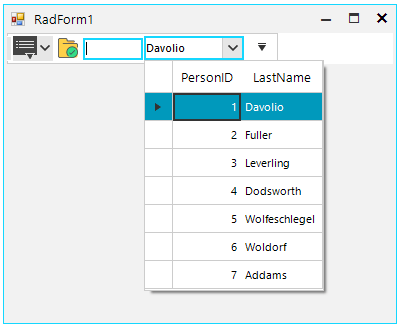

## Environment
 
|Product Version|Product|Author|
|----|----|----|
|2020.2.512|RadCommandBar for WinForms|[Nadya Karaivanova](https://www.telerik.com/blogs/author/nadya-karaivanova)|
 
## Description

By default, the items that are displayed in the overall area in **RadCommandBar** are arranged in **CommandBarStripElement**. More information about the **RadCommandBar's structure** is available [here](https://docs.telerik.com/devtools/winforms/controls/commandbar/structure). Every item (eg. CommandBarButton, CommandBarTextBox, etc.) is descendant of **RadCommandBarBaseItem** which is a base class for all of the items contained in the **CommandBarStripElement**. A common requirement is to add a custom element into the area in **RadCommandBar** in order to achive more flixibility.

This article demonsrates how you can add a [RadMultiColumnComboBox](https://docs.telerik.com/devtools/winforms/controls/multicolumncombobox/multicolumncombobox) in the **CommandBarStripElement**.

 


## Solution 

**RadCommandBar** offers the **CommandBarHostItem**. The **CommandBarHostItem** can host any RadElement that you would like to display in the command bar area. You can add **CommandBarHostItem** both at design time or run time and just specify the **HostedItem** property to the element that you want to host.

````C#
 public RadForm1()
{
    InitializeComponent();

    RadMultiColumnComboBoxElement mccb = new RadMultiColumnComboBoxElement();
    mccb.BindingContext = new BindingContext();
    mccb.AutoSizeDropDownToBestFit = true;
    mccb.DataSource = GetTable();
    mccb.MinSize = new Size(100, 20);
    this.commandBarHostItem1.HostedItem = mccb;
}

private object GetTable()
{
    DataTable dt = new DataTable();
    dt.Columns.Add("PersonID", typeof(int));
    dt.Columns.Add("LastName", typeof(string));
    dt.Rows.Add(1, "Davolio");
    dt.Rows.Add(2, "Fuller");
    dt.Rows.Add(3, "Leverling");
    dt.Rows.Add(4, "Dodsworth");
    dt.Rows.Add(5, "Wolfeschlegel");
    dt.Rows.Add(6, "Woldorf");
    dt.Rows.Add(7, "Addams");
    return dt;
}

````
````VB.NET
Public Sub New()
    InitializeComponent()
    Dim mccb As RadMultiColumnComboBoxElement = New RadMultiColumnComboBoxElement()
    mccb.BindingContext = New BindingContext()
    mccb.AutoSizeDropDownToBestFit = True
    mccb.DataSource = GetTable()
    mccb.MinSize = New Size(100, 20)
    Me.CommandBarHostItem1.HostedItem = mccb
End Sub

Private Function GetTable() As Object
    Dim dt As DataTable = New DataTable()
    dt.Columns.Add("PersonID", GetType(Integer))
    dt.Columns.Add("LastName", GetType(String))
    dt.Rows.Add(1, "Davolio")
    dt.Rows.Add(2, "Fuller")
    dt.Rows.Add(3, "Leverling")
    dt.Rows.Add(4, "Dodsworth")
    dt.Rows.Add(5, "Wolfeschlegel")
    dt.Rows.Add(6, "Woldorf")
    dt.Rows.Add(7, "Addams")
    Return dt
End Function

````

