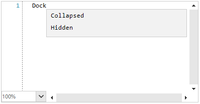
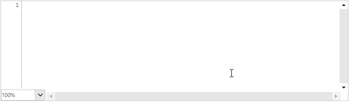

## Environment
 
|Product Version|Product|Author|
|----|----|----|
|2020.2.616|RadSyntaxEditor for WinForms|[Desislava Yordanova](https://www.telerik.com/blogs/author/desislava-yordanova)|
 
## Description

**RadSyntaxEditor** allows you to specify the [CompletionInfoCollection]() and add **CompletionInfos** to it.

By default, the **CodeCompletionCommand** is being executed by **RadSyntaxEditor** when pressing `Space` + `Ctrl` keys. It shows the **CompletionListWindow**. An alternative solution is to display the dialog programmatically by simply calling the SyntaxEditorElement.IntelliPrompts.CompletionListWindow.**Show** method.



However, the completion items are fixed and the window always shows the same items. A common requirement is to show dynamic items according to the the user's inputs. This tutorial aims to demonstrate a sample approach.

## Solution 

**RadSyntaxEditor** handles the user's keyboard input by its **SyntaxEditorInputBehavior**. You can create a custom behavior and override its **ProcessKeyDown** method. Thus, you can handle specific keys and execute the desired logic.

The following code snippet demonstrates how to show different suggestions in the **CompletionListWindow** when `Ctrl` + `Space` keys are pressed considering the text just before the caret position: 
 



````C#
 public RadForm1()
{
    InitializeComponent();

    this.radSyntaxEditor1.InputHandler = new CustomSyntaxEditorInputBehavior(this.radSyntaxEditor1.SyntaxEditorElement);
}

public class CustomSyntaxEditorInputBehavior : SyntaxEditorInputBehavior
{ 
    public CustomSyntaxEditorInputBehavior(RadSyntaxEditorElement editor) : base(editor)
    {
    }

    public override void ProcessKeyDown(KeyEventArgs e)
    {
        if (e.KeyCode == Keys.Space && e.Control) // default is CodeCompletionCommand
        {
            CaretPosition start = new CaretPosition(this.SyntaxEditor.CaretPosition);
            CaretPosition end = new CaretPosition(start);
            start.MoveToPreviousWord(); 
            string textBeforeCaret = this.SyntaxEditor.GetText(start, end);
            if (textBeforeCaret == "Dock")
            {
                CompletionInfoCollection completionList = new CompletionInfoCollection()
                {
                    new CompletionInfo("Collapsed", "Indicates that the element is collapsed.", null),
                    new CompletionInfo("Hidden", "Indicates that the element is hidden.",null),
                    new CompletionInfo("Visible", "Indicates that the element is visible." ,null),
                };

                this.SyntaxEditor.IntelliPrompts.CompletionListWindow.Presenter.CompletionListItems = completionList;
            }
            else if (textBeforeCaret == "Telerik")
            {
                CompletionInfoCollection completionList = new CompletionInfoCollection()
                {
                    new CompletionInfo("RadGridView", "Grid component", null),
                    new CompletionInfo("RadSyntaxEditor", "Syntax editor",null),
                    new CompletionInfo("RadButton", "Button" ,null),
                };

                this.SyntaxEditor.IntelliPrompts.CompletionListWindow.Presenter.CompletionListItems = completionList;
            }
            base.PerformCodeCompletion(e);
        }
        else
        {
            base.ProcessKeyDown(e);
        }
    } 
}

 
````
````VB.NET
 Public Sub New()
    InitializeComponent()
    Me.RadSyntaxEditor1.InputHandler = New CustomSyntaxEditorInputBehavior(Me.RadSyntaxEditor1.SyntaxEditorElement)
End Sub

Public Class CustomSyntaxEditorInputBehavior
    Inherits SyntaxEditorInputBehavior

    Public Sub New(ByVal editor As RadSyntaxEditorElement)
        MyBase.New(editor)
    End Sub

    Public Overrides Sub ProcessKeyDown(ByVal e As KeyEventArgs)
        If e.KeyCode = Keys.Space AndAlso e.Control Then
            Dim start As CaretPosition = New CaretPosition(Me.SyntaxEditor.CaretPosition)
            Dim [end] As CaretPosition = New CaretPosition(start)
            start.MoveToPreviousWord()
            Dim textBeforeCaret As String = Me.SyntaxEditor.GetText(start, [end])

            If textBeforeCaret = "Dock" Then
                Dim completionList As CompletionInfoCollection = New CompletionInfoCollection() From {
                    New CompletionInfo("Collapsed", "Indicates that the element is collapsed.", Nothing),
                    New CompletionInfo("Hidden", "Indicates that the element is hidden.", Nothing),
                    New CompletionInfo("Visible", "Indicates that the element is visible.", Nothing)
                }
                Me.SyntaxEditor.IntelliPrompts.CompletionListWindow.Presenter.CompletionListItems = completionList
            ElseIf textBeforeCaret = "Telerik" Then
                Dim completionList As CompletionInfoCollection = New CompletionInfoCollection() From {
                    New CompletionInfo("RadGridView", "Grid component", Nothing),
                    New CompletionInfo("RadSyntaxEditor", "Syntax editor", Nothing),
                    New CompletionInfo("RadButton", "Button", Nothing)
                }
                Me.SyntaxEditor.IntelliPrompts.CompletionListWindow.Presenter.CompletionListItems = completionList
            End If

            MyBase.PerformCodeCompletion(e)
        Else
            MyBase.ProcessKeyDown(e)
        End If
    End Sub
End Class


```` 

# See Also

* [IntelliPrompts]()  

