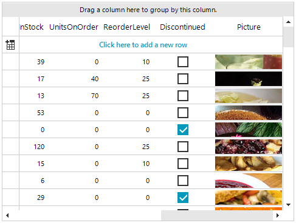
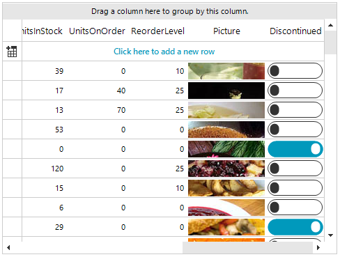

## Environment
|Product Version|Product|Author|
|----|----|----|
|2022.3.913|RadGridView for WinForms|[Desislava Yordanova](https://www.telerik.com/blogs/author/desislava-yordanova)|

## Description

When RadGridView is bound to a DataSource collection, it automatically generates the columns considering the data type of each field of the source object. Thus, for boolean properties RadGridView generates a [GridViewCheckBoxColumn]().
This article demonstrates how to replace the default GridViewCheckBoxColumn with a [custom]() one that uses [RadToggleSwitch]().

>caption Default column for boolean properties - "Discontinued"

 

## Solution

It is necessary to create a custom GridViewDataColumn that uses a custom GridDataCellElement containing the RadToggleSwitchElement for managing the boolean property: 
 
````C#

private void RadForm1_Load(object sender, EventArgs e)
{ 
    this.productsTableAdapter.Fill(this.nwindDataSet.Products);

    this.radGridView1.DataSource = this.productsBindingSource;
    this.radGridView1.Columns.Remove("Discontinued");

    ToggleSwitchColumn toggleSwitchColumn = new ToggleSwitchColumn("Discontinued");
    this.radGridView1.Columns.Add(toggleSwitchColumn);

    this.radGridView1.BestFitColumns();
}

public class ToggleSwitchCellElement : GridDataCellElement
{
    public ToggleSwitchCellElement(GridViewColumn column, GridRowElement row) : base(column, row)
    {
    }
    
    private RadToggleSwitchElement toggleSwitchElement;

    protected override void CreateChildElements()
    {
        base.CreateChildElements();

        toggleSwitchElement = new RadToggleSwitchElement();
        toggleSwitchElement.ValueChanged+=toggleSwitchElement_ValueChanged;
        this.Children.Add(toggleSwitchElement);
    }

    private void toggleSwitchElement_ValueChanged(object sender, EventArgs e)
    {
        this.RowInfo.Cells[this.ColumnInfo.Name].Value = this.toggleSwitchElement.Value;
    }
    
    protected override void SetContentCore(object value)
    {
        if (this.Value != null && this.Value != DBNull.Value)
        {
               toggleSwitchElement.ValueChanged-=toggleSwitchElement_ValueChanged;
            this.toggleSwitchElement.Value = (bool)this.Value;
               toggleSwitchElement.ValueChanged+=toggleSwitchElement_ValueChanged;
        }
    }
    
    protected override Type ThemeEffectiveType
    {
        get
        {
            return typeof(GridDataCellElement);
        }
    }

    public override bool IsCompatible(GridViewColumn data, object context)
    {
        return data is ToggleSwitchColumn && context is GridDataRowElement;
    }
}

public class ToggleSwitchColumn : GridViewDataColumn
{
    public ToggleSwitchColumn(string fieldName) : base(fieldName)
    {
    }

    public override Type GetCellType(GridViewRowInfo row)
    {
        if (row is GridViewDataRowInfo)
        {
            return typeof(ToggleSwitchCellElement);
        }
        return base.GetCellType(row);
    }
}

````
````VB.NET

Private Sub RadForm1_Load(sender As Object, e As EventArgs) Handles MyBase.Load 
    Me.ProductsTableAdapter.Fill(Me.NwindDataSet.Products)
    Me.RadGridView1.DataSource = Me.ProductsBindingSource
    Me.RadGridView1.Columns.Remove("Discontinued")
    Dim toggleSwitchColumn As ToggleSwitchColumn = New ToggleSwitchColumn("Discontinued")
    Me.RadGridView1.Columns.Add(toggleSwitchColumn)

    Me.RadGridView1.BestFitColumns()
End Sub

Public Class ToggleSwitchCellElement
    Inherits GridDataCellElement

    Public Sub New(ByVal column As GridViewColumn, ByVal row As GridRowElement)
        MyBase.New(column, row)
    End Sub

    Private toggleSwitchElement As RadToggleSwitchElement

    Protected Overrides Sub CreateChildElements()
        MyBase.CreateChildElements()
        toggleSwitchElement = New RadToggleSwitchElement()
        AddHandler toggleSwitchElement.ValueChanged, AddressOf toggleSwitchElement_ValueChanged
        Me.Children.Add(toggleSwitchElement)
    End Sub

    Private Sub toggleSwitchElement_ValueChanged(ByVal sender As Object, ByVal e As EventArgs)
        Me.RowInfo.Cells(Me.ColumnInfo.Name).Value = Me.toggleSwitchElement.Value
    End Sub

    Protected Overrides Sub SetContentCore(ByVal value As Object)
        If Me.Value IsNot Nothing AndAlso Not Me.Value.Equals(DBNull.Value) Then
            RemoveHandler toggleSwitchElement.ValueChanged, AddressOf toggleSwitchElement_ValueChanged
            Me.toggleSwitchElement.Value = CBool(Me.Value)
            AddHandler toggleSwitchElement.ValueChanged, AddressOf toggleSwitchElement_ValueChanged
        End If
    End Sub

    Protected Overrides ReadOnly Property ThemeEffectiveType As Type
        Get
            Return GetType(GridDataCellElement)
        End Get
    End Property

    Public Overrides Function IsCompatible(ByVal data As GridViewColumn, ByVal context As Object) As Boolean
        Return TypeOf data Is ToggleSwitchColumn AndAlso TypeOf context Is GridDataRowElement
    End Function
End Class

Public Class ToggleSwitchColumn
    Inherits GridViewDataColumn

    Public Sub New(ByVal fieldName As String)
        MyBase.New(fieldName)
    End Sub

    Public Overrides Function GetCellType(ByVal row As GridViewRowInfo) As Type
        If TypeOf row Is GridViewDataRowInfo Then
            Return GetType(ToggleSwitchCellElement)
        End If

        Return MyBase.GetCellType(row)
    End Function
End Class

````

>caption Custom ToggleSwitch column - "Discontinued"

 

# See Also

* [GridViewCheckBoxColumn]()
* [RadToggleSwitch]()
* [Creating Custom Cells]()