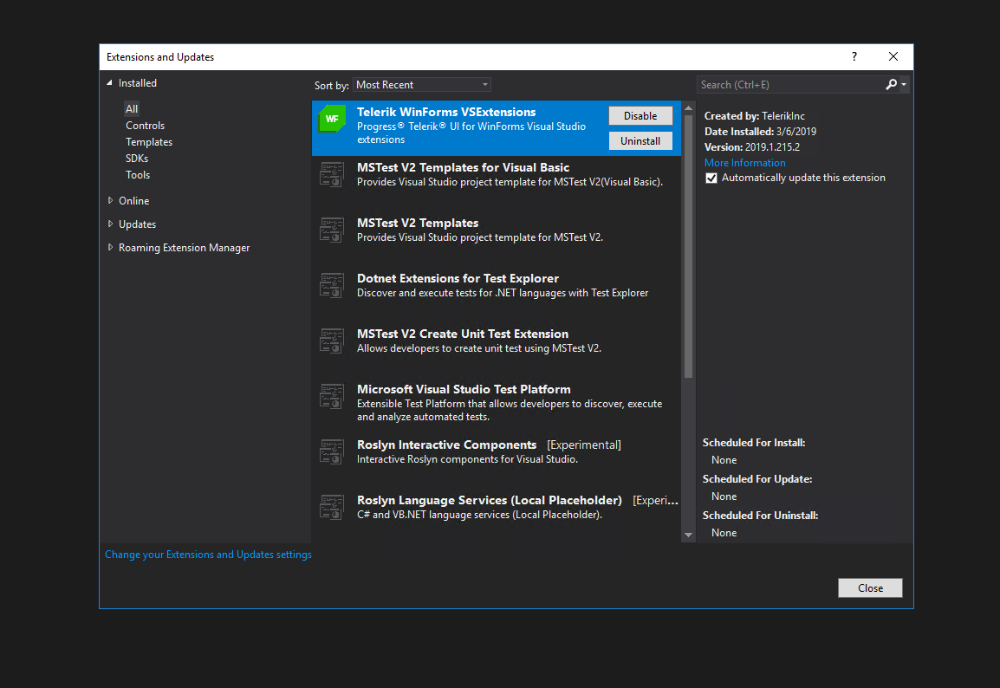

|Product Version|Product|
|----|----|
|2018.3.1016|Converter for WinForms| 

## Problem

The WinForms converter crashes when converting a project. This happens with Visual Studio 2017 15.8 and newer. This is caused because in the latest version of Visual Studio a type used in the converter was moved. Detailed information can be found here: [Version used in VS 15.8 not available on NuGet (Breaks VS extension using MSBuildWorkspace) Issue #29334](https://github.com/dotnet/roslyn/issues/29334)

## Solution

We have a new custom build of the converter extension. This version will work on Visual Studio 15.8 and newer. You can download it form here: [Converter Extension](https://www.telerik.com/docs/default-source/ui-for-winforms/telerik-wincontrols-converter-vspackage-vsix.zip?sfvrsn=f91dc85c_2).  

You need to uninstall the converter extension if it is already installed.

Another approach is using version 15.7 where the converter is working (the converter works well with Visual Studio 2015 as well). 

>note Please note that this installs only the converter extension. The main Telerik UI for WinForms extension should be installed as well. It provides the menu in Visual Studio.

