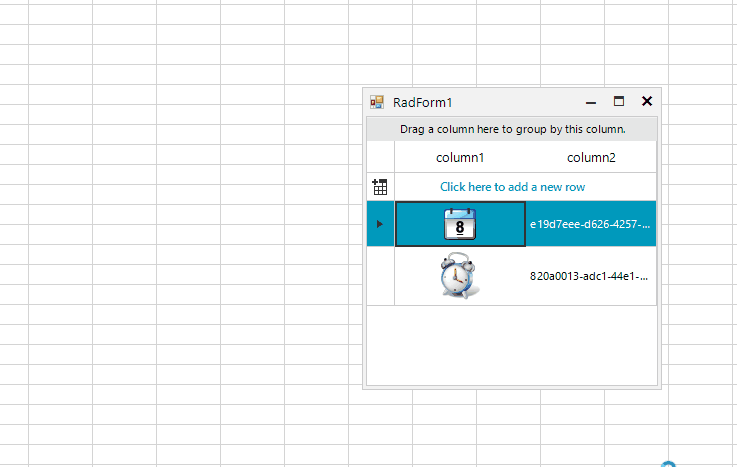

## Environment
|Product Version|Product|Author|
|----|----|----|
|2021.2.511|RadGridView|[Desislava Yordanova](https://www.telerik.com/blogs/author/desislava-yordanova)|

## Description

The **copy** functionality, that **RadGridView** offers, supports three formats: **Text**, **HTML**, **CommaSeparatedValue**.
The internal copy implementation uses the Clipboard.**SetDataObject** method where the cell's content is extracted in the supported formats. If you store Bitmap values in the cells from the **GridViewImageColumn**, this value is stored as *"System.Drawing.Bitmap"* which is the string representation of the type stored in the cell's Value.

This article demonstrates how to achieve copy image functionality in **RadGridView** and thus to be able to paste it to another application, e.g. MS Excel: 
 


## Solution

This requires implementing additional functionality and overriding the default **Copy** method logic. The Clipboard.[SetImage](https://docs.microsoft.com/en-us/dotnet/api/system.windows.forms.clipboard.setimage?view=net-5.0) method is suitable for this case as it clears the Clipboard and then adds an Image in the Bitmap format.

````C#
public RadForm1()
{
    InitializeComponent();
    GridViewImageColumn imageColumn = new GridViewImageColumn();
    this.radGridView1.Columns.Add(imageColumn);
    GridViewTextBoxColumn textColumn = new GridViewTextBoxColumn();
    this.radGridView1.Columns.Add(textColumn);

    this.radGridView1.Rows.Add(Properties.Resources.calendar, Guid.NewGuid().ToString());
    this.radGridView1.Rows.Add(Properties.Resources.Clock_Alarm, Guid.NewGuid().ToString());

    this.radGridView1.AutoSizeColumnsMode = GridViewAutoSizeColumnsMode.Fill;
    this.radGridView1.ClipboardCopyMode = GridViewClipboardCopyMode.EnableAlwaysIncludeHeaderText;
}

public class CustomGrid : RadGridView
{
    protected override RadGridViewElement CreateGridViewElement()
    {
        return new CustomRadGridViewElement();
    }

    public override string ThemeClassName
    {
        get
        {
            return typeof(RadGridView).FullName;
        }
    }
}

public class CustomRadGridViewElement : RadGridViewElement
{
    protected override MasterGridViewTemplate CreateTemplate()
    {
        return new CustomMasterGridViewTemplate();
    }

    protected override Type ThemeEffectiveType
    {
        get
        {
            return typeof(RadGridViewElement);
        }
    }
}

public class CustomMasterGridViewTemplate : MasterGridViewTemplate
{
    public override void Copy()
    {
        Bitmap imageValue = this.CurrentRow.Cells[this.CurrentColumn.Name].Value as Bitmap;
        if (imageValue != null && this.CurrentColumn is GridViewImageColumn)
        {
            Clipboard.SetImage(imageValue);
        }
        else
        {
            base.Copy();
        }
    }
}   

````
````VB.NET
Public Sub New()
    InitializeComponent()
    Dim imageColumn As GridViewImageColumn = New GridViewImageColumn()
    Me.RadGridView1.Columns.Add(imageColumn)
    Dim textColumn As GridViewTextBoxColumn = New GridViewTextBoxColumn()
    Me.RadGridView1.Columns.Add(textColumn)
    Me.RadGridView1.Rows.Add(My.Resources.calendar, Guid.NewGuid().ToString())
    Me.RadGridView1.Rows.Add(My.Resources.Clock_Alarm, Guid.NewGuid().ToString())
    Me.RadGridView1.AutoSizeColumnsMode = GridViewAutoSizeColumnsMode.Fill
    Me.RadGridView1.ClipboardCopyMode = GridViewClipboardCopyMode.EnableAlwaysIncludeHeaderText
End Sub

Public Class CustomGrid
    Inherits RadGridView

    Protected Overrides Function CreateGridViewElement() As RadGridViewElement
        Return New CustomRadGridViewElement()
    End Function

    Public Overrides Property ThemeClassName As String
        Get
            Return GetType(RadGridView).FullName
        End Get
        Set(value As String)
            MyBase.ThemeClassName = value
        End Set
    End Property
End Class

Public Class CustomRadGridViewElement
    Inherits RadGridViewElement

    Protected Overrides Function CreateTemplate() As MasterGridViewTemplate
        Return New CustomMasterGridViewTemplate()
    End Function

    Protected Overrides ReadOnly Property ThemeEffectiveType As Type
        Get
            Return GetType(RadGridViewElement)
        End Get
    End Property
End Class

Public Class CustomMasterGridViewTemplate
    Inherits MasterGridViewTemplate

    Public Overrides Sub Copy()
        Dim imageValue As Bitmap = TryCast(Me.CurrentRow.Cells(Me.CurrentColumn.Name).Value, Bitmap)

        If imageValue IsNot Nothing AndAlso TypeOf Me.CurrentColumn Is GridViewImageColumn Then
            Clipboard.SetImage(imageValue)
        Else
            MyBase.Copy()
        End If
    End Sub
End Class

````

>important Do not forget to replace the default RadGridView with the custom class (CustomGrid) in the **InitializeComponent** method.

# See Also

* [Copy/Paste/Cut]()

