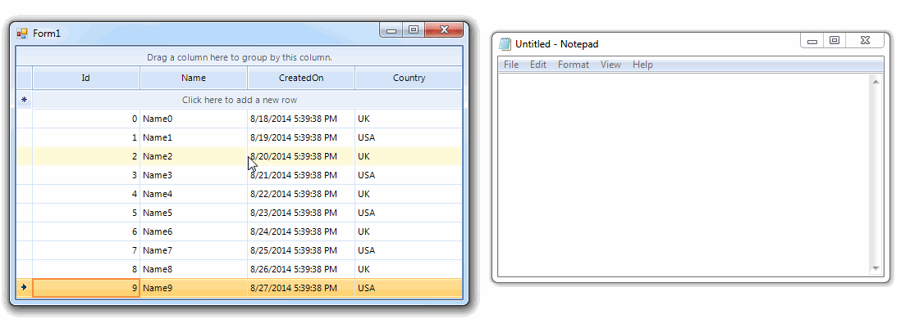
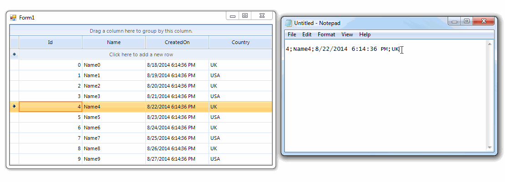

|Product Version|Product|Author|Last modified|
|----|----|----|----|
|Q2 2014|RadGridView for WinForms|[Desislava Yordanova](https://www.telerik.com/blogs/author/desislava-yordanova)| August 22, 2014|


## Problem

By default, the **RadGridView** built-in copy/paste functionality uses the selected cells’ value when storing data in the Clipboard. However, when you have a **[GridViewComboBoxColumn](https://docs.telerik.com/devtools/winforms/gridview/columns/column-types/gridviewcomboboxcolumn)** it is more suitable to copy/paste the cells’ text.

## 

## Solution

**MasterGridViewTemplate**introduces two methods appropriate for customizing the Clipboard data: **Copy**and **Paste**.

To achieve the desired functionality you should create a derivative of the **MasterGridViewTemplate**and override its **Copy** method, where the Clipboard content can be modified:

````C#
public class CustomMasterGridViewTemplate : MasterGridViewTemplate
{
    public override void Copy()
    {
        base.Copy();
        if (Clipboard.ContainsData(DataFormats.Text)) {
            string data = Clipboard.GetData(DataFormats.Text).ToString();
            if (data != string.Empty) {
                StringBuilder sb = new StringBuilder();
                //modify the copied data and replace it in the clipboard
                foreach (GridViewRowInfo row in this.Owner.SelectedRows) {
                    int i = 0;
                    while (i < row.Cells.Count) {
                        if (i > 0) {
                            sb.Append(";");
                        }
                        string cellText = null;
                        GridViewComboBoxColumn comboCol = row.Cells(i).ColumnInfo as GridViewComboBoxColumn;
                        if (comboCol != null) {
                            //copy the DisplayMember
                            cellText = comboCol.GetLookupValue(row.Cells(i).Value);
                        } else {
                            cellText = row.Cells(i).Value + string.Empty;
                        }
                        sb.Append(cellText);
                        i += 1;
                    }
                    sb.AppendLine();
                }
                Clipboard.SetData(DataFormats.Text, sb.ToString());
            }
        }
    }
}

````
````VB.NET
Public Class CustomMasterGridViewTemplate
Inherits MasterGridViewTemplate
    Public Overrides Sub Copy()
        MyBase.Copy()
        If Clipboard.ContainsData(DataFormats.Text) Then
            Dim data As String = Clipboard.GetData(DataFormats.Text).ToString()
            If data <> String.Empty Then
                Dim sb As New StringBuilder()
                'modify the copied data and replace it in the clipboard
                For Each row As GridViewRowInfo In Me.Owner.SelectedRows
                    Dim i As Integer = 0
                    While i < row.Cells.Count
                        If i > 0 Then
                            sb.Append(";")
                        End If
                        Dim cellText As String
                        Dim comboCol As GridViewComboBoxColumn = TryCast(row.Cells(i).ColumnInfo, GridViewComboBoxColumn)
                        If comboCol IsNot Nothing Then
                            'copy the DisplayMember
                            cellText = comboCol.GetLookupValue(row.Cells(i).Value)
                        Else
                            cellText = row.Cells(i).Value & String.Empty
                        End If
                         
                        sb.Append(cellText)
                        i += 1
                    End While
                    sb.AppendLine()
                Next
                Clipboard.SetData(DataFormats.Text, sb.ToString())
            End If
        End If
    End Sub
End Class

````

Overriding the **Paste** method allows you to convert the Clipboard data to format appropriate for **RadGridView**. Thus, copying the above data from Notepad and pasting it to **RadGridView** can be achieved.  
  

````C#
public override void Paste()
{
    if (Clipboard.ContainsData(DataFormats.Text))
    {
        string data = Clipboard.GetData(DataFormats.Text).ToString();
        if (data != string.Empty)
        {
            StringBuilder sb = new StringBuilder();
            string[] rowTokens = data.Split(new string[] { Environment.NewLine.ToString() }, StringSplitOptions.RemoveEmptyEntries);
            foreach (string rowToken in rowTokens)
            {
                string[] tokens = rowToken.Split(new char[] { ';' }, StringSplitOptions.RemoveEmptyEntries);
                
                for (int i = 0; i < tokens.Length; i++)
                {
                    GridViewComboBoxColumn comboColumn = this.Owner.Columns[i] as GridViewComboBoxColumn;
                    if (i < this.Owner.Columns.Count && comboColumn != null)
                    {
                        //get the ValueMember
                        sb.Append(GetValueMember(tokens[i], comboColumn.DataSource));
                    }
                    else
                    {
                        sb.Append(tokens[i]);
                    }
 
                    if (i < tokens.Length - 1)
                    {
                        sb.Append("\t");
                    }
                }
                sb.Append(Environment.NewLine.ToString());
            }
           
            Clipboard.SetData(DataFormats.Text, sb.ToString());
        }
    }
     
    base.Paste();
}
 
private string GetValueMember(string token, object source)
{
    IEnumerable<Country> dataSource = source as IEnumerable<Country>;
    if (dataSource != null)
    {
        foreach (Country c in dataSource)
        {
            if (c.Name == token)
            {
                return c.ID.ToString();
            }
        }
    }
 
    return string.Empty;
}

````
````VB.NET
Public Overrides Sub Paste()
    If Clipboard.ContainsData(DataFormats.Text) Then
        Dim data As String = Clipboard.GetData(DataFormats.Text).ToString()
        If data <> String.Empty Then
            Dim sb As New StringBuilder()
            Dim rowTokens As String() = data.Split(New String() {Environment.NewLine.ToString()}, StringSplitOptions.RemoveEmptyEntries)
            For Each rowToken As String In rowTokens
                Dim tokens As String() = rowToken.Split(New Char() {";"c}, StringSplitOptions.RemoveEmptyEntries)
 
                For i As Integer = 0 To tokens.Length - 1
                    Dim comboColumn As GridViewComboBoxColumn = TryCast(Me.Owner.Columns(i), GridViewComboBoxColumn)
                    If i < Me.Owner.Columns.Count AndAlso comboColumn IsNot Nothing Then
                        'get the ValueMember
                        sb.Append(GetValueMember(tokens(i), comboColumn.DataSource))
                    Else
                        sb.Append(tokens(i))
                    End If
 
                    If i < tokens.Length - 1 Then
                        sb.Append(vbTab)
                    End If
                Next
                sb.Append(Environment.NewLine.ToString())
            Next
 
            Clipboard.SetData(DataFormats.Text, sb.ToString())
        End If
    End If
 
    MyBase.Paste()
End Sub
 
Private Function GetValueMember(token As String, source As Object) As String
    Dim dataSource As IEnumerable(Of Country) = TryCast(source, IEnumerable(Of Country))
    If dataSource IsNot Nothing Then
        For Each c As Country In dataSource
            If c.Name = token Then
                Return c.ID.ToString()
            End If
        Next
    End If
 
    Return String.Empty
End Function

````

The last step we need to do is to replace the default **MasterGridViewTemplate** with the custom one:

````C#
public class CustomGrid : RadGridView
  {
      protected override RadGridViewElement CreateGridViewElement()
      {
          return new CustomRadGridViewElement();
      }
 
      public override string ThemeClassName
      {
          get
          {
              return typeof(RadGridView).FullName;
          }
      }
  }
 
  public class CustomRadGridViewElement : RadGridViewElement
  {
      protected override MasterGridViewTemplate CreateTemplate()
      {
          return new CustomMasterGridViewTemplate();
      }
 
      protected override Type ThemeEffectiveType   
      {
          get  
          {
              return typeof(RadGridViewElement);   
          }
      }
  }

````
````VB.NET
Public Class CustomGrid
Inherits RadGridView
    Protected Overrides Function CreateGridViewElement() As RadGridViewElement
        Return New CustomRadGridViewElement()
    End Function
 
    Public Overrides Property ThemeClassName As String
        Get
            Return GetType(RadGridView).FullName
        End Get
        Set(value As String)
            MyBase.ThemeClassName = value
        End Set
    End Property
End Class
 
Public Class CustomRadGridViewElement
Inherits RadGridViewElement
    Protected Overrides Function CreateTemplate() As MasterGridViewTemplate
        Return New CustomMasterGridViewTemplate()
    End Function
 
    Protected Overrides ReadOnly Property ThemeEffectiveType() As Type
        Get
            Return GetType(RadGridViewElement)
        End Get
    End Property
End Class

````

Clipboard.**SetData** method gives you the possibility to specify the format of the data to be set. You can customize not only DataFormats.*Text*, demonstrated above, but DataFormats.*CommaSeparatedValue* and DataFormats.*Html* as well, following the same approach.

>note A complete solution in C# and VB.NET can be found [here](https://github.com/telerik/winforms-sdk/tree/master/GridView/CopyPasteDisplayMember).

