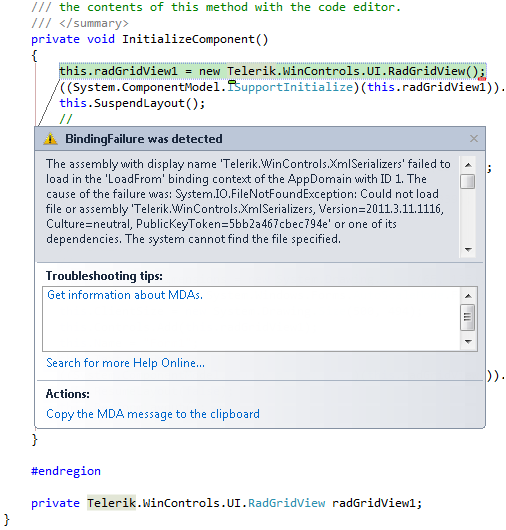
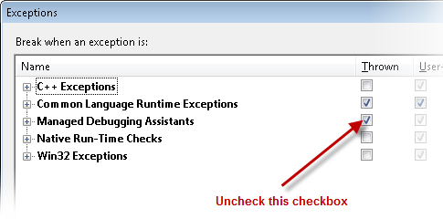

|Product Version|Product|Author|Last modified|
|----|----|----|----|
|Q3 2011|RadControls for WinForms|Nikolay Diyanov|Dec 12, 2011|

   
## PROBLEM  
   
If you start your project in Debug mode, you may get  the following exception:  
   
 *“The assembly with display name 'Telerik.WinControls.XmlSerializers' failed to load in the 'LoadFrom' binding context of the AppDomain with ID 1. The cause of the failure was: System.IO.FileNotFoundException: Could not load file or assembly 'Telerik.WinControls.XmlSerializers, Version=2011.3.11.1116, Culture=neutral, PublicKeyToken=5bb2a467cbec794e' or one of its dependencies. The system cannot find the file specified.  
 File name: 'Telerik.WinControls.XmlSerializers, Version=2011.3.11.1116, Culture=neutral, PublicKeyToken=5bb2a467cbec794e'”* 
   
*  

## SOLUTION  
 

Although this behavior may seem like an issue, it is the normal behavior of .NET Framework and it is expected. Here is a quite from the [MSDN Forums](http://social.msdn.microsoft.com/Forums/en-US/asmxandxml/thread/9f0c169f-c45e-4898-b2c4-f72c816d4b55/) regarding this exception:  
 *"This exception is a part of the XmlSerializer's normal operation. It is expected and will be caught and handled inside of the Framework code. Just ignore it and continue. If it bothers you during debugging, set the Visual Studio debugger to only stop on unhandled exceptions instead of all exceptions."*  

Although this behavior is normal, you may not want to see the exception. As stated in the above paragraph, you can prevent the exception from being thrown. In order to do that, please navigate to*Debug &gt;&gt; Exceptions* from the main menu of Visual Studio. This will open the *Exceptions*window. Uncheck the *Managed Debugging Assistance Thrown* checkbox and you will not see the exception anymore.  
   
  
   

For additional information on the topic, please refer to the following resources:  
 
[StackOverflow: C# XmlSerializer BindingFailure](http://stackoverflow.com/questions/2209443/c-sharp-xmlserializer-bindingfailure)  
[Microsoft Connect: BindingFailure - An assembly failed to load while using XMLSerialization](https://connect.microsoft.com/VisualStudio/feedback/details/88566/bindingfailure-an-assembly-failed-to-load-while-using-xmlserialization)  
[MSDN Forums: Strange XmlSerializer error](http://social.msdn.microsoft.com/Forums/en-US/asmxandxml/thread/9f0c169f-c45e-4898-b2c4-f72c816d4b55/)
   
