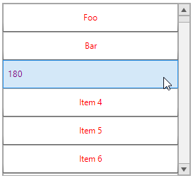

## Environment
 
|Product Version|Product|Author|
|----|----|----|
|2021.1.223|RadListControl for WinForms|[Desislava Yordanova](https://www.telerik.com/blogs/author/desislava-yordanova)|
 
## Description

A common requirement is to display different elements in the **RadListControl**'s visual items depending on a value in the **DataBoundItem**. 

This article demonstrates a sample approach how to use different elements (**RadButtonElement** or **LightVisualElement**) in the visual item according to underlying data item.
 


## Solution 

The possible solution is to create one common **RadListVisualItem** and add all the elements (**RadButtonElement** or **LightVisualElement**) that you will need to show in the visual item. However, in the **Synchronize** method you will manage the **Visibility** of each element considering your custom condition.
 

````C#
public RadForm1()
{
    InitializeComponent();

    List<Notification> notifications = new List<Notification>
    {
        new NotificationA { Name = "Foo" },
        new NotificationA { Name = "Bar" },
        new NotificationB { Degree = 180 }
    };

    for (var i = 4; i < 1000; i++)
    {
        notifications.Add(new NotificationA { Name = "Item " + i });
    }
    this.radListControl1.CreatingVisualListItem += radListControl1_CreatingVisualListItem;
    this.radListControl1.DataSource = notifications;
    this.radListControl1.ItemHeight = 40;
}

private void radListControl1_CreatingVisualListItem(object sender, CreatingVisualListItemEventArgs args)
{
    args.VisualItem = new NotificationVisualItem();
}

public class NotificationVisualItem : RadListVisualItem
{
    private LightVisualElement notificationATitleElement;
    private RadButtonElement notificationBTitleElement;
    private StackLayoutElement stackLayout;

    protected override void CreateChildElements()
    {
        base.CreateChildElements();

        stackLayout = new StackLayoutElement();
        stackLayout.StretchHorizontally = true;
        stackLayout.StretchVertically = true;

        notificationATitleElement = new LightVisualElement();
        notificationATitleElement.TextAlignment = ContentAlignment.MiddleCenter;
        notificationATitleElement.ForeColor = Color.Red;

        notificationBTitleElement = new RadButtonElement();
        notificationBTitleElement.TextAlignment = ContentAlignment.MiddleLeft;
        notificationBTitleElement.TextElement.ForeColor = Color.Purple;

        stackLayout.Children.Add(notificationATitleElement);
        stackLayout.Children.Add(notificationBTitleElement);

        this.Children.Add(stackLayout);
    }

    public override void Synchronize()
    {
        base.Synchronize();
        this.DrawText = false;
        NotificationA dataItemA = this.Data.DataBoundItem as NotificationA;
        NotificationB dataItemB = this.Data.DataBoundItem as NotificationB;
        if (dataItemA != null)
        {
            notificationATitleElement.Visibility = ElementVisibility.Visible;
            notificationBTitleElement.Visibility = ElementVisibility.Collapsed;
            notificationATitleElement.Text = dataItemA.Name;
        }
        else if (dataItemB != null)
        {
            notificationATitleElement.Visibility = ElementVisibility.Collapsed;
            notificationBTitleElement.Visibility = ElementVisibility.Visible;
            notificationBTitleElement.Text = dataItemB.Degree.ToString();
        }
    }
}

internal class Notification
{
    public int Id { get; set; }
}

internal class NotificationA : Notification
{
    public string Name { get; set; }

    public string Type
    {
        get
        {
            return typeof(NotificationA).ToString();
        }
    }
}

internal class NotificationB : Notification
{
    public int Degree { get; set; }

    public string Type
    {
        get
        {
            return typeof(NotificationB).ToString();
        }
    }
}
        
````
````VB.NET
Public Sub New()
    InitializeComponent()
    Dim notifications As List(Of Notification) = New List(Of Notification) From {
        New NotificationA With {
            .Name = "Foo"
        },
        New NotificationA With {
            .Name = "Bar"
        },
        New NotificationB With {
            .Degree = 180
        }
    }

    For i = 4 To 1000 - 1
        notifications.Add(New NotificationA With {
            .Name = "Item " & i
        })
    Next

    AddHandler Me.RadListControl1.CreatingVisualListItem, AddressOf radListControl1_CreatingVisualListItem
    Me.RadListControl1.DataSource = notifications
    Me.RadListControl1.ItemHeight = 40
End Sub

Private Sub radListControl1_CreatingVisualListItem(ByVal sender As Object, ByVal args As CreatingVisualListItemEventArgs)
    args.VisualItem = New NotificationVisualItem()
End Sub

Public Class NotificationVisualItem
    Inherits RadListVisualItem

    Private notificationATitleElement As LightVisualElement
    Private notificationBTitleElement As RadButtonElement
    Private stackLayout As StackLayoutElement

    Protected Overrides Sub CreateChildElements()
        MyBase.CreateChildElements()
        stackLayout = New StackLayoutElement()
        stackLayout.StretchHorizontally = True
        stackLayout.StretchVertically = True
        notificationATitleElement = New LightVisualElement()
        notificationATitleElement.TextAlignment = ContentAlignment.MiddleCenter
        notificationATitleElement.ForeColor = Color.Red
        notificationBTitleElement = New RadButtonElement()
        notificationBTitleElement.TextAlignment = ContentAlignment.MiddleLeft
        notificationBTitleElement.TextElement.ForeColor = Color.Purple
        stackLayout.Children.Add(notificationATitleElement)
        stackLayout.Children.Add(notificationBTitleElement)
        Me.Children.Add(stackLayout)
    End Sub

    Public Overrides Sub Synchronize()
        MyBase.Synchronize()
        Me.DrawText = False
        Dim dataItemA As NotificationA = TryCast(Me.Data.DataBoundItem, NotificationA)
        Dim dataItemB As NotificationB = TryCast(Me.Data.DataBoundItem, NotificationB)

        If dataItemA IsNot Nothing Then
            notificationATitleElement.Visibility = ElementVisibility.Visible
            notificationBTitleElement.Visibility = ElementVisibility.Collapsed
            notificationATitleElement.Text = dataItemA.Name
        ElseIf dataItemB IsNot Nothing Then
            notificationATitleElement.Visibility = ElementVisibility.Collapsed
            notificationBTitleElement.Visibility = ElementVisibility.Visible
            notificationBTitleElement.Text = dataItemB.Degree.ToString()
        End If
    End Sub
End Class

Friend Class Notification
    Public Property Id As Integer
End Class

Friend Class NotificationA
    Inherits Notification

    Public Property Name As String

    Public ReadOnly Property Type As String
        Get
            Return GetType(NotificationA).ToString()
        End Get
    End Property
End Class

Friend Class NotificationB
    Inherits Notification

    Public Property Degree As Integer

    Public ReadOnly Property Type As String
        Get
            Return GetType(NotificationB).ToString()
        End Get
    End Property
End Class

```` 

# See Also

* [Custom Items in RadListControl]()
 


    
   
  
    
 
