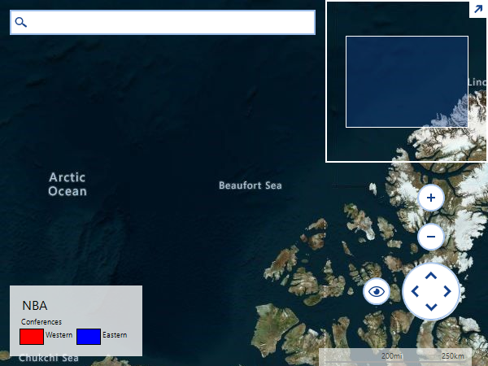

## Environment
 
|Product Version|Product|Author|
|----|----|----|
|2021.2.615|RadMap for WinForms|[Desislava Yordanova](https://www.telerik.com/blogs/author/desislava-yordanova)|


## Description

Learn how to export **RadMap** to an image silently from a Console application. 



## Solution 

The required assemblies that should be referred:

* System.Windows.Forms.dll
* System.Runtime.Serialization
* System.Drawing
* Telerik.WinControls
* Telerik.WinControls.RadMap
* Telerik.WinControls.UI
* Telerik.WinControls.UI

**RadMap** uses a **MapTileDownloader** which internally uses a WebClient calling its DownloadDataAsync method. It seems that in a console application the WebClient.DownloadDataCompleted event is not fired which is used in the MapTileDownloader. That is why the image that is created from the map is blank. That is why this example shows how to use the **DownloadString** method instead:


````C#

class Program
{
    static string bingKey = "your Bing key";

    static void Main(string[] args)
    {

        RadMap radMap1 = new RadMap();
        radMap1.CreateControl();
        CustomBingProvider bingProvider = new CustomBingProvider();
        bingProvider.UseSession = false;
        bingProvider.BingKey = bingKey;
        bingProvider.TileDownloader = new CustomTileDownLoader(bingProvider);
        radMap1.Providers.Add(bingProvider);           
        bingProvider.EnableCaching = false;
        radMap1.MapElement.Providers.Add(bingProvider);
        radMap1.ShowNavigationBar = true;
        radMap1.ShowSearchBar = true;
        radMap1.ShowScaleIndicator = true;
        radMap1.ShowLegend = true;

        radMap1.MapElement.LegendElement.TitleElement.Text = "NBA";
        radMap1.MapElement.LegendElement.SubtitleElement.Text = "Conferences";
        radMap1.MapElement.LegendElement.Orientation = Orientation.Horizontal;
        radMap1.MapElement.LegendElement.ItemStackElement.Children.Add(new MapLegendItemElement("Western", Color.Red));
        radMap1.MapElement.LegendElement.ItemStackElement.Children.Add(new MapLegendItemElement("Eastern", Color.Blue));

        radMap1.LoadElementTree(new Size(1000, 1000));
        radMap1.Providers[0].Initialize();
        radMap1.MapElement.LegendElement.Initialize();

        bingProvider.ViewportChanged(radMap1.MapElement, ViewportChangeAction.All); 
        radMap1.MapElement.InvalidateMeasure(true);
        radMap1.MapElement.UpdateLayout(); 

        var s = radMap1.MapElement.LegendElement.DesiredSize;

        Bitmap b = radMap1.MapElement.GetAsBitmap(Brushes.Red, 0, new SizeF(1, 1));
        b.Save(@"..\..\MapTest.png");
        Process.Start(@"..\..\MapTest.png");
    }

    public class CustomBingProvider : BingRestMapProvider
    {
        private ImageryMetadata tileMetadataInfo;
        private const string ImageryMetadataServiceUri = "https://dev.virtualearth.net/REST/v1/Imagery/Metadata/{set}?output=json&key={key}&c={culture}&dir={directory}";
        protected override void InitializeImageryService()
        {
            this.tileMetadataInfo = null;

            try
            {
                string uriString = ImageryMetadataServiceUri;
                uriString = uriString.Replace("{set}", this.ImagerySet.ToString());
                uriString = uriString.Replace("{key}", string.IsNullOrEmpty(this.SessionId) ? this.BingKey : this.SessionId);
                uriString = uriString.Replace("{culture}", this.Culture.ToString());
                uriString = uriString.Replace("{directory}", "0");

                WebClient client = new WebClient();
                //client.DownloadStringCompleted += this.InitializeImageryMetadataCompleted;
                //client.DownloadStringAsync(new Uri(uriString, UriKind.Absolute));
                string result = client.DownloadString(new Uri(uriString, UriKind.Absolute));
                InitializeImageryMetadataCompleted(client, result);
            }
            catch (Exception ex)
            {
                throw new Exception(string.Format("Imagery Service Exception: {0}", ex.Message));
            }
        }

        protected virtual void InitializeImageryMetadataCompleted(object sender, string result)
        {
            this.tileMetadataInfo = null;
            WebClient client = sender as WebClient;
            // client.DownloadStringCompleted -= InitializeImageryMetadataCompleted;
            try
            {
#if NET2
                using (StringReader reader = new StringReader(result))
                {
                    JsonSerializer serializer = new JsonSerializer();
                    ImageryMetadataResponse response = serializer.Deserialize<ImageryMetadataResponse>(new JsonTextReader(reader));

                    if (response != null && response.ResourceSets.Length > 0 && response.ResourceSets[0].Resources.Length > 0)
                    {
                        this.tileMetadataInfo = response.ResourceSets[0].Resources[0];

                        if (this.tileMetadataInfo.ImageUrl.StartsWith("http://") && this.ImagerySet == ImagerySet.OrdnanceSurvey)
                        {
                            this.tileMetadataInfo.ImageUrl = this.tileMetadataInfo.ImageUrl.Replace("http://", "https://");
                        }

                        this.tileSize = new Size(int.Parse(this.tileMetadataInfo.ImageWidth), int.Parse(this.tileMetadataInfo.ImageHeight));
                        this.MinZoomLevel = tileMetadataInfo.ZoomMin;
                        this.MaxZoomLevel = tileMetadataInfo.ZoomMax;
                    }
                }
#else
                using (MemoryStream stream = new MemoryStream(Encoding.UTF8.GetBytes(result)))
                {
                    DataContractJsonSerializer serializer = new DataContractJsonSerializer(typeof(ImageryMetadataResponse));
                    ImageryMetadataResponse response = serializer.ReadObject(stream) as ImageryMetadataResponse;

                    if (response != null && response.ResourceSets.Length > 0 && response.ResourceSets[0].Resources.Length > 0)
                    {
                        this.tileMetadataInfo = response.ResourceSets[0].Resources[0];
                        FieldInfo fi = typeof(BingRestMapProvider).GetField("tileSize", BindingFlags.Instance | BindingFlags.NonPublic);
                        fi.SetValue(this, new System.Drawing.Size(int.Parse(this.tileMetadataInfo.ImageWidth), int.Parse(this.tileMetadataInfo.ImageHeight)));
                        //  this.tileSize = new System.Drawing.Size(int.Parse(this.tileMetadataInfo.ImageWidth), int.Parse(this.tileMetadataInfo.ImageHeight));
                        this.MinZoomLevel = tileMetadataInfo.ZoomMin;
                        this.MaxZoomLevel = tileMetadataInfo.ZoomMax;
                    }
                }
#endif
            }
#if NET2
            catch (JsonSerializationException) { }
#else
            catch (SerializationException) { }
#endif

            FieldInfo ti = typeof(BingRestMapProvider).GetField("tileMetadataInfo", BindingFlags.Instance | BindingFlags.NonPublic);
            ti.SetValue(this, this.tileMetadataInfo);
            this.Initialized = true;
            this.OnInitializationComplete(EventArgs.Empty);
        }
    }

    public class CustomTileDownLoader : MapTileDownloader
    {
        private IMapTileProvider provider;

        public CustomTileDownLoader(IMapTileProvider provider)
        {
            this.provider = provider;
        }

        public override void BeginDownloadTile(Uri uri, TileInfo tileInfo)
        {
            lock (this.webClientsPoolLockObject)
            {
                if (!this.webClientsPool.ContainsKey(tileInfo.Quadkey))
                {
                    WebClient client = new WebClient();

                    foreach (string key in this.WebHeaders.AllKeys)
                    {
                        client.Headers.Add(key, this.WebHeaders[key]);
                    }
                    this.webClientsPool.Add(tileInfo.Quadkey, client);
                    this.webRequestCache.Add(tileInfo.Quadkey, uri);
                    //client.DownloadDataCompleted += TileDownloadDataCompleted;
                    //client.DownloadDataAsync(uri, tileInfo);
                    tileInfo.Content = client.DownloadData(uri);
                    if (provider.EnableCaching && provider.CacheProvider != null)
                    {
                        provider.CacheProvider.Save(GetCacheKey(tileInfo.TileX, tileInfo.TileY, tileInfo.ZoomLevel), DateTime.MaxValue, tileInfo.Content);
                    }
                }
            }
        }

        private string GetCacheKey(int tileX, int tileY, int zoomLevel)
        {
            return "Tile_" + tileX + "_" + tileY + "_" + zoomLevel + ".png";
        }
    }
}


 
````
````VB.NET

Dim bingKey As String = "your Bing key"

Sub Main()
    Dim radMap1 As RadMap = New RadMap()
    radMap1.CreateControl()
    Dim bingProvider As CustomBingProvider = New CustomBingProvider()
    bingProvider.UseSession = False
    bingProvider.BingKey = bingKey
    bingProvider.TileDownloader = New CustomTileDownLoader(bingProvider)
    radMap1.Providers.Add(bingProvider)
    bingProvider.EnableCaching = False

    radMap1.MapElement.Providers.Add(bingProvider)
    radMap1.ShowNavigationBar = True
    radMap1.ShowSearchBar = True
    radMap1.ShowScaleIndicator = True
    radMap1.ShowLegend = True
    radMap1.MapElement.LegendElement.TitleElement.Text = "NBA"
    radMap1.MapElement.LegendElement.SubtitleElement.Text = "Conferences"
    radMap1.MapElement.LegendElement.Orientation = Orientation.Horizontal
    radMap1.MapElement.LegendElement.ItemStackElement.Children.Add(New MapLegendItemElement("Western", Color.Red))
    radMap1.MapElement.LegendElement.ItemStackElement.Children.Add(New MapLegendItemElement("Eastern", Color.Blue))
    radMap1.LoadElementTree(New System.Drawing.Size(1000, 1000))
    radMap1.Providers(0).Initialize()
    radMap1.MapElement.LegendElement.Initialize()
    bingProvider.ViewportChanged(radMap1.MapElement, ViewportChangeAction.All)
    radMap1.MapElement.InvalidateMeasure(True)
    radMap1.MapElement.UpdateLayout()
    Dim s = radMap1.MapElement.LegendElement.DesiredSize
    Dim b As System.Drawing.Bitmap = radMap1.MapElement.GetAsBitmap(Brushes.Red, 0, New SizeF(1, 1))
    b.Save("..\..\MapTest.png")
    Process.Start("..\..\MapTest.png")
End Sub

Public Class CustomBingProvider
    Inherits BingRestMapProvider

    Private tileMetadataInfo As ImageryMetadata
    Private Const ImageryMetadataServiceUri As String = "https://dev.virtualearth.net/REST/v1/Imagery/Metadata/{set}?output=json&key={key}&c={culture}&dir={directory}"

    Protected Overrides Sub InitializeImageryService()
        Me.tileMetadataInfo = Nothing

        Try
            Dim uriString As String = ImageryMetadataServiceUri
            uriString = uriString.Replace("{set}", Me.ImagerySet.ToString())
            uriString = uriString.Replace("{key}", If(String.IsNullOrEmpty(Me.SessionId), Me.BingKey, Me.SessionId))
            uriString = uriString.Replace("{culture}", Me.Culture.ToString())
            uriString = uriString.Replace("{directory}", "0")
            Dim client As WebClient = New WebClient()
            Dim result As String = client.DownloadString(New Uri(uriString, UriKind.Absolute))
            InitializeImageryMetadataCompleted(client, result)
        Catch ex As Exception
            Throw New Exception(String.Format("Imagery Service Exception: {0}", ex.Message))
        End Try
    End Sub

    Protected Overridable Sub InitializeImageryMetadataCompleted(ByVal sender As Object, ByVal result As String)
        Me.tileMetadataInfo = Nothing
        Dim client As WebClient = TryCast(sender, WebClient)

        Try

            Using stream As MemoryStream = New MemoryStream(Encoding.UTF8.GetBytes(result))
                Dim serializer As DataContractJsonSerializer = New DataContractJsonSerializer(GetType(ImageryMetadataResponse))
                Dim response As ImageryMetadataResponse = TryCast(serializer.ReadObject(stream), ImageryMetadataResponse)

                If response IsNot Nothing AndAlso response.ResourceSets.Length > 0 AndAlso response.ResourceSets(0).Resources.Length > 0 Then
                    Me.tileMetadataInfo = response.ResourceSets(0).Resources(0)
                    Dim fi As FieldInfo = GetType(BingRestMapProvider).GetField("tileSize", BindingFlags.Instance Or BindingFlags.NonPublic)
                    fi.SetValue(Me, New System.Drawing.Size(Integer.Parse(Me.tileMetadataInfo.ImageWidth), Integer.Parse(Me.tileMetadataInfo.ImageHeight)))
                    Me.MinZoomLevel = tileMetadataInfo.ZoomMin
                    Me.MaxZoomLevel = tileMetadataInfo.ZoomMax
                End If
            End Using

        Catch __unusedSerializationException1__ As SerializationException
        End Try

        Dim ti As FieldInfo = GetType(BingRestMapProvider).GetField("tileMetadataInfo", BindingFlags.Instance Or BindingFlags.NonPublic)
        ti.SetValue(Me, Me.tileMetadataInfo)
        Me.Initialized = True
        Me.OnInitializationComplete(EventArgs.Empty)
    End Sub
End Class

Public Class CustomTileDownLoader
    Inherits MapTileDownloader

    Private provider As IMapTileProvider

    Public Sub New(ByVal provider As IMapTileProvider)
        Me.provider = provider
    End Sub

    Public Overrides Sub BeginDownloadTile(ByVal uri As Uri, ByVal tileInfo As TileInfo)
        SyncLock Me.webClientsPoolLockObject

            If Not Me.webClientsPool.ContainsKey(tileInfo.Quadkey) Then
                Dim client As WebClient = New WebClient()

                For Each key As String In Me.WebHeaders.AllKeys
                    client.Headers.Add(key, Me.WebHeaders(key))
                Next

                Me.webClientsPool.Add(tileInfo.Quadkey, client)
                Me.webRequestCache.Add(tileInfo.Quadkey, uri)
                tileInfo.Content = client.DownloadData(uri)

                If provider.EnableCaching AndAlso provider.CacheProvider IsNot Nothing Then
                    provider.CacheProvider.Save(GetCacheKey(tileInfo.TileX, tileInfo.TileY, tileInfo.ZoomLevel), DateTime.MaxValue, tileInfo.Content)
                End If
            End If
        End SyncLock
    End Sub

    Private Function GetCacheKey(ByVal tileX As Integer, ByVal tileY As Integer, ByVal zoomLevel As Integer) As String
        Return "Tile_" & tileX & "_" & tileY & "_" & zoomLevel & ".png"
    End Function
End Class
    
````

Make sure that the following **using**/**imports** are added:

````C#

using System;
using System.Diagnostics;
using System.Drawing;
using System.IO;
using System.Linq;
using System.Net;
using System.Reflection;
using System.Runtime.Serialization;
using System.Runtime.Serialization.Json;
using System.Text;
using System.Windows.Forms;
using Telerik.WinControls.UI;
using Telerik.WinControls.UI.Map.Bing;

````
````VB.NET

Imports Telerik.WinControls.UI.Map.Bing
Imports Telerik.WinControls.UI
Imports System.Net
Imports System.Drawing
Imports System.Windows.Forms
Imports System.IO
Imports System.Text
Imports System.Reflection
Imports System.Runtime.Serialization
Imports System.Runtime.Serialization.Json
    
````

# See Also
* [BingRestMapProvider]()
* [OpenStreetMapProvider]()
* [LocalMapProvider]()
* [EmptyMapProvider]()

 