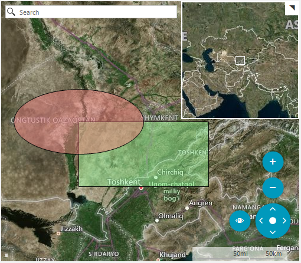

## Environment
 
|Product Version|Product|Author|
|----|----|----|
|2021.3.914|RadMap for WinForms|[Desislava Yordanova](https://www.telerik.com/blogs/author/desislava-yordanova)|
 

## Description

This tutorial demonstrates how draw rectangle and ellipse shapes in the WinForms RadMap control. 



## Solution 
 
Telerik UI for WinForms suite does not provide MapRectangle and MapEllipse shapes in RadMap out of the box. However, you can create your own MapRectangle and MapEllipse classes that inherit MapPoint and add your custom logic. Then you can use them as follows: 

````C#
public RadForm1()
{
    InitializeComponent();
    SetupProviders();
    PaintShapes();
}

private void PaintShapes()
{
    this.radMap1.Layers.Clear();

    MapLayer customShapesLayer = new MapLayer("CustomShapes");
    this.radMap1.Layers.Add(customShapesLayer);

    int rectangleWidth = 200;
    int rectangleHeight = 100;

    PointG location = new PointG(42.233833, 68.127000);

    MapRectangle rectangle = new MapRectangle(location)
    {
        WidthInKm = rectangleWidth,
        HeightInKm = rectangleHeight
    };

    rectangle.BackColor = Color.FromArgb(125, Color.LightGreen);
    this.radMap1.MapElement.Layers["CustomShapes"].Add(rectangle);

    MapEllipse ellipse = new MapEllipse(location)
    {
        Fx = rectangleWidth / 2,
        Fy = rectangleHeight / 2
    };

    ellipse.BackColor = Color.FromArgb(125, Color.LightCoral);
    this.radMap1.MapElement.Layers["CustomShapes"].Add(ellipse);
    this.radMap1.Zoom(5);
}

private void SetupProviders()
{
    BingRestMapProvider bingProvider = new BingRestMapProvider();
    bingProvider.UseSession = true;
    bingProvider.BingKey = "your Bing key";
    this.radMap1.BringIntoView(new RectangleG(65.256706493442579, 15.908203125, 19.890723023996898, 124.365234375));
    this.radMap1.MapElement.Providers.Add(bingProvider);
}

public class MapEllipse : MapPoint
{
    public MapEllipse(PointG location) : base(location)
    { }

    public MapEllipse(PointG location, Size size)
        : base(location, size)
    { }

    /// <summary>
    /// Horizontal radius
    /// </summary>
    public int Fx { get; set; }

    public int Fy { get; set; }

    public override void ViewportChanged(IMapViewport viewport, ViewportChangeAction action)
    {
        double onePixelInMeters = MapTileSystemHelper.GroundResolution(this.Location.Latitude, viewport.ZoomLevel);

        int scaleX = Math.Max(0, (int)(this.Fx * 2 * 1000 / onePixelInMeters));
        int scaleY = Math.Max(0, (int)(this.Fy * 2 * 1000 / onePixelInMeters));

        this.Size = new Size(scaleX, scaleY);

        base.ViewportChanged(viewport, action);
    }

    protected override MapVisualElementInfo CreateVisualElementInfo(IMapViewport viewport)
    {
        GraphicsPath path = new GraphicsPath();

        RectangleL ellipseRect = new RectangleL(0 - this.Size.Width / 2, 0 - this.Size.Height / 2,
            this.Size.Width, this.Size.Height);
        path.AddEllipse(ellipseRect);

        PointL offset = MapTileSystemHelper.LatLongToPixelXY(this.Location, viewport.ZoomLevel);

        return new MapVisualElementInfo(path, offset);
    }
}

public class MapRectangle : MapPoint
{
    public MapRectangle(PointG location) : base(location)
    { }

    public MapRectangle(PointG location, Size size)
        : base(location, size)
    { }

    public int WidthInKm { get; set; }

    public int HeightInKm { get; set; }

    public override void ViewportChanged(IMapViewport viewport, ViewportChangeAction action)
    {
        double onePixelInMeters = MapTileSystemHelper.GroundResolution(this.Location.Latitude, viewport.ZoomLevel);

        int scaleX = Math.Max(0, (int)(this.WidthInKm * 1000 / onePixelInMeters));
        int scaleY = Math.Max(0, (int)(this.HeightInKm * 1000 / onePixelInMeters));

        this.Size = new Size(scaleX, scaleY);

        base.ViewportChanged(viewport, action);
    }

    protected override MapVisualElementInfo CreateVisualElementInfo(IMapViewport viewport)
    {
        GraphicsPath path = new GraphicsPath();

        RectangleL drawRect = new RectangleL(0, 0, this.Size.Width, this.Size.Height);
        path.AddRectangle(drawRect);

        PointL offset = MapTileSystemHelper.LatLongToPixelXY(this.Location, viewport.ZoomLevel);

        return new MapVisualElementInfo(path, offset);
    }
}

       

````
````VB.NET
Public Sub New()
    InitializeComponent()
    SetupProviders()
    PaintShapes()
End Sub

Private Sub PaintShapes()
    Me.RadMap1.Layers.Clear()
    Dim customShapesLayer As MapLayer = New MapLayer("CustomShapes")
    Me.RadMap1.Layers.Add(customShapesLayer)
    Dim rectangleWidth As Integer = 200
    Dim rectangleHeight As Integer = 100
    Dim location As PointG = New PointG(42.233833, 68.127)
    Dim rectangle As MapRectangle = New MapRectangle(location) With {
        .WidthInKm = rectangleWidth,
        .HeightInKm = rectangleHeight
    }
    rectangle.BackColor = Color.FromArgb(125, Color.LightGreen)
    Me.RadMap1.MapElement.Layers("CustomShapes").Add(rectangle)
    Dim ellipse As MapEllipse = New MapEllipse(location) With {
        .Fx = rectangleWidth / 2,
        .Fy = rectangleHeight / 2
    }
    ellipse.BackColor = Color.FromArgb(125, Color.LightCoral)
    Me.RadMap1.MapElement.Layers("CustomShapes").Add(ellipse)
    Me.RadMap1.Zoom(5)
End Sub

Private Sub SetupProviders()
    Dim bingProvider As BingRestMapProvider = New BingRestMapProvider()
    bingProvider.UseSession = True
    bingProvider.BingKey = "AqaPuZWytKRUA8Nm5nqvXHWGL8BDCXvK8onCl2PkC581Zp3T_fYAQBiwIphJbRAK"
    Me.RadMap1.BringIntoView(New RectangleG(65.256706493442579, 15.908203125, 19.890723023996898, 124.365234375))
    Me.RadMap1.MapElement.Providers.Add(bingProvider)
End Sub

Public Class MapEllipse
    Inherits MapPoint

    Public Sub New(ByVal location As PointG)
        MyBase.New(location)
    End Sub

    Public Sub New(ByVal location As PointG, ByVal size As Size)
        MyBase.New(location, size)
    End Sub

    Public Property Fx As Integer
    Public Property Fy As Integer

    Public Overrides Sub ViewportChanged(ByVal viewport As IMapViewport, ByVal action As ViewportChangeAction)
        Dim onePixelInMeters As Double = MapTileSystemHelper.GroundResolution(Me.Location.Latitude, viewport.ZoomLevel)
        Dim scaleX As Integer = Math.Max(0, CInt((Me.Fx * 2 * 1000 / onePixelInMeters)))
        Dim scaleY As Integer = Math.Max(0, CInt((Me.Fy * 2 * 1000 / onePixelInMeters)))
        Me.Size = New Size(scaleX, scaleY)
        MyBase.ViewportChanged(viewport, action)
    End Sub

    Protected Overrides Function CreateVisualElementInfo(ByVal viewport As IMapViewport) As MapVisualElementInfo
        Dim path As GraphicsPath = New GraphicsPath()
        Dim ellipseRect As RectangleL = New RectangleL(0 - Me.Size.Width / 2, 0 - Me.Size.Height / 2, Me.Size.Width, Me.Size.Height)
        path.AddEllipse(ellipseRect)
        Dim offset As PointL = MapTileSystemHelper.LatLongToPixelXY(Me.Location, viewport.ZoomLevel)
        Return New MapVisualElementInfo(path, offset)
    End Function
End Class

Public Class MapRectangle
    Inherits MapPoint

    Public Sub New(ByVal location As PointG)
        MyBase.New(location)
    End Sub

    Public Sub New(ByVal location As PointG, ByVal size As Size)
        MyBase.New(location, size)
    End Sub

    Public Property WidthInKm As Integer
    Public Property HeightInKm As Integer

    Public Overrides Sub ViewportChanged(ByVal viewport As IMapViewport, ByVal action As ViewportChangeAction)
        Dim onePixelInMeters As Double = MapTileSystemHelper.GroundResolution(Me.Location.Latitude, viewport.ZoomLevel)
        Dim scaleX As Integer = Math.Max(0, CInt((Me.WidthInKm * 1000 / onePixelInMeters)))
        Dim scaleY As Integer = Math.Max(0, CInt((Me.HeightInKm * 1000 / onePixelInMeters)))
        Me.Size = New Size(scaleX, scaleY)
        MyBase.ViewportChanged(viewport, action)
    End Sub

    Protected Overrides Function CreateVisualElementInfo(ByVal viewport As IMapViewport) As MapVisualElementInfo
        Dim path As GraphicsPath = New GraphicsPath()
        Dim drawRect As RectangleL = New RectangleL(0, 0, Me.Size.Width, Me.Size.Height)
        path.AddRectangle(drawRect)
        Dim offset As PointL = MapTileSystemHelper.LatLongToPixelXY(Me.Location, viewport.ZoomLevel)
        Return New MapVisualElementInfo(path, offset)
    End Function
End Class    

```` 


 


    
   
  
    
 
