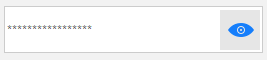

## Description

This article  shows how you can create a password textbox that is capable to show the password. This is done by pressing and holding a button. Figure 1 shows the result. For this example I am using the Fluent theme and a [RadButtonTextBox]().

>caption Figure 1: Create PasswordTextBox using RadButtonTextBox




## Solution

To achieve this you need to handle the __MouseDown__ and __MouseUp__ events. This way you can change the image and set the __PasswordChar__.

````C#
public RadForm1()
{
    InitializeComponent();

    radButtonElement1.DisplayStyle = DisplayStyle.Image;
    radButtonElement1.Image = Properties.Resources.eye32;
    radButtonElement1.MouseDown += RadButtonElement1_MouseDown;
    radButtonElement1.MouseUp += RadButtonElement1_MouseUp;
    radButtonTextBox1.PasswordChar = '*';
}

private void RadButtonElement1_MouseUp(object sender, MouseEventArgs e)
{
    radButtonElement1.Image = Properties.Resources.eye32;
    radButtonTextBox1.PasswordChar = '*';
}

private void RadButtonElement1_MouseDown(object sender, MouseEventArgs e)
{
    radButtonElement1.Image = Properties.Resources.eye32hidden;
    radButtonTextBox1.PasswordChar = '\0'; 
}

````
````VB.NET
Public Sub New()
	InitializeComponent()

	radButtonElement1.DisplayStyle = DisplayStyle.Image
	radButtonElement1.Image = My.Resources.eye32
	AddHandler radButtonElement1.MouseDown, AddressOf RadButtonElement1_MouseDown
	AddHandler radButtonElement1.MouseUp, AddressOf RadButtonElement1_MouseUp
	radButtonTextBox1.PasswordChar = "*"c
End Sub

Private Sub RadButtonElement1_MouseUp(ByVal sender As Object, ByVal e As MouseEventArgs)
	radButtonElement1.Image = My.Resources.eye32
	radButtonTextBox1.PasswordChar = "*"c
End Sub

Private Sub RadButtonElement1_MouseDown(ByVal sender As Object, ByVal e As MouseEventArgs)
	radButtonElement1.Image = My.Resources.eye32hidden
	radButtonTextBox1.PasswordChar = ControlChars.NullChar
End Sub
````


