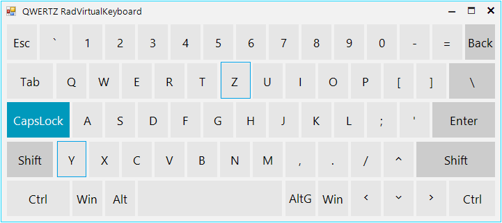

## Environment
 
|Product Version|Product|Author|
|----|----|----|
|2021.1.223|RadGridView for WinForms|[Nadya Karaivanova](https://www.telerik.com/blogs/author/nadya-karaivanova)|
 
## Description

By default, [RadVirtualKeybord](https://docs.telerik.com/devtools/winforms/controls/virtual-keyboard/default-layouts#simplified) is of QWERTY keyboard type. However, it is a commom requirement to customize the keyboard to another type, for example - QWERTZ or AZERTY. The main difference between these three keyboards is the position of the Q, W, Z and A keys. 

This tutorial will demonstrate how you can achieve this type of keyboard with **RadVirtualKeyboard** control.


 
## Solution 

In order to achieve this, we need to replace the positions of the Y and Z keys. We should find the desired keys, remove them from the **Keys** collection, then insert the keys back on desired position. The following code snippet demonstrates this:

````C#
public RadForm1()
{
    InitializeComponent();

    this.radVirtualKeyboard1.LayoutType = KeyboardLayoutType.Simplified;
    SimplifiedVirtualKeyboardLayoutPanel simplifiedLayoutPanel = this.radVirtualKeyboard1.MainLayoutPanel as SimplifiedVirtualKeyboardLayoutPanel;
    VirtualKeyboardLayout mainLayout = simplifiedLayoutPanel.MainButtonsLayout;
    Key Zkey = mainLayout.Rows[3].Keys.FirstOrDefault(k => k.VirtualKey == (int)Keys.Z) as Key;
    int zKeyIndex = mainLayout.Rows[3].Keys.IndexOf(Zkey);
    Key Ykey = mainLayout.Rows[1].Keys.FirstOrDefault(k => k.VirtualKey == (int)Keys.Y) as Key;
    int yKeyIndex = mainLayout.Rows[1].Keys.IndexOf(Ykey);
    //Remove keys
    mainLayout.Rows[3].Keys.Remove(Zkey);
    mainLayout.Rows[1].Keys.Remove(Ykey);
    //Insert keys
    mainLayout.Rows[1].Keys.Insert(yKeyIndex, Zkey);
    mainLayout.Rows[3].Keys.Insert(zKeyIndex, Ykey);
    //Reset layout
    mainLayout.ResetLayout(true);
}


````
````VB.NET
Public Sub New()
    InitializeComponent()
    Me.radVirtualKeyboard1.LayoutType = KeyboardLayoutType.Simplified
    Dim simplifiedLayoutPanel As SimplifiedVirtualKeyboardLayoutPanel = TryCast(Me.radVirtualKeyboard1.MainLayoutPanel, SimplifiedVirtualKeyboardLayoutPanel)
    Dim mainLayout As VirtualKeyboardLayout = simplifiedLayoutPanel.MainButtonsLayout
    Dim Zkey As Key = TryCast(mainLayout.Rows(3).Keys.FirstOrDefault(Function(k) k.VirtualKey = CInt(Keys.Z)), Key)
    Dim zKeyIndex As Integer = mainLayout.Rows(3).Keys.IndexOf(Zkey)
    Dim Ykey As Key = TryCast(mainLayout.Rows(1).Keys.FirstOrDefault(Function(k) k.VirtualKey = CInt(Keys.Y)), Key)
    Dim yKeyIndex As Integer = mainLayout.Rows(1).Keys.IndexOf(Ykey)
    'Remove keys
    mainLayout.Rows(3).Keys.Remove(Zkey)
    mainLayout.Rows(1).Keys.Remove(Ykey)
    'Insert keys
    mainLayout.Rows(1).Keys.Insert(yKeyIndex, Zkey)
    mainLayout.Rows(3).Keys.Insert(zKeyIndex, Ykey)
    'Reset layout
    mainLayout.ResetLayout(True)
End Sub

````

>note Feel free to use this approach in order to customize the position of the keys in any way that is suitable for you. 
