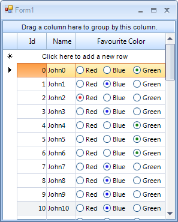

|Product Version|Product|Author|Last modified|
|----|----|----|----|
|Q1 2012 SP1|RadGridView for WinForms|Nikolay Diyanov|May 23, 2012|

  
**PROBLEM**  
   
The purpose of this article is to demonstrate how you can create a custom cell or more specifically - RadRadioButtonCellElement. The key principles in this article are valid for every custom cell element that you will want to create, not only for RadRadioButtonCellElement.  
   
**SOLUTION**  
   
 

   
   
The cell that we are going to implement represents three RadRadioButtonCellElements which we will make mutually exclusive - i.e. when you select one of them the others will get unselected. In order to make customizations in RadGridView cells that require setting a custom layout of controls/elements (in this case arranging three RadRadioButtonElements in a row) we need to create a custom cell element, deriving from an existing cell element.  
   
So here is the full list of steps that you need to follow in order to get your custom cell:  
   
 
1.First, we create a class that inherits from an existing cell type. Since we do not need any of the default editors that the predefined cell types provide, we will inherit our cell class from the base GridViewDataCellElement:
    
````C#
public class RadioButtonCellElement : GridDataCellElement
{
    public RadioButtonCellElement(GridViewColumn column, GridRowElement row)
        : base(column, row)
    {
    }
}

````
````VB.NET
Public Class RadioButtonCellElement
    Inherits GridDataCellElement

    Public Sub New(ByVal column As GridViewColumn, ByVal row As GridRowElement)
        MyBase.New(column, row)
    End Sub
End Class

````

2.Then, we insert the RadRadioButtonElements in the cell. This should be done in the Initialize method. As you can notice, we have some eye-candy stuff here - the bullets of the different RadRadioButtonElements are coloured differently. [RadControlSpy](https://docs.telerik.com/devtools/winforms/tools/controlspy/controlspy) can be of great use in order to inspect the structure of RadRadioButtonElement and set the appropriate colors to the appropriate elements. Please note that I am subscribing these RadRadioButtonElement to the MouseDown event. We will use the event handlers to set the Value of the cell:

````C#
protected override void CreateChildElements()
{
    base.CreateChildElements();
 
    radioButtonElement1 = new RadRadioButtonElement();
    radioButtonElement1.Margin = new Padding(0, 2, 0, 0);
    radioButtonElement1.MinSize = new Size(50, 20);
    radioButtonElement1.Text = "Red";
 
    radioButtonElement2 = new RadRadioButtonElement();
    radioButtonElement2.Margin = new Padding(0, 2, 0, 0);
    radioButtonElement2.MinSize = new Size(50, 20);
    radioButtonElement2.Text = "Blue";
 
    radioButtonElement3 = new RadRadioButtonElement();
    radioButtonElement3.Margin = new Padding(0, 2, 0, 0);
    radioButtonElement3.MinSize = new Size(50, 20);
    radioButtonElement3.Text = "Green";
 
    this.Children.Add(radioButtonElement1);
    this.Children.Add(radioButtonElement2);
    this.Children.Add(radioButtonElement3);
 
    radioButtonElement1.MouseDown += new MouseEventHandler(radioButtonElement1_MouseDown);
    radioButtonElement2.MouseDown += new MouseEventHandler(radioButtonElement2_MouseDown);
    radioButtonElement3.MouseDown += new MouseEventHandler(radioButtonElement3_MouseDown);
}
 
public override void Initialize(GridViewColumn column, GridRowElement row)
{
    base.Initialize(column, row);
 
    ((RadioPrimitive)radioButtonElement1.Children[1].Children[1].Children[0]).BackColor2 = Color.Red;
    ((RadioPrimitive)radioButtonElement2.Children[1].Children[1].Children[0]).BackColor2 = Color.Blue;
    ((RadioPrimitive)radioButtonElement3.Children[1].Children[1].Children[0]).BackColor2 = Color.Green;
}
 
void radioButtonElement1_MouseDown(object sender, System.Windows.Forms.MouseEventArgs e)
{
    this.Value = 0;
}
 
void radioButtonElement2_MouseDown(object sender, System.Windows.Forms.MouseEventArgs e)
{
    this.Value = 1;
}
 
void radioButtonElement3_MouseDown(object sender, System.Windows.Forms.MouseEventArgs e)
{
    this.Value = 2;
}

````
````VB.NET

    Protected Overrides Sub CreateChildElements()
        MyBase.CreateChildElements()
        radioButtonElement1 = New RadRadioButtonElement()
        radioButtonElement1.Margin = New Padding(0, 2, 0, 0)
        radioButtonElement1.MinSize = New Size(50, 20)
        radioButtonElement1.Text = "Red"
        radioButtonElement2 = New RadRadioButtonElement()
        radioButtonElement2.Margin = New Padding(0, 2, 0, 0)
        radioButtonElement2.MinSize = New Size(50, 20)
        radioButtonElement2.Text = "Blue"
        radioButtonElement3 = New RadRadioButtonElement()
        radioButtonElement3.Margin = New Padding(0, 2, 0, 0)
        radioButtonElement3.MinSize = New Size(50, 20)
        radioButtonElement3.Text = "Green"
        Me.Children.Add(radioButtonElement1)
        Me.Children.Add(radioButtonElement2)
        Me.Children.Add(radioButtonElement3)
        AddHandler, radioButtonElement1.MouseDown, New MouseEventHandler(AddressOf radioButtonElement1_MouseDown)
        AddHandler,radioButtonElement2.MouseDown, New MouseEventHandler(AddressOf radioButtonElement2_MouseDown)
        AddHandler,radioButtonElement3.MouseDown, New MouseEventHandler(AddressOf radioButtonElement3_MouseDown)
    End Sub

    Public Overrides Sub Initialize(ByVal column As GridViewColumn, ByVal row As GridRowElement)
        MyBase.Initialize(column, row)
        (CType(radioButtonElement1.Children(1).Children(1).Children(0), RadioPrimitive)).BackColor2 = Color.Red
        (CType(radioButtonElement2.Children(1).Children(1).Children(0), RadioPrimitive)).BackColor2 = Color.Blue
        (CType(radioButtonElement3.Children(1).Children(1).Children(0), RadioPrimitive)).BackColor2 = Color.Green
    End Sub

    Private Sub radioButtonElement1_MouseDown(ByVal sender As Object, ByVal e As System.Windows.Forms.MouseEventArgs)
        Me.Value = 0
    End Sub

    Private Sub radioButtonElement2_MouseDown(ByVal sender As Object, ByVal e As System.Windows.Forms.MouseEventArgs)
        Me.Value = 1
    End Sub

    Private Sub radioButtonElement3_MouseDown(ByVal sender As Object, ByVal e As System.Windows.Forms.MouseEventArgs)
        Me.Value = 2
    End Sub
End Class

````

3.The RadRadioButtonElement that we have just inserted in the cell should be arranged. For this purpose we override the ArrangeOverride method where we prepare the necessary layout. The ArrangeOverride method of Telerik Presentation Framework is similar to the [ArrangeOverride method of WPF](http://msdn.microsoft.com/en-us/library/system.windows.frameworkelement.arrangeoverride.aspx):

````C#
protected override SizeF ArrangeOverride(SizeF finalSize)
{
    if (this.Children.Count == 3)
    {
        this.Children[0].Arrange(new RectangleF(0, 0, 50, 20));
        this.Children[1].Arrange(new RectangleF(55, 0, 50, 20));
        this.Children[2].Arrange(new RectangleF(110, 0, 50, 20));
    }
    return finalSize;
}

````
````VB.NET
Protected Overrides Function ArrangeOverride(ByVal finalSize As SizeF) As SizeF
    If Me.Children.Count = 3 Then
        Me.Children(0).Arrange(New RectangleF(0, 0, 50, 20))
        Me.Children(1).Arrange(New RectangleF(55, 0, 50, 20))
        Me.Children(2).Arrange(New RectangleF(110, 0, 50, 20))
    End If
    Return finalSize
End Function

````
    

4.On DisposeManagedResources of this the custom cell, we need to unwire the MouseDown events:
    
````C#
protected override void DisposeManagedResources()
{
    radioButtonElement1.MouseDown -= new MouseEventHandler(radioButtonElement1_MouseDown);
    radioButtonElement2.MouseDown -= new MouseEventHandler(radioButtonElement2_MouseDown);
    radioButtonElement3.MouseDown -= new MouseEventHandler(radioButtonElement3_MouseDown);
    base.DisposeManagedResources();
}

````
````VB.NET
Protected Overrides Sub DisposeManagedResources()
    RemoveHandler radioButtonElement1.MouseDown, AddressOf radioButtonElement1_MouseDown
    RemoveHandler radioButtonElement2.MouseDown, AddressOf radioButtonElement2_MouseDown
    RemoveHandler radioButtonElement3.MouseDown, AddressOf radioButtonElement3_MouseDown
    MyBase.DisposeManagedResources()
End Sub

````

5. A key part of this example is setting the Value from the cell to the RadRadioButtonElements. If you do not perform the this step, the selected RadRadioButtonElements will get scrambled, since [RadGridView uses UI virtualization for its cell elements](https://docs.telerik.com/devtools/winforms/gridview/fundamentals/logical-vs.-visual-grid-structure) and it is your response to take care of the ToggleState of your custom cell's RadRadioButtonElements. It could be achieved using SetContentsCore. SetContetsCore is called whenever the data layer updates the Value of the cell and the cell needs to update its content:
    
 
````C#
protected override void SetContentCore(object value)
{
    if (this.Value != null && this.Value != DBNull.Value)
    {
        for (int i = 0; i < this.Children.Count; i++)
        {
            ((RadRadioButtonElement)this.Children[i]).ToggleState = Telerik.WinControls.Enumerations.ToggleState.Off;
        }
  
        switch (int.Parse(((GridDataCellElement)this).Value.ToString()))
        {
            case 0:
                ((RadRadioButtonElement)this.Children[0]).ToggleState = Telerik.WinControls.Enumerations.ToggleState.On;
                break;
            case 1:
                ((RadRadioButtonElement)this.Children[1]).ToggleState = Telerik.WinControls.Enumerations.ToggleState.On;
                break;
            case 2:
                ((RadRadioButtonElement)this.Children[2]).ToggleState = Telerik.WinControls.Enumerations.ToggleState.On;
                break;
        }
    }
}

````
````VB.NET
Protected Overrides Sub SetContentCore(ByVal value As Object)
    If Not Me.Value Is Nothing AndAlso Not Me.Value Is DBNull.Value Then
        Dim i As Integer = 0
        Do While i < Me.Children.Count
            CType(Me.Children(i), RadRadioButtonElement).ToggleState = Telerik.WinControls.Enumerations.ToggleState.Off
            i += 1
        Loop

        Select Case Integer.Parse((CType(Me, GridDataCellElement)).Value.ToString())
            Case 0
                CType(Me.Children(0), RadRadioButtonElement).ToggleState = Telerik.WinControls.Enumerations.ToggleState.On
            Case 1
                CType(Me.Children(1), RadRadioButtonElement).ToggleState = Telerik.WinControls.Enumerations.ToggleState.On
            Case 2
                CType(Me.Children(2), RadRadioButtonElement).ToggleState = Telerik.WinControls.Enumerations.ToggleState.On
        End Select
    End If
End Sub


````

6. Finally, we should replace the default cell in our radio button column with the custom one. To do this we should inherit GridViewColumn and override the GetCellType method:

````C#
public class RadioButtonColumn: GridViewDataColumn
{
    public RadioButtonColumn(string fieldName)
        : base(fieldName)
    {
    }
 
    public override Type GetCellType(GridViewRowInfo row)
    {
        if (row is GridViewDataRowInfo)
        {
            return typeof(RadioButtonCellElement);
        }       
        return base.GetCellType(row);
    }
}
 
RadioButtonColumn column = new RadioButtonColumn("FavouriteColor");
column.HeaderText = "Favourite Color";
column.Width = 170;
column.ReadOnly = true;
this.radGridView1.Columns.Add(column);

````
````VB.NET
Public Class RadioButtonColumn

    Inherits Telerik.WinControls.UI.GridViewDataColumn

    Public Sub New(ByVal fieldName As String)
        MyBase.New(fieldName)
    End Sub

    Public Overrides Function GetCellType(ByVal row As GridViewRowInfo) As System.Type
        If TypeOf row Is GridViewDataRowInfo Then
            Return GetType(RadioButtonCellElement)
        End If
        Return MyBase.GetCellType(row)
    End Function

End Class

Dim column = new RadioButtonColumn("FavouriteColor")
column.HeaderText = "Favourite Color"
column.Width = 170
column.ReadOnly = true
Me.RadGridView1.Columns.Add(column)

````

This is it! Now you have your new RadRadioButtonCellElement ready to display your data.

>note You can download a complete VB and C# project from the following [link](https://github.com/telerik/winforms-sdk/tree/master/GridView/RadRadioButtonCellElement).

