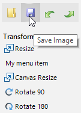
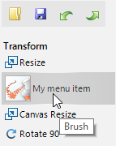

## Environment
 
|Product Version|Product|Author|
|----|----|----|
|2022.1.222|RadImageEditor for WinForms|[Desislava Yordanova](https://www.telerik.com/blogs/author/desislava-yordanova)|


## Description

The ImageEditorElement.CommandsElement gives you direct access to the **OpenButton**, **SaveButton**, **UndoButton** and **RedoButton** that are placed at the top stack. The rest of the command buttons, arranged vertically, can be accessed via the CommandsElement.CommandsStackElement.Children collection.

This tutorial demonstrates how to replace the default save button with a custom one and add a new button with custom logic among the rest of the command buttons.
 
## Custom Save Button

By default, the save button that is located in the top commands element executes `SaveAs` command, not `Save`. However, you can easily replace this button with your own and execute the desired action when the button is clicked:



````C# 
protected override void OnLoad(EventArgs e)
{
    base.OnLoad(e);

    RadButtonElement mySaveButton = new RadButtonElement();
    mySaveButton.Image = this.radImageEditor1.ImageEditorElement.CommandsElement.SaveButton.Image;
    mySaveButton.SvgImage = this.radImageEditor1.ImageEditorElement.CommandsElement.SaveButton.SvgImage;
    mySaveButton.ToolTipText = ImageEditorLocalizationProvider.CurrentProvider.GetLocalizedString(ImageEditorStringId.SaveCommandTooltip);
    mySaveButton.Click += MySaveButton_Click;
    this.radImageEditor1.ImageEditorElement.CommandsElement.TopCommandsStackElement.Children.Insert(1, mySaveButton);

    this.radImageEditor1.ImageEditorElement.CommandsElement.TopCommandsStackElement.Children.Remove(
        this.radImageEditor1.ImageEditorElement.CommandsElement.SaveButton);
}

private void MySaveButton_Click(object sender, EventArgs e)
{
    this.radImageEditor1.ImageEditorElement.SaveImageAs();
}
    
````
````VB.NET

Protected Overrides Sub OnLoad(ByVal e As EventArgs)
    MyBase.OnLoad(e)
    Dim mySaveButton As RadButtonElement = New RadButtonElement()
    mySaveButton.Image = Me.RadImageEditor1.ImageEditorElement.CommandsElement.SaveButton.Image
    mySaveButton.SvgImage = Me.RadImageEditor1.ImageEditorElement.CommandsElement.SaveButton.SvgImage
    mySaveButton.ToolTipText = ImageEditorLocalizationProvider.CurrentProvider.GetLocalizedString(ImageEditorStringId.SaveCommandTooltip)
    AddHandler mySaveButton.Click, AddressOf MySaveButton_Click
    Me.RadImageEditor1.ImageEditorElement.CommandsElement.TopCommandsStackElement.Children.Insert(1, mySaveButton)
    Me.RadImageEditor1.ImageEditorElement.CommandsElement.TopCommandsStackElement.Children.Remove(
        Me.RadImageEditor1.ImageEditorElement.CommandsElement.SaveButton)
End Sub

Private Sub MySaveButton_Click(ByVal sender As Object, ByVal e As EventArgs)
    Me.RadImageEditor1.ImageEditorElement.SaveImageAs()
End Sub
 
````

## Add Custom Command Button 

All command buttons, arranged vertically, are contained in the CommandsElement.CommandsStackElement.Children collection. If you want to add your own button that performs a specific logic, it is necessary to insert the item at the desired position:



````C# 
public RadForm1()
{
    InitializeComponent();

    RadMenuItem myMenuItem = new RadMenuItem("My menu item");
    myMenuItem.ToolTipText = "Brush";
    myMenuItem.Image = Properties.Resources.brush;
    myMenuItem.Click += myMenuItem_Click;
    this.radImageEditor1.ImageEditorElement.CommandsElement.CommandsStackElement.Children.Insert(3, myMenuItem);
}

private void myMenuItem_Click(object sender, EventArgs e)
{
    //TODO
}
    
````
````VB.NET
Public Sub New()
    InitializeComponent()
    Dim myMenuItem As RadMenuItem = New RadMenuItem("My menu item")
    myMenuItem.ToolTipText = "Brush"
    myMenuItem.Image = My.Resources.brush
    AddHandler myMenuItem.Click, AddressOf myMenuItem_Click
    Me.RadImageEditor1.ImageEditorElement.CommandsElement.CommandsStackElement.Children.Insert(3, myMenuItem)
End Sub

Private Sub myMenuItem_Click(ByVal sender As Object, ByVal e As EventArgs)
    'TODO
End Sub
 
````

# See Also

* [Structure]() 