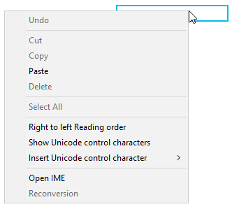
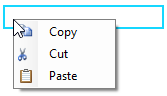

## Environment
 
|Product Version|Product|Author|
|----|----|----|
|2022.1.222|RadTextBox for WinForms|[Desislava Yordanova](https://www.telerik.com/blogs/author/desislava-yordanova)|


## Description

By default, **RadTextBox** offers the following context menu after right-clicking the controls:
 


This is actually the context menu for the hosted [TextBox](https://docs.microsoft.com/en-us/dotnet/api/system.windows.forms.textbox?view=windowsdesktop-6.0) that Microsoft offers.

This article demonstrates a sample approach how to eliminate the default menu and assign your custom one.

## Solution

In order to remove the default context menu, it is necessary to set the RadTextBox.TextBoxElement.TextBoxItem.HostedControl.**ContextMenuStrip** property to a new instance of [ContextMenuStrip](https://docs.microsoft.com/en-us/dotnet/api/system.windows.forms.contextmenustrip?view=windowsdesktop-6.0):

````C#  
   
this.radTextBox1.TextBoxElement.TextBoxItem.HostedControl.ContextMenuStrip = new ContextMenuStrip();

````
````VB.NET

Me.RadTextBox1.TextBoxElement.TextBoxItem.HostedControl.ContextMenuStrip = New ContextMenuStrip()

````

However, if you want to achieve your custom items, it is necesary to create your own [ContextMenuStrip](https://docs.microsoft.com/en-us/dotnet/api/system.windows.forms.contextmenustrip?view=windowsdesktop-6.0)


 
````C#  

public RadForm1()
{
    InitializeComponent();

    ContextMenuStrip menu = new ContextMenuStrip();
    ToolStripMenuItem copy = new ToolStripMenuItem("Copy", Properties.Resources.copy); 
    copy.Click += copy_Click;
    menu.Items.Add(copy);
    ToolStripMenuItem cut = new ToolStripMenuItem("Cut", Properties.Resources.cut);
    cut.Click += cut_Click;
    menu.Items.Add(cut);
    ToolStripMenuItem paste = new ToolStripMenuItem("Paste", Properties.Resources.paste); 
    paste.Click += paste_Click;
    menu.Items.Add(paste);
    this.radTextBox1.TextBoxElement.TextBoxItem.HostedControl.ContextMenuStrip = menu;
}

private void paste_Click(object sender, EventArgs e)
{
    //TODO paste
}

private void cut_Click(object sender, EventArgs e)
{
    //TODO cut
}

private void copy_Click(object sender, EventArgs e)
{
    //TODO copy
}

````
````VB.NET

Public Sub New()
    InitializeComponent()
    Dim menu As ContextMenuStrip = New ContextMenuStrip()
    Dim copy As ToolStripMenuItem = New ToolStripMenuItem("Copy", My.Resources.copy)
    AddHandler copy.Click, AddressOf copy_Click
    menu.Items.Add(copy)
    Dim cut As ToolStripMenuItem = New ToolStripMenuItem("Cut", My.Resources.cut)
    AddHandler cut.Click, AddressOf cut_Click
    menu.Items.Add(cut)
    Dim paste As ToolStripMenuItem = New ToolStripMenuItem("Paste", My.Resources.paste)
    AddHandler paste.Click, AddressOf paste_Click
    menu.Items.Add(paste)
    Me.radTextBox1.TextBoxElement.TextBoxItem.HostedControl.ContextMenuStrip = menu
End Sub

Private Sub paste_Click(ByVal sender As Object, ByVal e As EventArgs)
    'TODO paste
End Sub

Private Sub cut_Click(ByVal sender As Object, ByVal e As EventArgs)
    'TODO cut
End Sub

Private Sub copy_Click(ByVal sender As Object, ByVal e As EventArgs)
    'TODO copy
End Sub

````

