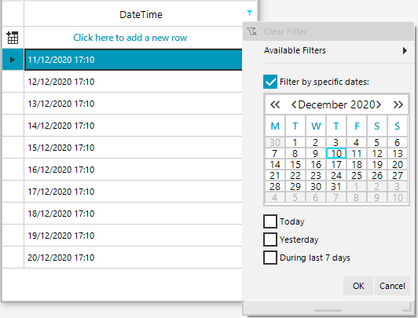

## Environment
 
|Product Version|Product|Author|
|----|----|----|
|2020.3.915|RadGridView for WinForms|[Nadya Karaivanova](https://www.telerik.com/blogs/author/nadya-karaivanova)|
 
## Description

By default, when using [Excel-like filtering](https://docs.telerik.com/devtools/winforms/controls/gridview/filtering/excel-like-filtering) functionality in **RadGridView** it shows a pop up with **RadCalendar** so the user can easily pick a date. 
 


The following tutorial will demonstrate how you can show a **RadDateTimePicker** in order to be able to pick a time as well as a date.


## Solution 

This can be achieved by creating a custom **RadDateFilterPopup** and add a time picker item.
Let's first create a custom FilterMenuTimePickerElement that will host the **RadDateTimePickerElement**. Then, we need to create FilterMenuTimePickerItem that inherits from the **RadMenuItemBase** which should be added to the **Items** collection in our custom pop up. 

````C#
public class FilterMenuTimePickerElement : LightVisualElement
{
    private RadHostItem hostItem;
    private RadDateTimePicker dateTimePicker;

    public RadDateTimePicker DateTimePicker
    {
        get { return this.dateTimePicker; }
    }

    protected override void InitializeFields()
    {
        base.InitializeFields();

        this.BorderGradientStyle = GradientStyles.Solid;
        this.BorderColor = Color.FromArgb(156, 189, 232);
    }

    protected override void CreateChildElements()
    {
        base.CreateChildElements();

        this.dateTimePicker = new RadDateTimePicker();
        this.dateTimePicker.DateTimePickerElement.Format = DateTimePickerFormat.Custom;
        this.dateTimePicker.DateTimePickerElement.CustomFormat = "dd/MM/yyyy HH:mm";

        this.dateTimePicker.DateTimePickerElement.ShowTimePicker = true;
        var calendar = this.dateTimePicker.DateTimePickerElement.GetCurrentBehavior() as RadDateTimePickerCalendar;
        calendar.TimePicker.TimePickerElement.Step = 1; 
        this.dateTimePicker.DateTimePickerElement.CalendarSize = new Size(400, 400);

        this.hostItem = new RadHostItem(this.dateTimePicker);
        this.Children.Add(this.hostItem);
    }
}

public class FilterMenuTimePickerItem : RadMenuItemBase
{
    RadCheckBoxElement checkBoxElement;
    FilterMenuTimePickerElement timePickerElement;
    
    public bool IsChecked
    {
        get { return this.checkBoxElement.IsChecked; }
        set { this.checkBoxElement.IsChecked = value; }
    }

    public FilterMenuTimePickerElement TimePickerElement
    {
        get { return this.timePickerElement; }
    }

    protected override void InitializeFields()
    {
        base.InitializeFields();
        this.Padding = new Padding(5, 5, 5, 0);
        this.MinSize = new Size(140, 60);
    }

    protected override void CreateChildElements()
    {
        base.CreateChildElements();

        this.checkBoxElement = new RadCheckBoxElement();
        this.checkBoxElement.IsChecked = false;
        this.checkBoxElement.Text = RadGridLocalizationProvider.CurrentProvider.GetLocalizedString(RadGridStringId.FilterFunctionSelectedDates);
        this.checkBoxElement.ToggleStateChanged += new StateChangedEventHandler(checkBoxElement_ToggleStateChanged);
        this.checkBoxElement.Margin = new Padding(0, 10, 0, 5);

        this.Children.Add(this.checkBoxElement);

        this.timePickerElement = new FilterMenuTimePickerElement();
        this.timePickerElement.Enabled = false;
        this.Children.Add(this.timePickerElement);
    }
    protected override SizeF ArrangeOverride(SizeF finalSize)
    {
        RectangleF rect = GetClientRectangle(finalSize);
        RadDropDownMenuLayout layout = FindAncestor<RadDropDownMenuLayout>();
        if (layout != null)
        {
            rect.X += (this.RightToLeft) ? 0 : layout.LeftColumnWidth;
            rect.Width -= layout.LeftColumnWidth;
        }

        foreach (RadElement element in this.Children)
        {
            if (element == this.checkBoxElement)
            {
                element.Arrange(new RectangleF(rect.X, 0, rect.Width, this.checkBoxElement.DesiredSize.Height));
            }
            else if (element == this.timePickerElement)
            {
                this.timePickerElement.Arrange(new RectangleF(rect.X, this.checkBoxElement.DesiredSize.Height,
                    rect.Width, rect.Height - this.checkBoxElement.DesiredSize.Height));
            }
            else
            {
                element.Arrange(rect);
            }
        }

        return finalSize;
    }

    void checkBoxElement_ToggleStateChanged(object sender, StateChangedEventArgs args)
    {
        this.timePickerElement.Enabled = this.checkBoxElement.IsChecked;
    }
    protected override void DisposeManagedResources()
    {
        this.checkBoxElement.ToggleStateChanged -= checkBoxElement_ToggleStateChanged;

        base.DisposeManagedResources();
    }
}

   
````
````VB.NET
Public Class FilterMenuTimePickerElement
    Inherits LightVisualElement

    Private hostItem As RadHostItem
    Public ReadOnly Property DateTimePicker As RadDateTimePicker

    Protected Overrides Sub InitializeFields()
        MyBase.InitializeFields()
        Me.BorderGradientStyle = GradientStyles.Solid
        Me.BorderColor = Color.FromArgb(156, 189, 232)
    End Sub

    Protected Overrides Sub CreateChildElements()
        MyBase.CreateChildElements()
        Dim dateTimePicker = New RadDateTimePicker()
        Me.dateTimePicker.DateTimePickerElement.Format = DateTimePickerFormat.Custom
        Me.dateTimePicker.DateTimePickerElement.CustomFormat = "dd/MM/yyyy HH:mm"
        Me.dateTimePicker.DateTimePickerElement.ShowTimePicker = True
        Dim calendar = TryCast(Me.dateTimePicker.DateTimePickerElement.GetCurrentBehavior(), RadDateTimePickerCalendar)
        calendar.TimePicker.TimePickerElement.Step = 1
        Me.dateTimePicker.DateTimePickerElement.CalendarSize = New Size(400, 400)
        Me.hostItem = New RadHostItem(Me.dateTimePicker)
        Me.Children.Add(Me.hostItem)
    End Sub
End Class

Public Class FilterMenuTimePickerItem
    Inherits RadMenuItemBase

    Private checkBoxElement As RadCheckBoxElement

    Public Property IsChecked As Boolean
        Get
            Return Me.checkBoxElement.IsChecked
        End Get
        Set(ByVal value As Boolean)
            Me.checkBoxElement.IsChecked = value
        End Set
    End Property

    Public ReadOnly Property TimePickerElement As FilterMenuTimePickerElement

    Protected Overrides Sub InitializeFields()
        MyBase.InitializeFields()
        Me.Padding = New Padding(5, 5, 5, 0)
        Me.MinSize = New Size(140, 60)
    End Sub

    Protected Overrides Sub CreateChildElements()
        MyBase.CreateChildElements()
        Me.checkBoxElement = New RadCheckBoxElement()
        Me.checkBoxElement.IsChecked = False
        Me.checkBoxElement.Text = RadGridLocalizationProvider.CurrentProvider.GetLocalizedString(RadGridStringId.FilterFunctionSelectedDates)
        AddHandler Me.checkBoxElement.ToggleStateChanged, New StateChangedEventHandler(AddressOf checkBoxElement_ToggleStateChanged)
        Me.checkBoxElement.Margin = New Padding(0, 10, 0, 5)
        Me.Children.Add(Me.checkBoxElement)
        Dim TimePickerElement = New FilterMenuTimePickerElement()
        Me.timePickerElement.Enabled = False
        Me.Children.Add(Me.timePickerElement)
    End Sub

    Protected Overrides Function ArrangeOverride(ByVal finalSize As SizeF) As SizeF
        Dim rect As RectangleF = GetClientRectangle(finalSize)
        Dim layout As RadDropDownMenuLayout = FindAncestor(Of RadDropDownMenuLayout)()

        If layout IsNot Nothing Then
            rect.X += If((Me.RightToLeft), 0, layout.LeftColumnWidth)
            rect.Width -= layout.LeftColumnWidth
        End If

        For Each element As RadElement In Me.Children

            If element Is Me.checkBoxElement Then
                element.Arrange(New RectangleF(rect.X, 0, rect.Width, Me.checkBoxElement.DesiredSize.Height))
            ElseIf element Is Me.timePickerElement Then
                Me.timePickerElement.Arrange(New RectangleF(rect.X, Me.checkBoxElement.DesiredSize.Height, rect.Width, rect.Height - Me.checkBoxElement.DesiredSize.Height))
            Else
                element.Arrange(rect)
            End If
        Next

        Return finalSize
    End Function

    Private Sub checkBoxElement_ToggleStateChanged(ByVal sender As Object, ByVal args As StateChangedEventArgs)
        Me.timePickerElement.Enabled = Me.checkBoxElement.IsChecked
    End Sub

    Protected Overrides Sub DisposeManagedResources()
        RemoveHandler Me.checkBoxElement.ToggleStateChanged, AddressOf checkBoxElement_ToggleStateChanged
        MyBase.DisposeManagedResources()
    End Sub
End Class

````

Now, let's create the custom filter popup:

````C#
public class MyRadDateFilterPopup : RadDateFilterPopup
{
    public MyRadDateFilterPopup(GridViewDataColumn dataColumn) 
        : base(dataColumn)
    {
    }

    protected override void InitializeElements()
    {
        CreateGeneralMenuItems();
        CreateCalendarElement();
        this.Items.Remove(this.CalendarItem);
        this.Items.Add(new FilterMenuTimePickerItem());
        CreateButtonsElement();
        CreateDateCustomItems();
    }
    protected override void SetInitialSelection()
    {
        base.SetInitialSelection();

        DateFilterDescriptor descriptor = GetFilterDescriptor() as DateFilterDescriptor;
        if (descriptor == null)
        {
            return;
        }

        foreach (RadItem item in this.Items)
        {
            FilterMenuTimePickerItem filterMenuTimePickerItem = item as FilterMenuTimePickerItem;
            if (filterMenuTimePickerItem == null)
            {
                continue;
            }

            if (descriptor.Operator == FilterOperator.IsEqualTo && descriptor.Value != null)
            {
                filterMenuTimePickerItem.IsChecked = true;
                filterMenuTimePickerItem.TimePickerElement.DateTimePicker.Value = descriptor.Value.Value;
            }
        }
    }

    protected override void OnButtonOkClick(EventArgs e)
    {
        FilterDescriptor filterDescriptor = null;
        foreach (RadItem item in this.Items)
        {
            FilterMenuTimePickerItem filterMenuTimePickerItem = item as FilterMenuTimePickerItem;
            if (filterMenuTimePickerItem != null && 
                filterMenuTimePickerItem.IsChecked)
            {
                DateTime? value = filterMenuTimePickerItem.TimePickerElement.DateTimePicker.DateTimePickerElement.Value;
                if (value.HasValue)
                {
                    DateTime date = value.Value;
                    filterDescriptor = new DateFilterDescriptor(this.DataColumn.Name, FilterOperator.IsEqualTo, date, false);
                }

                break;
            }
        }

        if (string.IsNullOrEmpty(filterDescriptor.Expression))
        {
            filterDescriptor = null;
        }

        base.FilterDescriptor = filterDescriptor;

        OnFilterConfirmed();
    }

    private bool SearchForAppliedFilterDescriptors(FilterDescriptor descriptor1, FilterDescriptor descriptor2)
    {
        if (descriptor1.Expression == descriptor2.Expression)
        {
            return true;
        }

        if (descriptor1 is CompositeFilterDescriptor)
        {
            foreach (FilterDescriptor descriptor in ((CompositeFilterDescriptor)descriptor1).FilterDescriptors)
            {
                if (SearchForAppliedFilterDescriptors(descriptor, descriptor2))
                {
                    return true;
                }
            }
        }

        return false;
    }
}
   
````
````VB.NET
Public Class MyRadDateFilterPopup
    Inherits RadDateFilterPopup

    Public Sub New(ByVal dataColumn As GridViewDataColumn)
        MyBase.New(dataColumn)
    End Sub

    Protected Overrides Sub InitializeElements()
        CreateGeneralMenuItems()
        CreateCalendarElement()
        Me.Items.Remove(Me.CalendarItem)
        Me.Items.Add(New FilterMenuTimePickerItem())
        CreateButtonsElement()
        CreateDateCustomItems()
    End Sub

    Protected Overrides Sub SetInitialSelection()
        MyBase.SetInitialSelection()
        Dim descriptor As DateFilterDescriptor = TryCast(GetFilterDescriptor(), DateFilterDescriptor)

        If descriptor Is Nothing Then
            Return
        End If

        For Each item As RadItem In Me.Items
            Dim filterMenuTimePickerItem As FilterMenuTimePickerItem = TryCast(item, FilterMenuTimePickerItem)

            If filterMenuTimePickerItem Is Nothing Then
                Continue For
            End If

            If descriptor.[Operator] = FilterOperator.IsEqualTo AndAlso descriptor.Value IsNot Nothing Then
                filterMenuTimePickerItem.IsChecked = True
                filterMenuTimePickerItem.TimePickerElement.DateTimePicker.Value = descriptor.Value.Value
            End If
        Next
    End Sub

    Protected Overrides Sub OnButtonOkClick(ByVal e As EventArgs)
        Dim filterDescriptor As FilterDescriptor = Nothing

        For Each item As RadItem In Me.Items
            Dim filterMenuTimePickerItem As FilterMenuTimePickerItem = TryCast(item, FilterMenuTimePickerItem)

            If filterMenuTimePickerItem IsNot Nothing AndAlso filterMenuTimePickerItem.IsChecked Then
                Dim value As DateTime? = filterMenuTimePickerItem.TimePickerElement.DateTimePicker.DateTimePickerElement.Value

                If value.HasValue Then
                    Dim date As DateTime = value.Value
                    filterDescriptor = New DateFilterDescriptor(Me.DataColumn.Name, FilterOperator.IsEqualTo, Date, False)
                End If

                Exit For
            End If
        Next

        If String.IsNullOrEmpty(filterDescriptor.Expression) Then
            filterDescriptor = Nothing
        End If

        MyBase.FilterDescriptor = filterDescriptor
        OnFilterConfirmed()
    End Sub

    Private Function SearchForAppliedFilterDescriptors(ByVal descriptor1 As FilterDescriptor, ByVal descriptor2 As FilterDescriptor) As Boolean
        If descriptor1.Expression = descriptor2.Expression Then
            Return True
        End If

        If TypeOf descriptor1 Is CompositeFilterDescriptor Then

            For Each descriptor As FilterDescriptor In (CType(descriptor1, CompositeFilterDescriptor)).FilterDescriptors

                If SearchForAppliedFilterDescriptors(descriptor, descriptor2) Then
                    Return True
                End If
            Next
        End If
        Return False
    End Function
End Class

````

Finally, we should use the **FilterPopupRequired** event that is thrown just before the filter popup shows and substitute the default popup with our custom made popup.

````C#
 public Form1()
 {
     InitializeComponent();

     GridViewDateTimeColumn dateTimeColumn = new GridViewDateTimeColumn("DateTime");
     dateTimeColumn.FormatString = "{0:dd/MM/yyyy HH:mm}";
     dateTimeColumn.Format = DateTimePickerFormat.Custom;
     dateTimeColumn.CustomFormat = "dd/MM/yyyy HH:mm";
     dateTimeColumn.EditorType = GridViewDateTimeEditorType.DateTimePickerSpinMode;
     dateTimeColumn.FilteringMode = GridViewTimeFilteringMode.DateTime;

     this.radGridView1.Columns.Add(dateTimeColumn);

     this.radGridView1.AutoSizeColumnsMode = GridViewAutoSizeColumnsMode.Fill;
  
     for (int i = 1; i <= 10; i++)
     {
         this.radGridView1.Rows.Add(DateTime.Now.AddDays(i), DateTime.Now.AddDays(i).AddHours(i - 10));
     }

     this.radGridView1.EnableFiltering = true;
     this.radGridView1.ShowHeaderCellButtons = true;
     this.radGridView1.ShowFilteringRow = false;
     this.radGridView1.FilterPopupRequired += this.RadGridView1_FilterPopupRequired;
 }

 private void RadGridView1_FilterPopupRequired(object sender, FilterPopupRequiredEventArgs e)
 {
     if (e.Column.Name == "DateTime")
     {
         RadDateFilterPopup popup = new MyRadDateFilterPopup(e.Column);
         popup.Size = new Size(popup.Size.Width, 240);
         e.FilterPopup = popup;
     }
 }

````
````VB.NET
Public Class RadForm1
    Public Sub New()
        InitializeComponent()

        Dim dateTimeColumn As GridViewDateTimeColumn = New GridViewDateTimeColumn("DateTime")
        dateTimeColumn.FormatString = "{0:dd/MM/yyyy HH:mm}"
        dateTimeColumn.Format = DateTimePickerFormat.Custom
        dateTimeColumn.CustomFormat = "dd/MM/yyyy HH:mm"
        dateTimeColumn.EditorType = GridViewDateTimeEditorType.DateTimePickerSpinMode
        dateTimeColumn.FilteringMode = GridViewTimeFilteringMode.DateTime
        Me.RadGridView1.Columns.Add(dateTimeColumn)
        Me.RadGridView1.AutoSizeColumnsMode = GridViewAutoSizeColumnsMode.Fill

        For i As Integer = 1 To 10
            Me.RadGridView1.Rows.Add(DateTime.Now.AddDays(i), DateTime.Now.AddDays(i).AddHours(i - 10))
        Next

        Me.RadGridView1.EnableFiltering = True
        Me.RadGridView1.ShowHeaderCellButtons = True
        Me.RadGridView1.ShowFilteringRow = False
        AddHandler Me.RadGridView1.FilterPopupRequired, AddressOf Me.RadGridView1_FilterPopupRequired
    End Sub

    Private Sub RadGridView1_FilterPopupRequired(ByVal sender As Object, ByVal e As FilterPopupRequiredEventArgs)
        If e.Column.Name = "DateTime" Then
            Dim popup As RadDateFilterPopup = New MyRadDateFilterPopup(e.Column)
            popup.Size = New Size(popup.Size.Width, 240)
            e.FilterPopup = popup
        End If
    End Sub
End Class

````

