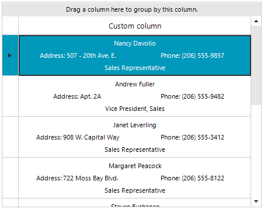

## Environment
 
|Product Version|Product|Author|
|----|----|----|
|2022.2.622|RadGridView for WinForms|[Desislava Yordanova](https://www.telerik.com/blogs/author/desislava-yordanova)|


## Description

This article demonstrates a sample approach how to construct a [custom cell]() in RadGridView with stacked elements.



## Solution

For this example the RadGridView control is bound to the Northwind.Employees table. The custom **GridDataCellElement** contains a main vertical container represented by a **StackLayoutElement**. It contains one LightVisualElement at the top for the name, another StackLayoutElement (horizontally oriented) for the address and phone and one LightVisualElement at the bottom for showing the title.

>note StackLayoutElements can be vertically or horizontally oriented. They can also contain other StackLayoutElements inside. This allows you to construct any stacked layout of nested elements. 
 
````C#  

private void RadForm1_Load(object sender, EventArgs e)
{ 
    this.employeesTableAdapter.Fill(this.nwindDataSet.Employees);
    this.radGridView1.AutoGenerateColumns = false;
    CustomColumn customColumn = new CustomColumn("Custom column");
    this.radGridView1.Columns.Add(customColumn);
    this.radGridView1.DataSource = this.employeesBindingSource;
    this.radGridView1.AutoSizeColumnsMode = GridViewAutoSizeColumnsMode.Fill;
    this.radGridView1.TableElement.RowHeight = 70;
}

public class CustomColumn : GridViewDataColumn
{
    public CustomColumn(string fieldName) : base(fieldName)
    {
    }

    public override Type GetCellType(GridViewRowInfo row)
    {
        if (row is GridViewDataRowInfo)
            return typeof(CustomCellElement);
        return base.GetCellType(row);
    }
}

public class CustomCellElement : GridDataCellElement
{
    private StackLayoutElement mainContainer;
    private StackLayoutElement middleContainer;
    private LightVisualElement nameElement;
    private LightVisualElement titleElement;
    private LightVisualElement addressElement;
    private LightVisualElement phoneElement;

    public CustomCellElement(GridViewColumn column, GridRowElement row) : base(column, row)
    {
    }

    protected override void CreateChildElements()
    {
        base.CreateChildElements();
        mainContainer = new StackLayoutElement();
        mainContainer.Orientation = Orientation.Vertical;
        mainContainer.StretchHorizontally = true;
        mainContainer.StretchVertically = true;
        this.Children.Add(mainContainer);
        nameElement = new LightVisualElement();
        mainContainer.Children.Add(nameElement);
        middleContainer = new StackLayoutElement();
        middleContainer.Orientation = Orientation.Horizontal;
        middleContainer.StretchHorizontally = true;
        addressElement = new LightVisualElement();
        phoneElement = new LightVisualElement();
        middleContainer.Children.Add(addressElement);
        middleContainer.Children.Add(phoneElement);
        mainContainer.Children.Add(middleContainer);
        titleElement = new LightVisualElement();
        mainContainer.Children.Add(titleElement);
    }

    protected override void SetContentCore(object value)
    {
        base.SetContentCore(value);
        DataRowView rowView = this.RowInfo.DataBoundItem as DataRowView;
        if (rowView != null)
        {
            this.titleElement.Text = rowView.Row["Title"].ToString();
            this.nameElement.Text = rowView.Row["FirstName"].ToString() + " " + rowView.Row["LastName"].ToString();
            this.addressElement.Text = "Address: " + rowView.Row["Address"].ToString().Replace(System.Environment.NewLine, " ");
            this.phoneElement.Text = "Phone: " + rowView.Row["HomePhone"].ToString();
        }
    }

    protected override Type ThemeEffectiveType
    {
        get
        {
            return typeof(GridDataCellElement);
        }
    }

    public override bool IsCompatible(GridViewColumn data, object context)
    {
        return data is CustomColumn && context is GridDataRowElement;
    }
}
         
````
````VB.NET

Private Sub RadForm1_Load(sender As Object, e As EventArgs) Handles MyBase.Load
    Me.EmployeesTableAdapter.Fill(Me.NwindDataSet.Employees)

    Me.RadGridView1.AutoGenerateColumns = False
    Dim customColumn As New CustomColumn("Custom column")
    Me.RadGridView1.Columns.Add(customColumn)
    Me.RadGridView1.DataSource = Me.EmployeesBindingSource
    Me.RadGridView1.AutoSizeColumnsMode = GridViewAutoSizeColumnsMode.Fill
    Me.RadGridView1.TableElement.RowHeight = 70
End Sub

Public Class CustomColumn
    Inherits GridViewDataColumn
    Public Sub New(ByVal fieldName As String)
        MyBase.New(fieldName)
    End Sub
    Public Overrides Function GetCellType(ByVal row As GridViewRowInfo) As Type
        If TypeOf row Is GridViewDataRowInfo Then
            Return GetType(CustomCellElement)
        End If
        Return MyBase.GetCellType(row)
    End Function
End Class

Public Class CustomCellElement
    Inherits GridDataCellElement
    Private mainContainer As StackLayoutElement
    Private middleContainer As StackLayoutElement
    Private nameElement As LightVisualElement
    Private titleElement As LightVisualElement
    Private addressElement As LightVisualElement
    Private phoneElement As LightVisualElement
    Public Sub New(ByVal column As GridViewColumn, ByVal row As GridRowElement)
        MyBase.New(column, row)
      
    End Sub
    Protected Overrides Sub CreateChildElements()
        MyBase.CreateChildElements()
        mainContainer = New StackLayoutElement()
        mainContainer.Orientation = Orientation.Vertical
        mainContainer.StretchHorizontally = True
        mainContainer.StretchVertically = True
        Me.Children.Add(mainContainer)
        nameElement = New LightVisualElement()
        mainContainer.Children.Add(nameElement)
        middleContainer = New StackLayoutElement()
        middleContainer.Orientation = Orientation.Horizontal
        middleContainer.StretchHorizontally = True
        addressElement = New LightVisualElement()
        phoneElement = New LightVisualElement()
        middleContainer.Children.Add(addressElement)
        middleContainer.Children.Add(phoneElement)
        mainContainer.Children.Add(middleContainer)
        titleElement = New LightVisualElement()
        mainContainer.Children.Add(titleElement)
    End Sub

    Protected Overrides Sub SetContentCore(value As Object)
        MyBase.SetContentCore(value)
        Dim rowView As DataRowView = TryCast(Me.RowInfo.DataBoundItem, DataRowView)
        If rowView IsNot Nothing Then
            Me.titleElement.Text = rowView.Row("Title").ToString()
            Me.nameElement.Text = rowView.Row("FirstName").ToString() & " " & rowView.Row("LastName").ToString()
            Me.addressElement.Text = "Address: " & rowView.Row("Address").ToString().Replace(System.Environment.NewLine, " ")
            Me.phoneElement.Text = "Phone: " & rowView.Row("HomePhone").ToString()
        End If

    End Sub

    Protected Overrides ReadOnly Property ThemeEffectiveType() As Type
        Get
            Return GetType(GridDataCellElement)
        End Get
    End Property
    Public Overrides Function IsCompatible(ByVal data As GridViewColumn, ByVal context As Object) As Boolean
        Return TypeOf data Is CustomColumn AndAlso TypeOf context Is GridDataRowElement
    End Function
End Class

````


# See Also

* [Creating custom cells]()