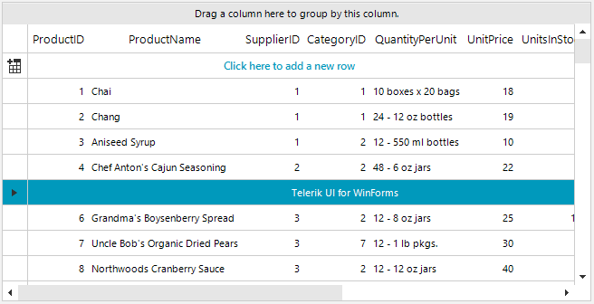

## Environment
 
|Product Version|Product|Author|
|----|----|----|
|2022.1.222|RadGridView for WinForms|[Desislava Yordanova](https://www.telerik.com/blogs/author/desislava-yordanova)|


## Description

This article demonstrates a sample approach how to create a custom **data** row element that contains a label stretched among the entire row. Then, display this row at a certain index, e.g. 4, in RadGridView and keep the rest of the rows with the default cells layout.



## Solution

One common visual row element is used for all the data rows which is returned by the GridViewDataRowInfo.**RowElementType** property. That is why you can't use one row element for the row at index 4 and another visual row element for the rest of the data rows. The suitable approach here is to create a common custom row element (typeof(**GridDataRowElement**)) that contains the desired label and simply show/hide it for the respective rows. 

>note The RadLabelElement can be replaced with any other RadElement according to the custom requirement that has to be accomplished. 

Use the RadGridView.**CreateRowInfo** event to replace the data row.

#### Custom Visual Data Row Element

````C#            

private void RadForm1_Load(object sender, EventArgs e)
{
    this.productsTableAdapter.Fill(this.nwindDataSet.Products);
    
    this.radGridView1.CreateRowInfo += this.radGridView1_CreateRowInfo;
    this.radGridView1.DataSource = this.productsBindingSource;
    this.radGridView1.BestFitColumns();
}

public class CustomGridRowElement : GridDataRowElement
{
    private RadLabelElement label;

    public CustomGridRowElement()
    {
    }

    protected override void CreateChildElements()
    {
        base.CreateChildElements();

        this.label = new RadLabelElement();
        label.Text = "Telerik UI for WinForms";
        this.Children.Add(label);
    }

    protected override SizeF ArrangeOverride(SizeF finalSize)
    {
        SizeF s = base.ArrangeOverride(finalSize);
        this.label.Arrange(new RectangleF(s.Width / 2, 0, s.Width / 2, s.Height));
        return s;
    }

    protected override Type ThemeEffectiveType
    {
        get
        {
            return typeof(GridDataRowElement);
        }
    }

    public override void UpdateInfo()
    {
        base.UpdateInfo();
        //show the label only for the fifth row with index=4
        if (this.RowInfo.Index == 4)
        {
            this.label.Visibility = ElementVisibility.Visible;
            this.ScrollableColumns.Visibility = ElementVisibility.Collapsed;
        }
        else
        {
            this.label.Visibility = ElementVisibility.Collapsed;
            this.ScrollableColumns.Visibility = ElementVisibility.Visible;
        }
    }

    public override bool IsCompatible(GridViewRowInfo data, object context)
    {
        return data is CustomGridViewRowInfo;
    }
}

public class CustomGridViewRowInfo : GridViewDataRowInfo
{
    public CustomGridViewRowInfo(GridViewInfo viewInfo) : base(viewInfo)
    {
    }

    public override Type RowElementType
    {
        get
        {
            return typeof(CustomGridRowElement);
        }
    }
}

private void radGridView1_CreateRowInfo(object sender, GridViewCreateRowInfoEventArgs e)
{
    if (e.RowInfo is GridViewDataRowInfo)
    {
        e.RowInfo = new CustomGridViewRowInfo(e.ViewInfo);
    }
}

````
````VB.NET

Private Sub RadForm1_Load(sender As Object, e As EventArgs) Handles MyBase.Load
    Me.ProductsTableAdapter.Fill(Me.NwindDataSet.Products)
    AddHandler Me.RadGridView1.CreateRowInfo, AddressOf Me.radGridView1_CreateRowInfo
    Me.RadGridView1.DataSource = Me.ProductsBindingSource
    Me.RadGridView1.BestFitColumns()
End Sub

Public Class CustomGridRowElement
    Inherits GridDataRowElement

    Private label As RadLabelElement

    Public Sub New()
    End Sub

    Protected Overrides Sub CreateChildElements()
        MyBase.CreateChildElements()
        Me.label = New RadLabelElement()
        label.Text = "Telerik UI for WinForms"
        Me.Children.Add(label)
    End Sub

    Protected Overrides Function ArrangeOverride(ByVal finalSize As SizeF) As SizeF
        Dim s As SizeF = MyBase.ArrangeOverride(finalSize)
        Me.label.Arrange(New RectangleF(s.Width / 2, 0, s.Width / 2, s.Height))
        Return s
    End Function

    Protected Overrides ReadOnly Property ThemeEffectiveType As Type
        Get
            Return GetType(GridDataRowElement)
        End Get
    End Property

    Public Overrides Sub UpdateInfo()
        MyBase.UpdateInfo()

        If Me.RowInfo.Index = 4 Then
            Me.label.Visibility = ElementVisibility.Visible
            Me.ScrollableColumns.Visibility = ElementVisibility.Collapsed
        Else
            Me.label.Visibility = ElementVisibility.Collapsed
            Me.ScrollableColumns.Visibility = ElementVisibility.Visible
        End If
    End Sub

    Public Overrides Function IsCompatible(ByVal data As GridViewRowInfo, ByVal context As Object) As Boolean
        Return TypeOf data Is CustomGridViewRowInfo
    End Function
End Class

Public Class CustomGridViewRowInfo
    Inherits GridViewDataRowInfo

    Public Sub New(ByVal viewInfo As GridViewInfo)
        MyBase.New(viewInfo)
    End Sub

    Public Overrides ReadOnly Property RowElementType As Type
        Get
            Return GetType(CustomGridRowElement)
        End Get
    End Property
End Class

Private Sub radGridView1_CreateRowInfo(ByVal sender As Object, ByVal e As GridViewCreateRowInfoEventArgs)
    If TypeOf e.RowInfo Is GridViewDataRowInfo Then
        e.RowInfo = New CustomGridViewRowInfo(e.ViewInfo)
    End If
End Sub

````


# See Also

* [Creating custom rows]()