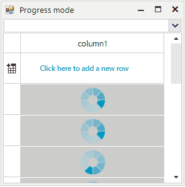

## Environment
 
|Product Version|Product|Author|
|----|----|----|
|2020.1.218|RadGridView for WinForms|[Desislava Yordanova](https://www.telerik.com/blogs/author/desislava-yordanova)|
 

## Description

**RadGridView** provides a convenient approach for creating [custom cell elements](). A common requirement is show different elements inside the cells depending on certain conditions.

This article demonstrates how to show either a **RadProgressBarElement** or a **RadWaitingBarElement** considering a custom property's (**ProgressMode**) value of the column.



## Solution 

Create a derivative of the **GridViewDataColumn** and introduce a **ProgressMode** property that will control whether the **RadProgressBarElement** or the **RadWaitingBarElement** will be shown inside the cells. Then, override the **GetCellType** method and specify the type of the **GridDataCellElement** that will be used for the respective row type.

In the custom **GridDataCellElement** it is necessary to add all the elements that you will need to show in the cell. However, in the **SetContentCore** method you will manage the **Visibility** of each element considering your custom condition, e.g. the column's **ProgressMode** in this case. 

Please refer to the complete code snippet:

````C#

public RadForm1()
{
    InitializeComponent();

    GridViewProgressColumn col = new GridViewProgressColumn();
    col.ProgressMode = ProgressStyle.Waiting;
    this.radGridView1.Columns.Add(col);

    for (int i = 0; i < 10; i++)
    {
        this.radGridView1.Rows.Add(i * 1.25 * 8);
    }
    this.radGridView1.TableElement.RowHeight = 50;
    this.radGridView1.TableElement.RowSpacing = 1;
}

enum ProgressStyle
{
    Progress,
    Waiting
}

class GridViewProgressColumn : GridViewDataColumn
{
    public GridViewProgressColumn() : base()
    {
    }

    public override Type GetCellType(GridViewRowInfo row)
    {
        if (row is GridViewDataRowInfo)
            return typeof(GridViewProgressBarCell);
        return base.GetCellType(row);
    }

    public ProgressStyle ProgressMode { get; set; }
}

internal class GridViewProgressBarCell : GridDataCellElement
{
    RadProgressBarElement progressBarElement;
    RadWaitingBarElement waitingBarElement;

    public GridViewProgressBarCell(GridViewColumn column, GridRowElement row) : base(column, row)
    {
    }

    protected override void CreateChildElements()
    {
        base.CreateChildElements();
        progressBarElement = new RadProgressBarElement();
        waitingBarElement = new RadWaitingBarElement();
        waitingBarElement.WaitingStyle = Telerik.WinControls.Enumerations.WaitingBarStyles.SegmentedRing;
        waitingBarElement.WaitingSpeed = 50;
        this.Children.Add(progressBarElement);
        this.Children.Add(waitingBarElement);
    }

    protected override void SetContentCore(object value)
    {
        int intValue = 0;

        int.TryParse(value + "", out intValue);
        {
            progressBarElement.Value1 = intValue;
        }
        GridViewProgressColumn col = this.ColumnInfo as GridViewProgressColumn;
        if (col != null)
        {
            if (col.ProgressMode == ProgressStyle.Waiting)
            {
                this.progressBarElement.Visibility = ElementVisibility.Collapsed;
                this.waitingBarElement.Visibility = ElementVisibility.Visible;
                if (!this.waitingBarElement.IsWaiting)
                {
                    this.waitingBarElement.StartWaiting();
                }
            }
            else
            {
                this.progressBarElement.Visibility = ElementVisibility.Visible;
                this.waitingBarElement.Visibility = ElementVisibility.Collapsed;
                this.waitingBarElement.StopWaiting();
            }
        }

        base.SetContentCore(value);
    }
}

private void radDropDownList1_SelectedIndexChanged(object sender, Telerik.WinControls.UI.Data.PositionChangedEventArgs e)
{
    GridViewProgressColumn col = this.radGridView1.Columns[0] as GridViewProgressColumn;
    if (e.Position == 0)
    {
        col.ProgressMode = ProgressStyle.Waiting;
    }
    else
    {
        col.ProgressMode = ProgressStyle.Progress;
    }

    this.radGridView1.MasterTemplate.Refresh();
}


````
````VB.NET

Public Sub New()
    InitializeComponent()
    Dim col As GridViewProgressColumn = New GridViewProgressColumn()
    col.ProgressMode = ProgressStyle.Waiting
    Me.RadGridView1.Columns.Add(col)

    For i As Integer = 0 To 10 - 1
        Me.RadGridView1.Rows.Add(i * 1.25 * 8)
    Next

    Me.RadGridView1.TableElement.RowHeight = 50
    Me.RadGridView1.TableElement.RowSpacing = 1
End Sub

Enum ProgressStyle
    Progress
    Waiting
End Enum

Class GridViewProgressColumn
    Inherits GridViewDataColumn

    Public Sub New()
        MyBase.New()
    End Sub

    Public Overrides Function GetCellType(ByVal row As GridViewRowInfo) As Type
        If TypeOf row Is GridViewDataRowInfo Then Return GetType(GridViewProgressBarCell)
        Return MyBase.GetCellType(row)
    End Function

    Public Property ProgressMode As ProgressStyle
End Class

Friend Class GridViewProgressBarCell
    Inherits GridDataCellElement
    Private progressBarElement As RadProgressBarElement
    Private waitingBarElement As RadWaitingBarElement

    Public Sub New(ByVal column As GridViewColumn, ByVal row As GridRowElement)
        MyBase.New(column, row)
    End Sub

    Protected Overrides Sub CreateChildElements()
        MyBase.CreateChildElements()
        progressBarElement = New RadProgressBarElement()
        waitingBarElement = New RadWaitingBarElement()
        waitingBarElement.WaitingStyle = Telerik.WinControls.Enumerations.WaitingBarStyles.SegmentedRing
        waitingBarElement.WaitingSpeed = 50
        Me.Children.Add(progressBarElement)
        Me.Children.Add(waitingBarElement)
    End Sub

    Protected Overrides Sub SetContentCore(ByVal value As Object)
        Dim intValue As Integer = 0
        Integer.TryParse(value & "", intValue)

        If True Then
            progressBarElement.Value1 = intValue
        End If

        Dim col As GridViewProgressColumn = TryCast(Me.ColumnInfo, GridViewProgressColumn)

        If col IsNot Nothing Then

            If col.ProgressMode = ProgressStyle.Waiting Then
                Me.progressBarElement.Visibility = ElementVisibility.Collapsed
                Me.waitingBarElement.Visibility = ElementVisibility.Visible

                If Not Me.waitingBarElement.IsWaiting Then
                    Me.waitingBarElement.StartWaiting()
                End If
            Else
                Me.progressBarElement.Visibility = ElementVisibility.Visible
                Me.waitingBarElement.Visibility = ElementVisibility.Collapsed
                Me.waitingBarElement.StopWaiting()
            End If
        End If

        MyBase.SetContentCore(value)
    End Sub
End Class

Private Sub radDropDownList1_SelectedIndexChanged(ByVal sender As Object, ByVal e As Telerik.WinControls.UI.Data.PositionChangedEventArgs) _
    Handles RadDropDownList1.SelectedIndexChanged
    Dim col As GridViewProgressColumn = TryCast(Me.RadGridView1.Columns(0), GridViewProgressColumn)
    If e.Position = 0 Then
        col.ProgressMode = ProgressStyle.Waiting
    Else
        col.ProgressMode = ProgressStyle.Progress
    End If
    Me.RadGridView1.MasterTemplate.Refresh()
End Sub


````


# See Also

* [Creating Custom Cells]()
* [How to Create Custom Cells with Input Elements]()


