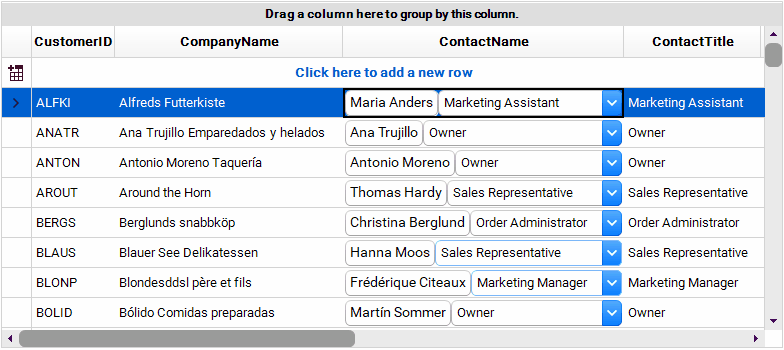

## Environment
 
|Product Version|Product|Author|
|----|----|----|
|2020.1.218|RadGridView for WinForms|[Desislava Yordanova](https://www.telerik.com/blogs/author/desislava-yordanova)|
 

## Description

**RadGridView** provides a convenient approach for creating [custom cell elements](). A common requirement is host input controls in the grid cells that provide build-in editing without entering edit mode. 

>note Please have in mind that using controls in grid cells may slow down the scrolling and will cause visual glitches as they do not support clipping. A better option would be using [custom editors](https://docs.telerik.com/devtools/winforms/controls/gridview/editors/using-custom-editors). Thus, you can construct the desired editor and activate it for the respective cell.   
>

This article demonstrates how to use **RadElements** instead of **RadControls** in the grid cells in order to achieve the following result:



## Solution 

Before setting the **DataSource** of **RadGridView**, it is necessary to subscribe to the **CreateCell** event. In the **GridViewCreateCellEventArgs** you can replace the **CellElement** considering the **CellType**. The code snippet below shows how to replace the default cell element for the **ContactName** column. The custom defined cell hosts a **RadTextBoxControlElement** that updates the **ContactName** field of the DataBoundItem and a **RadDropDownListElement** that manages the **ContactTitle**. 

>important Since **RadGridView** uses data virtualization, cell elements are created only for currently visible cells and they are being reused during operations like scrolling, filtering, etc. It is necessary to specify that your custom cell is applicable only to the desired column, e.g. ContactName. For this purpose, it is necessary to override the **IsCompatible** method and return *true* only if the cell is relevant for this column and row. This will ensure that the custom cell will be used only in this particular column and it won't be reused in other columns. However, the cell elements belonging to the rest of the columns, by default, are applicable to your column (ContactName) as well. This requires creating a default **GridDataCellElement** which **IsCompatible** with all the columns but ContactName. 
> 

Please refer to the complete code snippet:

````C#

private void RadForm1_Load(object sender, EventArgs e)
{
    this.radGridView1.CreateCell += radGridView1_CreateCell;

    this.radGridView1.DataSource = this.customersBindingSource;
    this.customersTableAdapter.Fill(this.nwindDataSet.Customers);
    this.radGridView1.BestFitColumns();

    this.radGridView1.CellBeginEdit+=radGridView1_CellBeginEdit;
}

private void radGridView1_CellBeginEdit(object sender, GridViewCellCancelEventArgs e)
        {
            if (e.Column.Name=="ContactName")
            {
                e.Cancel = true;
            }
        }

private void radGridView1_CreateCell(object sender, GridViewCreateCellEventArgs e)
        {
            if (e.CellType == typeof(GridDataCellElement))
            {
                if (e.Column.Name == "ContactName")
                {
                    e.CellElement = new CustomGridDataCellElement(e.Column, e.Row);
                }
                else
                {
                    e.CellElement = new DefaultGridDataCellElement(e.Column, e.Row);
                }
            }
        }

public class DefaultGridDataCellElement : GridDataCellElement
{
    public DefaultGridDataCellElement(GridViewColumn column, GridRowElement row)
        : base(column, row)
            {
            }

    protected override Type ThemeEffectiveType
            {
                get
                {
                    return typeof(GridDataCellElement);
                }
            }

    public override bool IsCompatible(GridViewColumn data, object context)
            {
                //use this cell for all columns but ContactName
                if (data.Name != "ContactName")
                {
                    return true;
                }
                return false;
            }
}

public class CustomGridDataCellElement : GridDataCellElement
{
    public CustomGridDataCellElement(GridViewColumn column, GridRowElement row)
        : base(column, row)
            {
            }

    protected override Type ThemeEffectiveType
            {
                get
                {
                    return typeof(GridDataCellElement);
                }
            }

    public override bool IsCompatible(GridViewColumn data, object context)
            {
                //use this cell only for ContactName column
                if (data.Name == "ContactName")
                {
                    return true;
                }
                return false;
            }

    
    StackLayoutElement mainContainer;
    RadTextBoxControlElement nameElement;
    RadDropDownListElement contactTitleDropDown;

    protected override void CreateChildElements()
            {
                base.CreateChildElements();
                mainContainer = new StackLayoutElement();
                mainContainer.StretchHorizontally = true;
                mainContainer.Orientation = Orientation.Horizontal;

                contactTitleDropDown = new RadDropDownListElement();
                contactTitleDropDown.DropDownStyle = RadDropDownStyle.DropDownList;
                contactTitleDropDown.Items.Add("Accounting Manager");
                contactTitleDropDown.Items.Add("Assistant Sales Representative");
                contactTitleDropDown.Items.Add("Marketing Assistant");
                contactTitleDropDown.Items.Add("Marketing Manager");
                contactTitleDropDown.Items.Add("Order Administrator");
                contactTitleDropDown.Items.Add("Owner");
                contactTitleDropDown.Items.Add("Owner/Marketing Assistant");
                contactTitleDropDown.Items.Add("Sales Agent");
                contactTitleDropDown.Items.Add("Sales Associate");
                contactTitleDropDown.Items.Add("Sales Manager");
                contactTitleDropDown.Items.Add("Sales Representative");
                contactTitleDropDown.SelectedIndexChanged += contactTitleDropDown_SelectedIndexChanged;

                nameElement = new RadTextBoxControlElement();
                nameElement.StretchHorizontally = false;
                nameElement.TextChanged += nameElement_TextChanged;

                mainContainer.Children.Add(nameElement);
                mainContainer.Children.Add(contactTitleDropDown);
                this.Children.Add(mainContainer);
            }

    private void nameElement_TextChanged(object sender, EventArgs e)
            {
                DataRowView rowView = this.RowInfo.DataBoundItem as DataRowView;
                rowView.Row["ContactName"] = nameElement.Text;
            }

    private void contactTitleDropDown_SelectedIndexChanged(object sender, Telerik.WinControls.UI.Data.PositionChangedEventArgs e)
            {
                DataRowView rowView = this.RowInfo.DataBoundItem as DataRowView;
                if (e.Position > -1)
                {
                    rowView.Row["ContactTitle"] = contactTitleDropDown.Items[e.Position].Text;
                }
            }

    protected override void SetContentCore(object value)
            {
                base.SetContentCore(value);

                if (this.RowInfo != null)
                {
                    DataRowView rowView = this.RowInfo.DataBoundItem as DataRowView;
                    if (rowView != null)
                    {
                        nameElement.TextChanged -= nameElement_TextChanged;
                        nameElement.Text = rowView.Row["ContactName"].ToString();
                        nameElement.TextChanged += nameElement_TextChanged;
                        contactTitleDropDown.SelectedIndexChanged -= contactTitleDropDown_SelectedIndexChanged;
                        contactTitleDropDown.SelectedIndex = GetIndexByText(rowView["ContactTitle"].ToString());
                        contactTitleDropDown.SelectedIndexChanged += contactTitleDropDown_SelectedIndexChanged;
                    }
                }
            }

    private int GetIndexByText(string contactName)
            {
                int index = -1;
                for (int i = 0; i < contactTitleDropDown.Items.Count; i++)
                {
                    if (contactTitleDropDown.Items[i].Text == contactName)
                    {
                        index = i;
                        break;
                    }
                }
                return index;
            }
}

    

````
````VB.NET
Private Sub RadForm1_Load(sender As Object, e As EventArgs) Handles MyBase.Load
    AddHandler Me.RadGridView1.CreateCell, AddressOf radGridView1_CreateCell
    Me.RadGridView1.DataSource = Me.CustomersBindingSource
    Me.CustomersTableAdapter.Fill(Me.NwindDataSet.Customers)
    Me.RadGridView1.BestFitColumns()
    AddHandler Me.RadGridView1.CellBeginEdit, AddressOf radGridView1_CellBeginEdit
End Sub

Private Sub radGridView1_CellBeginEdit(ByVal sender As Object, ByVal e As GridViewCellCancelEventArgs)
    If e.Column.Name = "ContactName" Then
        e.Cancel = True
    End If
End Sub

Private Sub radGridView1_CreateCell(ByVal sender As Object, ByVal e As GridViewCreateCellEventArgs)
    If e.CellType = GetType(GridDataCellElement) Then

        If e.Column.Name = "ContactName" Then
            e.CellElement = New CustomGridDataCellElement(e.Column, e.Row)
        Else
            e.CellElement = New DefaultGridDataCellElement(e.Column, e.Row)
        End If
    End If
End Sub

Public Class DefaultGridDataCellElement
    Inherits GridDataCellElement

    Public Sub New(ByVal column As GridViewColumn, ByVal row As GridRowElement)
        MyBase.New(column, row)
    End Sub

    Protected Overrides ReadOnly Property ThemeEffectiveType As Type
        Get
            Return GetType(GridDataCellElement)
        End Get
    End Property

    Public Overrides Function IsCompatible(ByVal data As GridViewColumn, ByVal context As Object) As Boolean
        If data.Name <> "ContactName" Then
            Return True
        End If

        Return False
    End Function
End Class

Public Class CustomGridDataCellElement
    Inherits GridDataCellElement

    Public Sub New(ByVal column As GridViewColumn, ByVal row As GridRowElement)
        MyBase.New(column, row)
    End Sub

    Protected Overrides ReadOnly Property ThemeEffectiveType As Type
        Get
            Return GetType(GridDataCellElement)
        End Get
    End Property

    Public Overrides Function IsCompatible(ByVal data As GridViewColumn, ByVal context As Object) As Boolean
        If data.Name = "ContactName" Then
            Return True
        End If

        Return False
    End Function

    Private mainContainer As StackLayoutElement
    Private nameElement As RadTextBoxControlElement
    Private contactTitleDropDown As RadDropDownListElement

    Protected Overrides Sub CreateChildElements()
        MyBase.CreateChildElements()
        mainContainer = New StackLayoutElement()
        mainContainer.StretchHorizontally = True
        mainContainer.Orientation = Orientation.Horizontal
        contactTitleDropDown = New RadDropDownListElement()
        contactTitleDropDown.DropDownStyle = RadDropDownStyle.DropDownList
        contactTitleDropDown.Items.Add("Accounting Manager")
        contactTitleDropDown.Items.Add("Assistant Sales Representative")
        contactTitleDropDown.Items.Add("Marketing Assistant")
        contactTitleDropDown.Items.Add("Marketing Manager")
        contactTitleDropDown.Items.Add("Order Administrator")
        contactTitleDropDown.Items.Add("Owner")
        contactTitleDropDown.Items.Add("Owner/Marketing Assistant")
        contactTitleDropDown.Items.Add("Sales Agent")
        contactTitleDropDown.Items.Add("Sales Associate")
        contactTitleDropDown.Items.Add("Sales Manager")
        contactTitleDropDown.Items.Add("Sales Representative")
        AddHandler contactTitleDropDown.SelectedIndexChanged, AddressOf contactTitleDropDown_SelectedIndexChanged
        nameElement = New RadTextBoxControlElement()
        nameElement.StretchHorizontally = False
        AddHandler nameElement.TextChanged, AddressOf nameElement_TextChanged
        mainContainer.Children.Add(nameElement)
        mainContainer.Children.Add(contactTitleDropDown)
        Me.Children.Add(mainContainer)
    End Sub

    Private Sub nameElement_TextChanged(ByVal sender As Object, ByVal e As EventArgs)
        Dim rowView As DataRowView = TryCast(Me.RowInfo.DataBoundItem, DataRowView)
        rowView.Row("ContactName") = nameElement.Text
    End Sub

    Private Sub contactTitleDropDown_SelectedIndexChanged(ByVal sender As Object, ByVal e As Telerik.WinControls.UI.Data.PositionChangedEventArgs)
        Dim rowView As DataRowView = TryCast(Me.RowInfo.DataBoundItem, DataRowView)

        If e.Position > -1 Then
            rowView.Row("ContactTitle") = contactTitleDropDown.Items(e.Position).Text
        End If
    End Sub

    Protected Overrides Sub SetContentCore(ByVal value As Object)
        MyBase.SetContentCore(value)

        If Me.RowInfo IsNot Nothing Then
            Dim rowView As DataRowView = TryCast(Me.RowInfo.DataBoundItem, DataRowView)

            If rowView IsNot Nothing Then
                RemoveHandler nameElement.TextChanged, AddressOf nameElement_TextChanged
                nameElement.Text = rowView.Row("ContactName").ToString()
                AddHandler nameElement.TextChanged, AddressOf nameElement_TextChanged
                RemoveHandler contactTitleDropDown.SelectedIndexChanged, AddressOf contactTitleDropDown_SelectedIndexChanged
                contactTitleDropDown.SelectedIndex = GetIndexByText(rowView("ContactTitle").ToString())
                AddHandler contactTitleDropDown.SelectedIndexChanged, AddressOf contactTitleDropDown_SelectedIndexChanged
            End If
        End If
    End Sub

    Private Function GetIndexByText(ByVal contactName As String) As Integer
        Dim index As Integer = -1

        For i As Integer = 0 To contactTitleDropDown.Items.Count - 1

            If contactTitleDropDown.Items(i).Text = contactName Then
                index = i
                Exit For
            End If
        Next

        Return index
    End Function
End Class

````


# See Also

* [Creating Custom Cells]()


