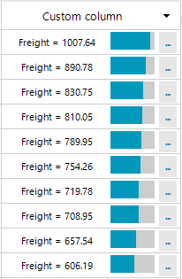

## Environment
 
|Product Version|Product|Author|
|----|----|----|
|2019.3.917|RadGridView for WinForms|[Desislava Yordanova](https://www.telerik.com/blogs/author/desislava-yordanova)|
 
## Description

**RadGridView** provides a convenient way to create [custom cell elements](). This tutorial will extend the example from the referred help article and add a button and text element inside the custom cell next to the progress bar.





## Solution 

Consider the grid is bound to the Northwind.Orders table. The custom column is mapped to the **Freight** column.
We will use a horizontal **StackLayoutElement** as a container that holds the the inner elements inside the custom cell. The **RadProgressBarElement** will be mapped to the freight value. The **LightVisualElement**'s text will display the string representation of the freight. The **RadButtonElement** will execute some custom logic when it is clicked. You can find below a complete code snippet how to achieve the design from the above screenshot:


````C#

 private void RadForm1_Load(object sender, EventArgs e)
{ 
    this.ordersTableAdapter.Fill(this.nwindDataSet.Orders);
    this.radGridView1.DataSource = this.ordersBindingSource;
    this.radGridView1.BestFitColumns();

    CustomGridViewDataColumn customColumn = new CustomGridViewDataColumn();
    customColumn.HeaderText = "Custom column";
    customColumn.FieldName = "Freight";
    customColumn.Width = 200;
    this.radGridView1.Columns.Insert(0, customColumn);
}

public class CustomGridViewDataColumn : GridViewDataColumn
{
    public override Type GetCellType(GridViewRowInfo row)
    {
        if (row is GridViewDataRowInfo)
        {
            return typeof(CustomGridDataCellElement);
        }
        return base.GetCellType(row);
    }
}

public class CustomGridDataCellElement : GridDataCellElement
{ 
    public CustomGridDataCellElement(GridViewColumn column, GridRowElement row) : base(column, row)
    {
    }

    protected override Type ThemeEffectiveType
    {
        get
        {
            return typeof(GridDataCellElement);
        }
    }

    //indicate that the custom cell will be used only in the custom column
    public override bool IsCompatible(GridViewColumn data, object context)
    {
        return data is CustomGridViewDataColumn && context is GridDataRowElement;
    }

    StackLayoutElement container;
    RadProgressBarElement progressBarElement;
    RadButtonElement buttonElement;
    LightVisualElement textElement;

    protected override void CreateChildElements()
    {
        container = new StackLayoutElement();
        container.Orientation = Orientation.Horizontal;
        container.StretchHorizontally = true;

        progressBarElement = new RadProgressBarElement();
        progressBarElement.StretchHorizontally = false;
        Size s= new System.Drawing.Size(50,20);
        progressBarElement.MinSize = s;
        progressBarElement.MaxSize = s;
        progressBarElement.Minimum = 0;
        progressBarElement.Maximum = 1100;

        textElement = new LightVisualElement();
        textElement.StretchHorizontally = true;

        buttonElement = new RadButtonElement();
        buttonElement.Text = "...";
        buttonElement.Margin = new System.Windows.Forms.Padding(5, 0, 0, 0);
        buttonElement.StretchHorizontally = false;
        buttonElement.Click += buttonElement_Click;

        container.Children.Add(textElement);
        container.Children.Add(progressBarElement);
        container.Children.Add(buttonElement);

        this.Children.Add(container);
        base.CreateChildElements();
    }

    private void buttonElement_Click(object sender, EventArgs e)
    {
        RadMessageBox.Show(this.Value + "");
    }

    protected override void SetContentCore(object value)
    {
        base.SetContentCore(value);
        this.DrawText = false;
        if (this.RowInfo != null && this.RowInfo.DataBoundItem != null && this.Value != null)
        {
            decimal freight = 0;
            if (decimal.TryParse(this.Value.ToString(), out freight))
            {
                progressBarElement.Value1 = (int)freight;
            }
            this.textElement.Text = "Freight = " + this.Value.ToString();
        }
    }
}


        
````
````VB.NET

 Private Sub RadForm1_Load(sender As Object, e As EventArgs) Handles MyBase.Load
    Me.OrdersTableAdapter.Fill(Me.NwindDataSet.Orders)
    Me.RadGridView1.DataSource = Me.OrdersBindingSource
    Me.RadGridView1.BestFitColumns()
    Dim customColumn As CustomGridViewDataColumn = New CustomGridViewDataColumn()
    customColumn.HeaderText = "Custom column"
    customColumn.FieldName = "Freight"
    customColumn.Width = 200
    Me.RadGridView1.Columns.Insert(0, customColumn)
End Sub
Public Class CustomGridViewDataColumn
    Inherits GridViewDataColumn

    Public Overrides Function GetCellType(ByVal row As GridViewRowInfo) As Type
        If TypeOf row Is GridViewDataRowInfo Then
            Return GetType(CustomGridDataCellElement)
        End If

        Return MyBase.GetCellType(row)
    End Function
End Class

Public Class CustomGridDataCellElement
    Inherits GridDataCellElement

    Public Sub New(ByVal column As GridViewColumn, ByVal row As GridRowElement)
        MyBase.New(column, row)
    End Sub

    Protected Overrides ReadOnly Property ThemeEffectiveType As Type
        Get
            Return GetType(GridDataCellElement)
        End Get
    End Property

    Public Overrides Function IsCompatible(ByVal data As GridViewColumn, ByVal context As Object) As Boolean
        Return TypeOf data Is CustomGridViewDataColumn AndAlso TypeOf context Is GridDataRowElement
    End Function

    Private container As StackLayoutElement
    Private progressBarElement As RadProgressBarElement
    Private buttonElement As RadButtonElement
    Private textElement As LightVisualElement

    Protected Overrides Sub CreateChildElements()
        container = New StackLayoutElement()
        container.Orientation = Orientation.Horizontal
        container.StretchHorizontally = True
        progressBarElement = New RadProgressBarElement()
        progressBarElement.StretchHorizontally = False
        Dim s As Size = New System.Drawing.Size(50, 20)
        progressBarElement.MinSize = s
        progressBarElement.MaxSize = s
        progressBarElement.Minimum = 0
        progressBarElement.Maximum = 1100
        textElement = New LightVisualElement()
        textElement.StretchHorizontally = True
        buttonElement = New RadButtonElement()
        buttonElement.Text = "..."
        buttonElement.Margin = New System.Windows.Forms.Padding(5, 0, 0, 0)
        buttonElement.StretchHorizontally = False
        AddHandler buttonElement.Click, AddressOf buttonElement_Click
        container.Children.Add(textElement)
        container.Children.Add(progressBarElement)
        container.Children.Add(buttonElement)
        Me.Children.Add(container)
        MyBase.CreateChildElements()
    End Sub

    Private Sub buttonElement_Click(ByVal sender As Object, ByVal e As EventArgs)
        RadMessageBox.Show(Me.Value & "")
    End Sub

    Protected Overrides Sub SetContentCore(ByVal value As Object)
        MyBase.SetContentCore(value)
        Me.DrawText = False

        If Me.RowInfo IsNot Nothing AndAlso Me.RowInfo.DataBoundItem IsNot Nothing AndAlso Me.Value IsNot Nothing Then
            Dim freight As Decimal = 0

            If Decimal.TryParse(Me.Value.ToString(), freight) Then
                progressBarElement.Value1 = CInt(freight)
            End If

            Me.textElement.Text = "Freight = " & Me.Value.ToString()
        End If
    End Sub
End Class

     

```` 
 

# See Also

* [Custom Cells]() 


    
   
  
    
 
