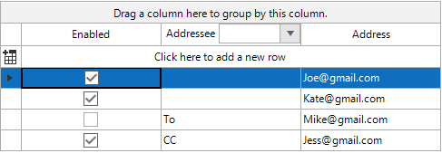

## Environment
|Product Version|Product|Author|
|----|----|----|
|2021.1.223|RadGridView for WinForms|[Desislava Yordanova](https://www.telerik.com/blogs/author/desislava-yordanova)|

## Description

Learn how to create a custom column which has both, a text and a drop down list in the header cell itself.  When a drop down value is selected its value is applied to every **Enabled** data cell in the column. 



## Solution

It is necessary to create a custom column and override its **GetCellType** method where you can specify what cell element exactly to be used for the **GridViewTableHeaderRowInfo**. The custom **GridComboBoxCellElement** contains a **StackLayoutElement** used as a container to hold the **LightVisualElement** and **RadDropDownListElement**. When the selection in the drop down is changed, we will check the value of the checkbox column to only apply the new value to those cells where the row is checked. The following code snippet demonstrates a sample implementation:
 
````C#
public RadForm1()
{
    InitializeComponent();

    List<Email> Emails = new List<Email>();
    Email newEmail = new Email(true,"","Joe@gmail.com"); 
    Emails.Add(newEmail);

    Email newEmail1 = new Email(true, "","Kate@gmail.com"); 
    Emails.Add(newEmail1);

    Email newEmail2 = new Email(false,"To","Mike@gmail.com"); 
    Emails.Add(newEmail2);

    Email newEmail3 = new Email(true, "CC","Jess@gmail.com"); 
    Emails.Add(newEmail3);

    radGridView1.DataSource = Emails; 

    CustomComboxColumn customColumn  = new CustomComboxColumn();
    customColumn.HeaderText = "Addressee";
    customColumn.Name = "Addressee";
    customColumn.FieldName = "Addressee"; 
    customColumn.IsVisible = true;
    customColumn.DataSource = new List<string> { "", "To", "CC", "BCC" };
    customColumn.DisplayMember = "Addressee"; 

    radGridView1.Columns.Remove("Addressee");
    radGridView1.Columns.Insert(1,customColumn);
}

public class Email
{
    public bool Enabled { get; set; }
    public string Addressee { get; set; }
    public string Address { get; set; }

    public Email(bool enabled, string addressee, string address)
    {
        this.Enabled = enabled;
        this.Addressee = addressee;
        this.Address = address;
    }
}

public class CustomComboxColumn : GridViewComboBoxColumn
{
    public override Type GetCellType(GridViewRowInfo row)
    {
        if (row.GetType() == typeof(GridViewTableHeaderRowInfo))
        {
            return typeof(ComboxHeaderCell);
        }

        return base.GetCellType(row);
    }
}

public class ComboxHeaderCell : GridComboBoxCellElement
{
    StackLayoutElement stack = new StackLayoutElement();
    LightVisualElement text = new LightVisualElement();
    RadDropDownListElement dropdown = new RadDropDownListElement();
    protected override Type ThemeEffectiveType
    {
        get
        {
            return typeof(GridHeaderCellElement);
        }
    }

    public ComboxHeaderCell(GridViewColumn column, GridRowElement row)
        : base(column, row)
    {
        this.text.Text = column.HeaderText;
        column.AllowSort = false;
    }  
    protected override void DisposeManagedResources()
    {
        dropdown.SelectedIndexChanged -= new Telerik.WinControls.UI.Data.PositionChangedEventHandler(dropdown_SelectedIndexChanged);
        base.DisposeManagedResources();
    }
    private void dropdown_SelectedIndexChanged(object sender, Telerik.WinControls.UI.Data.PositionChangedEventArgs e)
    {
        if (dropdown.SelectedIndex < 0) return;

        string selectedText = dropdown.SelectedItem.Text;

        GridViewRowCollection rows = this.TableElement.ViewTemplate.Rows;
        for (int i = 0; i < rows.Count; i++)
        {
            GridViewRowInfo row = rows[i];

            if ((bool)row.Cells[0].Value == true)
            {
                row.Cells[this.ColumnIndex].Value = selectedText;
            }
        }
    }

    protected override void CreateChildElements()
    {
        base.CreateChildElements();
        this.dropdown.DropDownStyle = Telerik.WinControls.RadDropDownStyle.DropDownList; 
        this.text.StretchHorizontally = false;
        stack.StretchHorizontally = true; 
        stack.Orientation = Orientation.Horizontal;
        stack.Children.Add(text);
        stack.Children.Add(dropdown);
        this.Children.Add(stack);
    }
     
    public override void Attach(GridViewColumn data, object context)
    {
        base.Attach(data, context);
         
        List<string> dropDownDataSource = new List<string>(((GridViewComboBoxColumn)data).DataSource as List<string>);
        dropdown.DataSource = dropDownDataSource;
        dropdown.Text = "(None)";
        dropdown.SelectedIndexChanged -= (dropdown_SelectedIndexChanged);
        dropdown.SelectedIndexChanged += (dropdown_SelectedIndexChanged); 
    }  
}

````
````VB.NET
Public Sub New()
    InitializeComponent()
    Dim Emails As List(Of Email) = New List(Of Email)()
    Dim newEmail As Email = New Email(True, "", "Joe@gmail.com")
    Emails.Add(newEmail)
    Dim newEmail1 As Email = New Email(True, "", "Kate@gmail.com")
    Emails.Add(newEmail1)
    Dim newEmail2 As Email = New Email(False, "To", "Mike@gmail.com")
    Emails.Add(newEmail2)
    Dim newEmail3 As Email = New Email(True, "CC", "Jess@gmail.com")
    Emails.Add(newEmail3)
    RadGridView1.DataSource = Emails
    Dim customColumn As CustomComboxColumn = New CustomComboxColumn()
    customColumn.HeaderText = "Addressee"
    customColumn.Name = "Addressee"
    customColumn.FieldName = "Addressee"
    customColumn.IsVisible = True
    customColumn.DataSource = New List(Of String) From {
        "",
        "To",
        "CC",
        "BCC"
    }
    customColumn.DisplayMember = "Addressee"
    RadGridView1.Columns.Remove("Addressee")
    RadGridView1.Columns.Insert(1, customColumn)
End Sub

Public Class Email
    Public Property Enabled As Boolean
    Public Property Addressee As String
    Public Property Address As String

    Public Sub New(ByVal enabled As Boolean, ByVal addressee As String, ByVal address As String)
        Me.Enabled = enabled
        Me.Addressee = addressee
        Me.Address = address
    End Sub
End Class

Public Class CustomComboxColumn
    Inherits GridViewComboBoxColumn

    Public Overrides Function GetCellType(ByVal row As GridViewRowInfo) As Type
        If row.[GetType]() = GetType(GridViewTableHeaderRowInfo) Then
            Return GetType(ComboxHeaderCell)
        End If

        Return MyBase.GetCellType(row)
    End Function
End Class

Public Class ComboxHeaderCell
    Inherits GridComboBoxCellElement

    Private stack As StackLayoutElement
    Private text As LightVisualElement
    Private dropdown As RadDropDownListElement

    Protected Overrides ReadOnly Property ThemeEffectiveType As Type
        Get
            Return GetType(GridHeaderCellElement)
        End Get
    End Property

    Public Sub New(ByVal column As GridViewColumn, ByVal row As GridRowElement)
        MyBase.New(column, row)
        Me.text.Text = column.HeaderText
        column.AllowSort = False
    End Sub

    Protected Overrides Sub DisposeManagedResources()
        RemoveHandler dropdown.SelectedIndexChanged, AddressOf dropdown_SelectedIndexChanged
        MyBase.DisposeManagedResources()
    End Sub

    Private Sub dropdown_SelectedIndexChanged(ByVal sender As Object,
                   ByVal e As Telerik.WinControls.UI.Data.PositionChangedEventArgs)
        If dropdown.SelectedIndex < 0 Then Return
        Dim selectedText As String = dropdown.SelectedItem.Text
        Dim rows As GridViewRowCollection = Me.TableElement.ViewTemplate.Rows

        For i As Integer = 0 To rows.Count - 1
            Dim row As GridViewRowInfo = rows(i)

            If CBool(row.Cells(0).Value) = True Then
                row.Cells(Me.ColumnIndex).Value = selectedText
            End If
        Next
    End Sub

    Protected Overrides Sub CreateChildElements()
        MyBase.CreateChildElements()

        stack = New StackLayoutElement()
        text = New LightVisualElement()
        dropdown = New RadDropDownListElement()

        Me.dropdown.DropDownStyle = Telerik.WinControls.RadDropDownStyle.DropDownList
        Me.text.StretchHorizontally = False
        stack.StretchHorizontally = True
        stack.Orientation = Orientation.Horizontal
        stack.Children.Add(text)
        stack.Children.Add(dropdown)
        Me.Children.Add(stack)
    End Sub

    Public Overrides Sub Attach(ByVal data As GridViewColumn, ByVal context As Object)
        MyBase.Attach(data, context)
        Dim dropDownDataSource As List(Of String) = New List(Of String)(TryCast((CType(data,
                                 GridViewComboBoxColumn)).DataSource, List(Of String)))
        dropdown.DataSource = dropDownDataSource
        dropdown.Text = "(None)"
        RemoveHandler dropdown.SelectedIndexChanged, AddressOf dropdown_SelectedIndexChanged
        AddHandler dropdown.SelectedIndexChanged, AddressOf dropdown_SelectedIndexChanged
    End Sub
End Class
 

````

# See Also

* [Creating Custom Cells]()  


